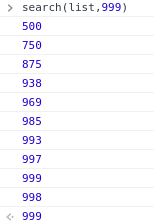

# 이진 탐색 ( Binary Search )

이진 탐색은 정렬되어 있는 배열에서 원하는 값을 찾아내는 알고리즘입니다. 자세하게 설명하자면 이진 탐색은 배열의 중간을 나눠 중간 값이 원하는 값보다 크다면 작은 값들을 탐색에서 제외 시키고 또 다시 중간을 나눠 원하는 값보다 큰지 작은지를 판별해 그에 맞게 탐색을 좁혀나가 원하는 값을 찾으면 탐색을 멈추는 알고리즘입니다.

만약 1부터 1000까지의 숫자가 담겨있는 배열에서 이진 탐색을 이용하지 않고 단순하게 숫자 999를 탐색한다면 1번부터 999를 찾기위해 배열을 999번 탐색할겁니다. 이러한 방법은 단순 탐색( Simple Search )라 부릅니다.

같은 예로 이진 탐색을 이용한다면 1000의 길이를 절반 나눈 500부터 시작하고 999는 500보다 큰 값이니 1~500까지의 값들은 탐색에서 제외시킵니다. 다시 500 ~ 1000의 중간인 750을 999와 비교하고 나머지를 제외시키고 또 절반을 나누고 반복하며 999를 찾아낼겁니다. 단순 탐색은 999를 찾기위해 999번 탐색했지만 이진 탐색은 10번만에 999를 찾아내어 탐색을 종료시켰습니다.



이렇게 이진 탐색의 장점을 확인했습니다. 물론 배열의 길이가 짧다면 탐색 시간이 크게 차이나지 않겠지만 만약 길이가 40억이 된다면 단순 탐색은 40억번을 탐색해야하고 이진 탐색은 32번의 탐색만에 값을 탐색할 수 있습니다. 엄청나게 단축된 횟수로 훨씬 더 빠른 시간내에 원하는 값을 찾아낼 수 있겠죠??

이진 탐색을 자바스크립트 코드로 한번 구현해봤습니다. 코드 설명은 주석에 포함할게요!

```jsx
function BSearch(list, item) {
  let low = 0; // 배열의 첫번째가 될 기준입니다.
  let high = list.length - 1; // 배열의 마지막이 될 기준입니다.

  while (low <= high) {
    // 배열의 중간값을 구하는데 소수가 나올 경우도 있으니 반올림을 해둡니다
    let mid = Math.round((low + high) / 2);

    if (list[mid] === item) return list[mid]; // 원하는 값에 도달했다면 리턴시켜줍니다.
    if (list[mid] > item) high = mid - 1;
    // 원하는 값이 배열 중간보다 크다면 high를 줄여줍니다.
    else low = mid + 1; // 반대로 작다면 low를 올려줍니다.
  }

  return "None"; // 길이를 다 순회했지만 원하는 값이 없다면 리턴
}
```
