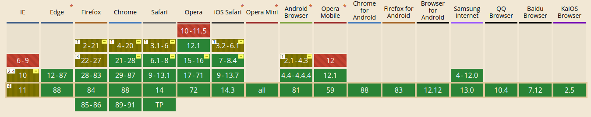
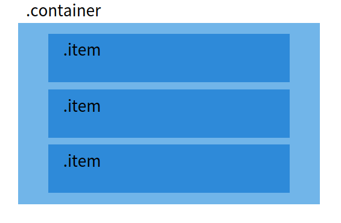
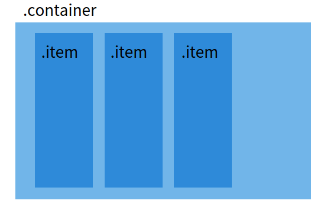

# Flex

Flex 속성은 레이아웃 배치를 위해 만들어진 속성입니다. Flex의 등장 이전 레이아웃을 구성할때 대부분의 엘리먼트들이 `Block`의 속성을 가지고 있어 수직으로 쌓이는 구조로 되어있고 수평으로 만들기 위해선 `float`과 `inline-block`의 도움을 받아 해결해왔지만 `clear`를 해줘야 한다던지 `inline-block`의 공백을 없애줘야 한다던지 여러가지 문제도 동반되어 왔습니다. 하지만 Flex 속성이 등장함으로써 보다 쉽게 레이아웃을 구성할 수 있게 되었지요



Flex의 지원 현황을 보자면 ie를 제외한 모든 브라우저에선 완벽 지원 중이고 ie도 10과 11에선 부분 지원을 하고 있습니다. 11에선 Flex의 표준 스펙을 지원해서 완벽하진 않지만 무리없이 사용 가능한 수준이라고 해요 ie를 11까지 지원하는 프로젝트라면 충분히 사용할 만해 보입니다.

<br />

## Flex 레이아웃

```html
<div class="container">
  <div class="item"></div>
  <div class="item"></div>
  <div class="item"></div>
</div>
```

위의 HTML의 구조를 그림으로 봅시다.



수직 구조를 가진 Block 속성의 대표적인 엘리먼트 div를 이용해 레이아웃을 구성해봤습니다. 수직적인 구조를 수평적인 구조로 바꿔보기 위해 부모 요소인 container에 Flex를 부여해봅시다.

```css
.container {
  display: flex;
}
```



flex를 부모 요소에 넣어주면 부모 요소는 flex container가 되고 자식 요소들은 flex item이 됩니다. 이때 이 item들은 각자 가지고 있는 width를 가지고
