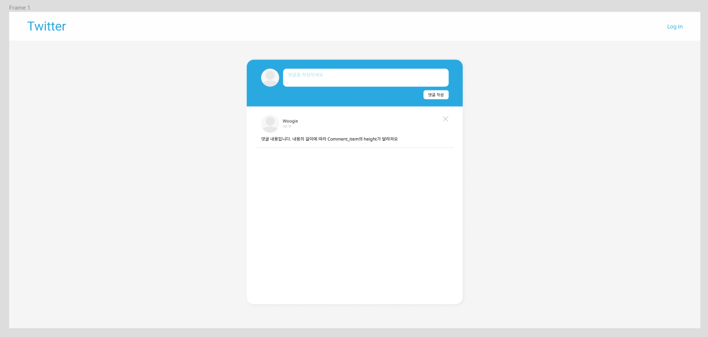
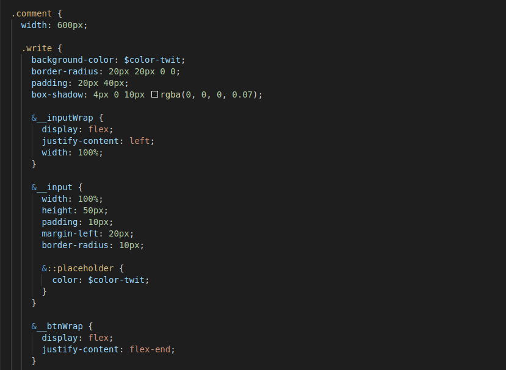
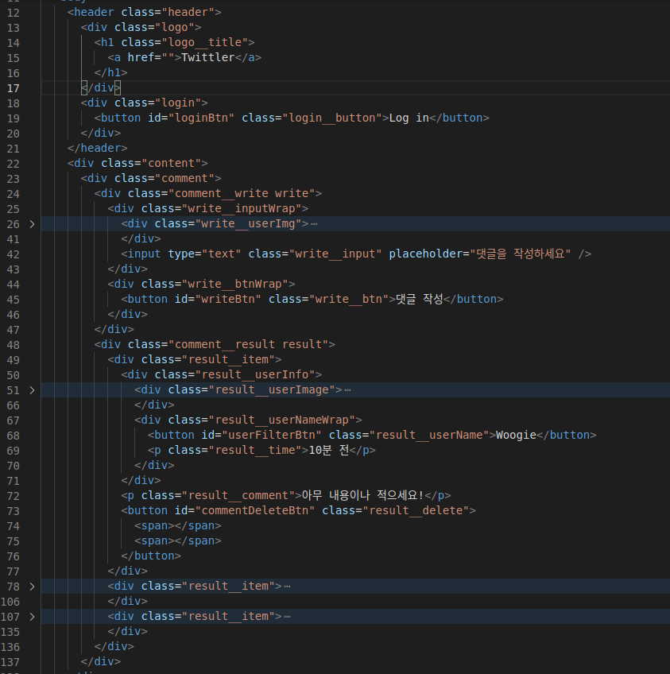

# Pre Week2 Twittler

HTML CSS 완성물

### [Twittler 결과물 Link](https://woogie-94.github.io/CodeStates/Pre_Twittler/)

Pair 시간에 급하게 대강 마무리한 Twittler CSS를 전부 뜯어내고 BEM 방법론을 이용한 SASS로 다시 작성하였다. BEM을 쓰려다보니 HTML 구조도 맘에 안들어서 처음부터 다시 해버렸다.

 
 
## 디자인 그리고 Flex

디자인을 하라고해서 Figma를 이용해서 간단하고 심플하게 디자인 했다. 디자인은 익숙하지 않은 작업이라 그런지 조금 힘들었는데 그래도 내 기준엔 심플하게 잘 만든거 같다.

Figma라는걸 이번에 처음 알았는데 페어분이 극찬을 하시더라 Figma에 익숙하신 페어분이였는데 덕분에 요긴한걸 몇가지 배워갔다. Figma 아마 애용할거같다.

최대한 시안과 비슷하게 결과물을 만드려고 노력했는데 100%까진 아니더라도 매우 비슷한 정도는 되는거같다. 오랜만에 다시 CSS를 잡으니 갑자기 머릿속에 있던 CSS에 대한 기억들이 사라진 느낌이 들었다. 그리고 이번에 처음으로 Flex를 이용해봤는데 익숙해지니 float따윈 생각이 안나더라 앞으론 계속 Flex에 익숙해질 겸 float은 자제해보려 한다.

 
 
## Sass?? BEM??

SASS는 독학하면서도 한번 써본적이 있는데 그땐 별 활용을 못했던 기억이 난다. 그냥 중첩과 변수만 이용한 느낌?? 이 과제도 그렇게 큰 분량이 아니다보니 SASS의 기능을 활용해보진 못했고 그냥 맛뵈기 수준으로 사용했다. 솔직히 어떻게 써야하는지 감도 안잡히는데 나중에 SASS를 멋지게 활용한 예제를 한번 찾아봐야겠다.

BEM 방법론은 클래스명을 잘 못짓는 나에겐 정말 대단한 방법론이다. 아직 아리까리한 느낌이 없지않아 있지만 아무런 규칙이 없는것보단 편안한 느낌이랄까?? 쨋든 SASS랑 궁합도 잘 맞는거 같다

 
 
## Twittler 기능 구현

이번엔 기본 요구 조건보다 여러가지를 더 추가하려는 생각을했다. 디자인도 추가 할 기능을 고려하며 디자인을 했는데 음... 할 수 있을까?

코드스테이츠에서 보여준 원래의 기능은 이름과 댓글을 작성해서 넘겨주는 기능이였는데 아무리 디자인을 해도 input이 2개가 들어가는걸 심플하게 꾸밀 능력이 안되더라 그래서 시원하게 이름 작성란을 없애버리고 로그인을 하는 방식으로 만드려한다. 말이 로그인이지 그냥 이름을 적으면 로컬스토리지에 담아주는거 뿐이다.

그리고 유저 이름을 누르면 해당 유저가 쓴 댓글만 필터하여 보여주는 기능이 있는데 원래의 댓글창에 새로 뿌려주는 형식이라 별로 이쁘지가 않다고 해야하나? 쨋든 맘에 안든다. 나는 팝업 형태로 필더된 댓글을 띄우는 방식을 택했다.

그 외에도 생각한건 많지만 일단 시간이 되냐가 문제다. 시간이 된다면 더 추가해보고 다음 글에 남겨볼 생각이다.
