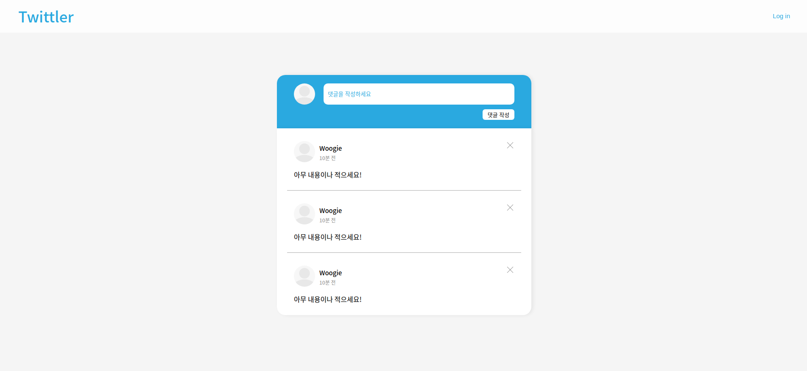
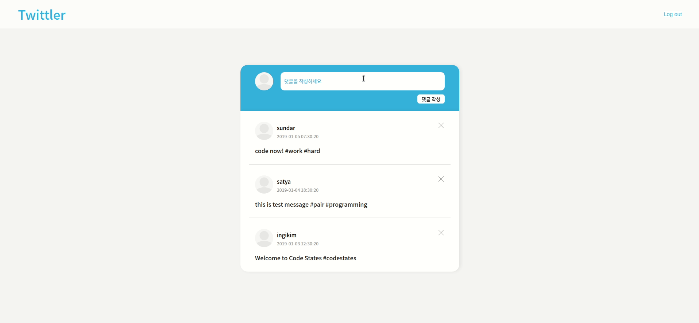
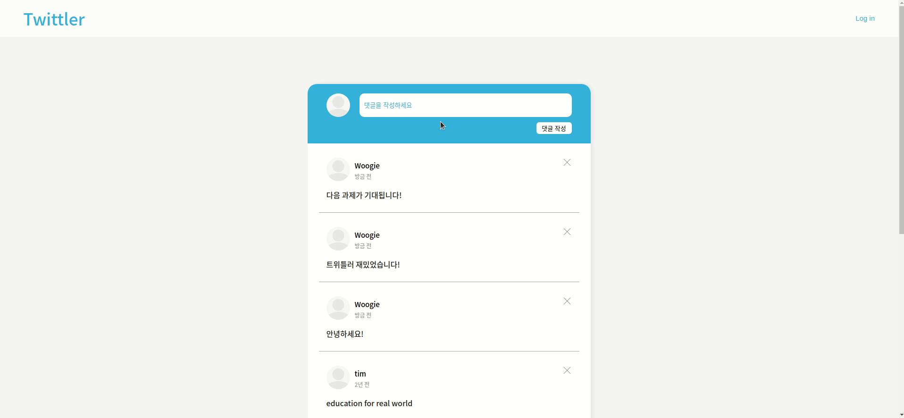
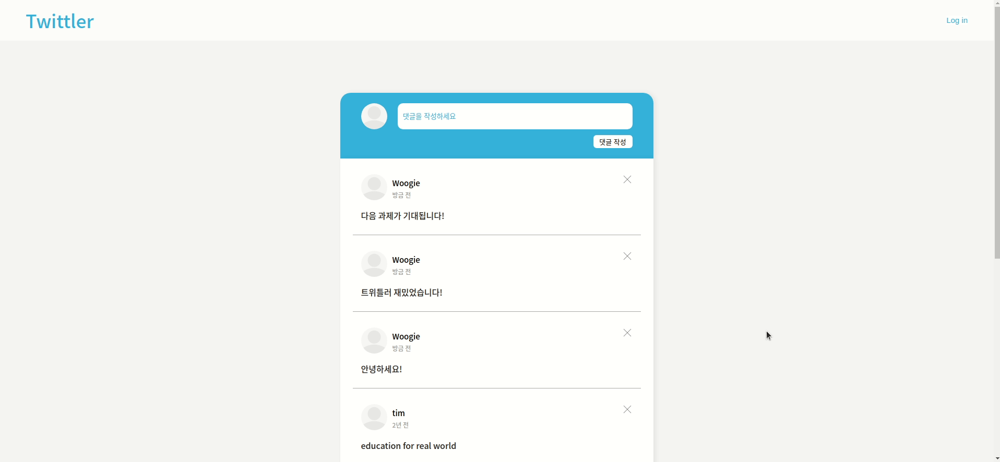

# Pre Week3 Twittler



이번주는 저번주에 HTML과 CSS로 만들어둔 Twittler에 기능을 구현하는 과제를 내주셨습니다!!

코드스테이츠에서 기본적으로 걸어둔 조건은

1. DATA라는 변수를 이용해 이미 작성 된 댓글들을 보여주세요.
2. 댓글이 작성 된 시간이 나오도록 timestamp 기능을 만들어 주세요 시간을 직접 작성하진 마세요!
3. 댓글을 다 작성하고 버튼을 눌러 제출하면 실시간으로 댓글 창에 추가되게 만드세요
4. 댓글에 유저를 클릭하면 해당 유저의 댓글만 보이도록 필터 기능을 만들어주세요!

이렇게가 기본 조건이였고 조금 더 욕심을 낼 사람들은 Advanced Challenge라는 추가 조건을 만족시켜도 됩니다.

1. timestamp 기능을 현재 시각과 작성한 시각을 계산해 "10분 전" 이런 식으로 작성 해 주세요!
2. 해당 데이터들은 페이지 새로고침 시 모두 초기화 됩니다. 이를 방지하기 위해 Web Storage라는 기술을 이용해서 새로고침을 해도 유지되게 만들어 보세요!

지금 진행 상황을 보자면 1, 2, 3번은 모두 완료 된 상태고 추가적으로 Login인척 하는 Login 기능과 댓글을 삭제하는 기능까지 완료한 상태입니다.

<br />
 
## Log in


Log in 기능을 만든 계기가 있는데 코드 스테이츠에서 보여준 예시를 보면 아이디를 적는 인풋과 내용을 작성하는 두 가지의 인풋을 만들어줘야 하더군요. 저는 크기가 다른 인풋 두개가 있는게 별로 보기 좋지 않다고 판단해서 아이디의 인풋을 숨겨두어 Log in 버튼을 누르면 나오게끔 만들어 뒀습니다. 인풋에 적어준 아이디는 로컬 스토리지에 저장되어 계속 유지할 수 있게 만들었어요!

```jsx
const loginBtn = document.getElementById("loginBtn");
const dim = document.getElementById("dim");
const loginPop = document.querySelector(".loginPop");

const loginSwitch = (() => {
  let state = false;

  return function () {
    state = !state;
    if (state) loginPop.classList.remove("loginPop--off");
    else loginPop.classList.add("loginPop--off");
  };
})();

loginBtn.addEventListener("click", () => loginSwitch());
dim.addEventListener("click", () => loginSwitch());
```

위 함수는 Log in 버튼을 눌렀을때 숨어있던 아이디를 적을 인풋을 보여줘야하고 Log in이 정상적으로 됐다면 다시 사라져야하기 때문에 클릭할 때 마다 열고 닫고하는 기능을 만들었어요

상태 관리를 생각하니 예전에 클로저에 적어둔 예시가 딱 떠올라서 클로져 함수로 관리하게끔 만들어 봤는데요 전 아주 만족하는 코드입니다!

저기서 dim이라 적혀있는 엘리먼트는 인풋 주변에 불투명한 검은색 화면인데요 저 dim을 눌러도 Log in 창이 사라지게 만들어뒀습니다!

```jsx
const submitBtn = document.getElementById("submitBtn");
const logoutBtn = document.getElementById("logoutBtn");
const idInput = document.getElementById("idInput");

submitBtn.addEventListener("click", function (e) {
  e.preventDefault();

  if (idValue.trim() === "") {
    alert("다시 써");
    return;
  }

  const idValue = idInput.value;

  loginBtn.style.display = "none";
  logoutBtn.style.display = "block";

  loginSwitch();
  localStorage.setItem("id", idValue);
  idValue = "";
});
```

위의 코드는 아이디를 인풋에 작성했다면 그 값을 로컬스토리지에 넘겨주는 작업을 하는 코드입니다. 해당 인풋에 아무런 값을 적지 않거나 공백으로 넣어줬다면 Log in이 안되게끔 제어를 해뒀고요. 부가적으로 Log in이 완료 되었다면 더 이상 Log in 버튼이 필요 없으니 Log out 버튼이 나오게끔 만들어 뒀습니다. 이때 당연히 Log in 화면도 꺼지게끔 위의 `switch` 함수를 호출했어요!

로컬 스토리지는 제가 공부를 하면서 이번에 처음 시도 해봤는데 이렇게 간단한걸 왜 안 해봤을까 싶었습니다 로컬 스토리지에 담아주고 인풋의 값이 남아있으면 이상하니 초기화 시켜주는 작업까지 했습니다!

```jsx
logoutBtn.addEventListener("click", function () {
  localStorage.removeItem("id");

  loginBtn.style.display = "block";
  logoutBtn.style.display = "none";
});
```

위의 코드는 당연히! Log in이 있다면 Log out이 있어야죠! Log in 버튼이 다시 등장하게 만들고 로컬 스토리지에 있는 id를 삭제해주는 작업을 했어요!

<br />
 
## Comment



이제 본격적인 댓글 기능입니다. 일단 Advanced Challenge 조건을 충족하기 위해서 로컬 스토리지를 이용했습니다. 기본적으로 로컬스토리지는 비어져 있기 때문에 DATA 변수를 로컬 스토리지에 담아두는 작업 먼저 진행하였습니다.

```jsx
let DATA = [
  { id: 1, user: "ingikim", message: "Welcome to Code States #codestates", created_at: "Fri Feb 05 2021 12:44:35 GMT+0900 (Korean Standard Time)" },
  { id: 2, user: "satya", message: "this is test message #pair #programming", created_at: "Fri Feb 03 2021 10:44:35 GMT+0900 (Korean Standard Time)" },
  { id: 3, user: "sundar", message: "code now! #work #hard", created_at: "Fri Jan 18 2021 12:44:35 GMT+0900 (Korean Standard Time)" },
  { id: 4, user: "steve", message: "Stay hungry, and stay foolish", created_at: "Fri Dec 05 2020 12:44:35 GMT+0900 (Korean Standard Time)" },
  { id: 5, user: "tim", message: "education for real world", created_at: "Fri Feb 05 2019 12:44:35 GMT+0900 (Korean Standard Time)" },
];

// local에 data가 없으면, DATA 변수를 담아줌,
if (localStorage.getItem("data") === null) localStorage.setItem("data", JSON.stringify(DATA));

// local에 data가 있다면 가져옴
let storageDATA = JSON.parse(localStorage.getItem("data"));
```

DATA에 부여한 id는 이따 작성 할 comment remove 기능을 위해 넣어두었습니다. 그리고 다시 로컬 스토리지 부분을 보면 처음 사이트에 들어와 data의 로컬이 없다면 로컬 스토리지에 DATA 변수를 담아주게끔 만들어 주었고 로컬 스토리지에서 DATA를 가져와 `storageDATA`라는 변수에 할당 시켜 사용했습니다.

```jsx
const result = document.querySelector(".result");

//[[[ comment default ]]]//
storageDATA.map((el) => {
  result.prepend(createTag(el.id, el.user, el.created_at, el.message));
});
```

그리곤 `storageDATA`를 map 함수로 반복을 돌려 result라는 comment 부모 요소에게 만들어둔 태그를 전달 시키게 만들었어요 `createTag`라는 함수가 comment의 item을 담당합니다.

```jsx
const createTag = (id, name, date, comment) => {
  let tag = `
<div class="result__userInfo">
  <div class="result__userImage">
    <svg width="50" height="50" viewBox="0 0 50 50" fill="none" xmlns="http://www.w3.org/2000/svg" xmlns:xlink="http://www.w3.org/1999/xlink">
      <rect width="50" height="50" rx="25" fill="url(#pattern0)" />
      <defs>
        <pattern id="pattern0" patternContentUnits="objectBoundingBox" width="1" height="1">
          <use xlink:href="#image0" transform="scale(0.005)" />
        </pattern>
        <image
          
        />
      </defs>
    </svg>
  </div>
  <div class="result__userNameWrap">
    <button class="result__userName">${name}</button>
    <p class="result__time">${timeStamp(date)}</p>
  </div>
</div>
<p class="result__comment">${comment}</p>
<button class="result__delete">
  <span></span>
  <span></span>
</button>
`;

  const itemBox = document.createElement("div");
  itemBox.classList.add("result__item");
  itemBox.innerHTML = tag;
  itemBox.id = id;

  idCount.increase();

  return itemBox;
};
```

보시다 싶이 너무 많은 양의 태그들이여서 createElement를 사용하기엔 너무 시간이 걸릴거 같아서 템플릿 리터럴로 빠르게 넘어갔습니다. 여기서 태그에 id를 부여함으로서 데이터와 엘리먼트의 연결 점을 만들어 줬어요! 여기서 새롭게 보이는 `idCount.increase()`는 id의 값을 조정하기 위해서 만들어진 생성자 함수입니다.

```jsx
//[[[ id Counting Fn]]]//
function IdCount() {
  let count = storageDATA[storageDATA.length - 1].id;

  this.increase = () => {
    return ++count;
  };

  this.getCount = () => {
    return count;
  };
}
```

위와 같이 storageDATA의 마지막 id를 기점으로 증가 시키게 만들었고 그 값을 가져오는 메소드도 만들었습니다. 이렇게 함으로서 count는 외부에서 사용이 불가능하게 만들어 예외 상황이 생기지 않게 만들어 뒀습니다.

```jsx
const writeBtn = document.getElementById("writeBtn");

//[[[ comment add ]]]//
writeBtn.addEventListener("click", () => {
  const writeInput = document.querySelector(".write__input");

  if (!isNaN(localStorage.getItem("id"))) return alert("로그인 먼저 해 ㅡㅡ");
  if (writeInput.value.trim() === "") return alert("댓글 안써??");

  const baseDATA = { id: idCount.getCount(), user: localStorage.getItem("id"), message: writeInput.value, created_at: new Date() };
  result.prepend(createTag(idCount.getCount(), baseDATA.user, baseDATA.created_at, baseDATA.message));
  storageDATA.push(baseDATA);
  localStorage.setItem("data", JSON.stringify([...storageDATA]));

  writeInput.value = "";
});
```

이제 댓글 작성 버튼을 눌러 comment에 추가가 되게 만들어야합니다. 그러기 위해서 베이스가 될 DATA의 형태를 띈 `baseDATA`를 만들어서 comment의 앞 부분에 넣어주려 합니다. `baseDATA`의 id는 위에 보신대로 `idCount.increase()`에 의해 상태가 변한 값을 `idCount.getCount()`로 가져와 id에 넣어주었고요 이 후에 storageDATA에 push를 해준 뒤 로컬 스토리지에 새롭게 덮어줍니다.

<br />
 
## Comment Filter



이번엔 4번 조건입니다. 댓글의 유저 네임을 누르면 해당 유저의 댓글만 모아서 보여주게끔 만드라는 조건인데요 원래 예시에는 원래 있던 댓글들이 사라지면서 필터된 댓글들만 나오는데요 저는 역시 이것 또한 맘에 들지 않아 로그인 처럼 팝업 기능을 만들었어요!

```jsx
//[[[ comment event ]]]//
result.addEventListener("click", (e) => {
  const target = e.target;
  const targetClass = target.classList[0];

  //[[ comment filter ]//
  if (targetClass === "result__userName") {
    const commentFilter = document.querySelector(".commentFilter");
    const commentFilterWrap = document.querySelector(".commentFilter__wrap");
    const commentDim = document.querySelector(".commentFilter__dim");

    commentFilter.classList.remove("commentFilter--off");

    const filter = storageDATA.filter((el) => {
      return el.user === target.textContent;
    });

    filter.map((el) => {
      commentFilterWrap.innerHTML += createFilterTag(el.id, el.user, el.created_at, el.message);
    });

    commentDim.addEventListener("click", () => {
      commentFilter.classList.add("commentFilter--off");
      commentFilterWrap.innerHTML = "";
    });
  }
});
```

이번 이벤트는 부모 요소를 대상으로 걸어주었는데요 이름이 하나가 아니라 여러개이기 때문에 결국 반복문을 돌려서 클릭 한 요소를 찾거나 위와 같이 부모 요소에 이벤트를 걸어주어 event.target으로 클릭한 요소의 정보를 가져오는 방법도 있습니다. 저는 후자가 효율적인것 같아 후자를 선택했어요

`commentFilte` 팝업은 기본적으로 `display: none`이 부여되어 있어서 그걸 부여 해준 클래스를 지워주고 `storageDATA`에 filter 함수를 사용하여 target의 유저 이름과 DATA안에 있는 유저 이름을 비교해 같은 이름을 가져와 팝업창에 새로 뿌려줍니다.

그리고 dimed라고 팝업에 집중할 수 있도록 주변을 어둡거나 흐리게 만들어주는 기법이 있습니다. 이를 만들어 주었고 dimed를 클릭하면 팝업 창에 다시 off 클래스를 주어 `display:none`이 되게 만들었습니다.

<br />
 
## Comment Remove



이번엔 comment를 삭제 시켜 줄 remove 기능입니다. 이 기능 때문에 고생을 했어요... 로컬 스토리지를 이용하지 않았을땐 아주 간편하고 쉽게 만들 수 있었는데 로컬 스토리지를 뒤늦게 추가하고 만들다보니 서로 엉키더라고요... 이걸 해결하려고 아주 고생을 했습니다. 안됐던 이유를 찾았는데 태그에 id를 부여하고 다시 새로 고침하면 새롭게 id를 부여하고 순서 사이에 빈 공간이 생기면 그 공간을 채워버려 태그에 있던 id와 데이터에 있던 id가 맞지 않았습니다. 이걸 뒤늦게 깨닫고 고치기 시작했어요!

```jsx
result.addEventListener("click", (e) => {
  const target = e.target;
  const targetClass = target.classList[0];
  const targetParent = target.parentNode;

  //[[[ comment remove ]]]//
  if (targetClass === "result__delete") {
    result.removeChild(targetParent);

    storageDATA.map((item, i) => {
      if (item.id === Number(targetParent.id)) {
        storageDATA.splice(i, 1);
      }
    });

    localStorage.setItem("data", JSON.stringify([...storageDATA]));
  }
```

filter 기능과 똑같이 remove 기능도 부모 요소에게 이벤트를 걸어 주었습니다. 타겟 태그의 id 값과 데이터에 있는 id를 비교해서 일치하다면 바로 삭제시켜주고 그걸 다시 로컬 스토리지에 뒤덮는 코드입니다.

<br />
 
## 회고

이렇게 트위틀러를 마무리 했는데 음... 코드가 솔직히 만족스럽진 않아요 너무 더럽습니다!! 코드가 더러워서 깔끔하게 교통 정리를 해볼까하다 힘이 다 빠져서 냅두었습니다. 아마 나중에 트위틀러를 다시 본다면 경악을 하고 다시 닫겠죠?? 그래도 트위틀러하면서 얻어가는게 많은거 같아요! 일부로 클로져를 사용해보려고 노력해 봤고 SCSS와 BEM 방법론을 사용해본 점? 여튼 재미있던 과제였습니다 앞으로의 과제들도 항상 재미있길 바랍니다 ㅠ...

그리고 이번엔 발표를 해봤는데요 진짜 별 생각 없이 신청한건데 제 차례가 가까워질 수록 심장이 쿵쾅쿵쾅 거리더군요 괜히 신청했나 호들갑 떨었지만 막상 시작하니 긴장은 사라졌습니다. 준비되지 않은 발표라 조금 횡설수설하고 정리가 안되었다고 생각해요 그래서 조금 아쉽다고 해야하나? 다음번에 또 발표하게 된다면 내용 정리라도 해서 가야겠습니다.
