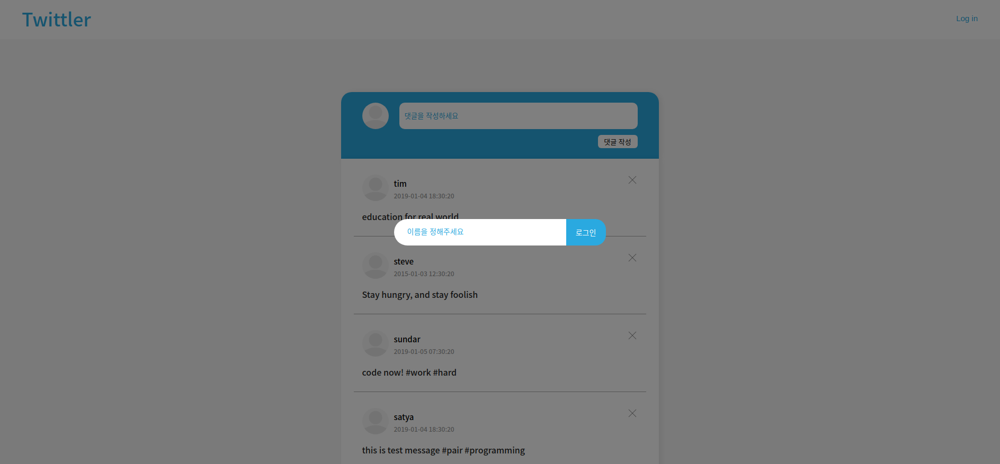

# Pre Week3 Twittler


이번주는 저번주에 HTML과 CSS로 만들어둔 Twittler에 기능을 구현하는 과제를 내주셨습니다!!

코드스테이츠에서 기본적으로 걸어둔 조건은

1. DATA라는 변수를 이용해 이미 작성 된 댓글들을 보여주세요.
2. 댓글이 작성 된 시간이 나오도록 timestamp 기능을 만들어 주세요 시간을 직접 작성하진 마세요!
3. 댓글을 다 작성하고 버튼을 눌러 제출하면 실시간으로 댓글 창에 추가되게 만드세요
4. 댓글에 유저를 클릭하면 해당 유저의 댓글만 보이도록 필터 기능을 만들어주세요!

<br />
 
이렇게가 기본 조건이였고 조금 더 욕심을 낼 사람들은 Advanced Challenge라는 추가 조건을 만족시켜도 됩니다.

1. timestamp 기능을 현재 시각과 작성한 시각을 계산해 "10분 전" 이런 식으로 작성 해 주세요!
2. 해당 데이터들은 페이지 새로고침 시 모두 초기화 됩니다. 이를 방지하기 위해 Web Storage라는 기술을 이용해서 새로고침을 해도 유지되게 만들어 보세요!

<br />
 
지금 진행 상황을 보자면 1, 2, 3번은 모두 완료 된 상태고 추가적으로 Login인척 하는 Login 기능과 댓글을 삭제하는 기능까지 완료한 상태입니다.

<br />
 
## Log in



Log in 기능을 만든 계기가 있는데 코드 스테이츠에서 보여준 예시를 보면 아이디를 적는 인풋과 내용을 작성하는 두 가지의 인풋을 만들어줘야 하더군요. 저는 크기가 다른 인풋 두개가 있는게 별로 보기 좋지 않다고 판단해서 아이디의 인풋을 숨겨두어 Log in 버튼을 누르면 나오게끔 만들어 뒀습니다. 인풋에 적어준 아이디는 로컬 스토리지에 저장되어 계속 유지할 수 있게 만들었어요!

```jsx
const loginBtn = document.getElementById("loginBtn");
const dim = document.getElementById("dim");
const loginPop = document.querySelector(".loginPop");

const loginSwitch = (() => {
  let state = false;

  return function () {
    state = !state;
    if (state) loginPop.classList.remove("loginPop--off");
    else loginPop.classList.add("loginPop--off");
  };
})();

loginBtn.addEventListener("click", () => loginSwitch());
dim.addEventListener("click", () => loginSwitch());
```

위 함수는 Log in 버튼을 눌렀을때 숨어있던 아이디를 적을 인풋을 보여줘야하고 Log in이 정상적으로 됐다면 다시 사라져야하기 때문에 클릭할 때 마다 열고 닫고하는 기능을 만들었어요

상태 관리를 생각하니 예전에 클로저에 적어둔 예시가 딱 떠올라서 클로져 함수로 관리하게끔 만들어 봤는데요 전 아주 만족하는 코드입니다!

저기서 dim이라 적혀있는 엘리먼트는 인풋 주변에 불투명한 검은색 화면인데요 저 dim을 눌러도 Log in 창이 사라지게 만들어뒀습니다!

```jsx
const submitBtn = document.getElementById("submitBtn");
const logoutBtn = document.getElementById("logoutBtn");
const idInput = document.getElementById("idInput");

submitBtn.addEventListener("click", function (e) {
  e.preventDefault();

  if (idValue.trim() === "") {
    alert("다시 써");
    return;
  }

  const idValue = idInput.value;

  loginBtn.style.display = "none";
  logoutBtn.style.display = "block";

  loginSwitch();
  localStorage.setItem("id", idValue);
  idValue = "";
});
```

위의 코드는 아이디를 인풋에 작성했다면 그 값을 로컬스토리지에 넘겨주는 작업을 하는 코드입니다. 해당 인풋에 아무런 값을 적지 않거나 공백으로 넣어줬다면 Log in이 안되게끔 제어를 해뒀고요. 부가적으로 Log in이 완료 되었다면 더 이상 Log in 버튼이 필요 없으니 Log out 버튼이 나오게끔 만들어 뒀습니다. 이때 당연히 Log in 화면도 꺼지게끔 위의 Switch 함수를 호출했어요!

로컬 스토리지는 제가 공부를 하면서 이번에 처음 시도 해봤는데 이렇게 간단한걸 왜 안 해봤을까 싶었습니다 로컬 스토리지에 담아주고 인풋의 값이 남아있으면 이상하니 초기화 시켜주는 작업까지 했습니다!

```jsx
logoutBtn.addEventListener("click", function () {
  localStorage.removeItem("id");

  loginBtn.style.display = "block";
  logoutBtn.style.display = "none";
});
```

위의 코드는 당연히! Log in이 있다면 Log out이 있어야죠! Log in 버튼이 다시 등장하게 만들고 로컬 스토리지에 있는 id를 삭제해주는 작업을 했어요!

<br />
 
## Comment

이제 본격적인 댓글 기능입니다. 코드스테이츠에서 기본적인 DATA 변수를 만들어 뒀습니다. 일단 기본적으로 그 DATA 변수에 있는 데이터를 출력해야 해요!

```jsx
var DATA = [
  { id: 5, user: "ingikim", message: "Welcome to Code States #codestates", created_at: "2019-01-03 12:30:20" },
  { id: 4, user: "satya", message: "this is test message #pair #programming", created_at: "2019-01-04 18:30:20" },
  { id: 3, user: "sundar", message: "code now! #work #hard", created_at: "2019-01-05 07:30:20" },
  { id: 2, user: "steve", message: "Stay hungry, and stay foolish", created_at: "2015-01-03 12:30:20" },
  { id: 1, user: "tim", message: "education for real world", created_at: "2019-01-04 18:30:20" },
];
```

```jsx
const result = document.querySelector(".result");

DATA.map((el) => {
  result.prepend(createTag(idCount, el.user, el.created_at, el.message));
});
```

일단 DATA를 map 메소드로 순회를 돌아 객체의 수 만큼 댓글을 생성하는 코드인데요 댓글을 생성 하려면 HTML 태그를 넣어줘야합니다 태그를 만들기 위한 함수 createTag를 호출해 객체의 데이터를 넘겨 줬어요!

```jsx
const createTag = (id, name, date, comment) => {
  let tag = `
<div class="result__userInfo">
  <div class="result__userImage">
    <svg width="50" height="50" viewBox="0 0 50 50" fill="none" xmlns="http://www.w3.org/2000/svg" xmlns:xlink="http://www.w3.org/1999/xlink">
      <rect width="50" height="50" rx="25" fill="url(#pattern0)" />
      <defs>
        <pattern id="pattern0" patternContentUnits="objectBoundingBox" width="1" height="1">
          <use xlink:href="#image0" transform="scale(0.005)" />
        </pattern>
        <image
          id="image0"
          width="200"
          height="200"
        />
      </defs>
    </svg>
  </div>
  <div class="result__userNameWrap">
    <button class="result__userName">${name}</button>
    <p class="result__time">${date}</p>
  </div>
</div>
<p class="result__comment">${comment}</p>
<button class="result__delete">
  <span></span>
  <span></span>
</button>
`;
  idCount.increase();
  const itemBox = document.createElement("div");
  itemBox.classList.add("result__item");
  itemBox.id = idCount.getCount();
  itemBox.innerHTML = tag;

  return itemBox;
};
```

이게 댓글을 만들어주는 태그 함수인데요 createElement를 이용해서 만드려하니 너무 많은 태그를 만들어야 하더라고요 ㅠ... 그래서 템플릿 리터럴을 이용해서 tag 변수를 만들어주고 부모 엘리먼트를 만들어서 그 안에 innerHTML로 넣어준 코드입니다. innerHTML이 보안상의 이슈가 있다하여 다른 방법을 찾아보고 있는 중입니다.
