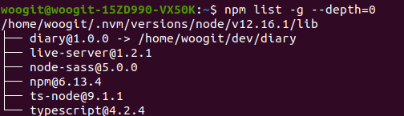

# NPM Global & Local

npm을 이용하다보면 `-global`이나 `-g`라는 명령어를 접해본 적이 있으실 겁니다. 해당 명령어는 Global에 설치한다는 개념은 있었지만 전역에 설치한다는 것이 어떤 의미인지는 몰랐고 갑자기 생각이 들어 이번 주제로 선정하여 작성합니다.

## Local

기본적으로 npm은 설치한 모듈은 로컬 모드로 설치합니다. 로컬 모드는 명령어를 실행한 디렉토리 안에 있는 node_modules에 설치한다는 것을 의미합니다.

### Global

`-g` 명령어를 작성하면 기본 로컬 설치에서 글로벌하게 설치가 됩니다. 글로벌하게 설치가 된다는 것은 현재 디렉토리 안에 설치가 되는 것이 아닌 시스템 디렉토리에 있는 lib 폴더 안에 설치되는 것을 의미합니다. global에 설치된 패키지 목록을 보려면 `npm list -g --depth=0`으로 확인해보면 됩니다.

`npm uninstall -g [패키지명]` 명령어로 불필요한 패키지를 삭제할 수도 있습니다.

글로벌로 설치된 패키지는 전역에서 사용 가능합니다. 모든 프로젝트에서 공통으로 사용되는 패키지는 전역으로 설치해도 되지만 모든 패키지를 전역으로 설치하는 것은 지양해야 합니다.
