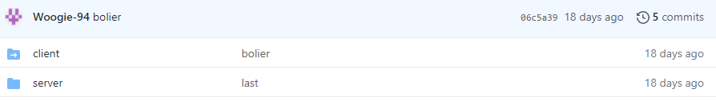
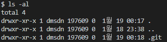

이런식으로 폴더에 화살표가 생기고 클릭이 안됩니다!!! 

# 해결

이 오류가 생기는 이유는 git 끼리 충돌했기 때문입니다. 

제일 큰 상위 폴더에 git 파일이 있고 client에도 git 파일이 존재해서 서로 충돌한겁니다. 

git 파일은 git init을 하면 생기는데 숨김파일이라 눈에는 보이지않는 파일입니다 

```jsx
$ ls - al
```



ls -al을 하시면 내부에 .git 파일이 보이는데 이걸 없애줘야 합니다.

문제가 있는 폴더로 가셔서 아래와 같이 작성해보세요 

```jsx
$ rm -rf .git
```

이제 .git 파일이 사라졌을거고 다시 깃에 올려봅시다!!