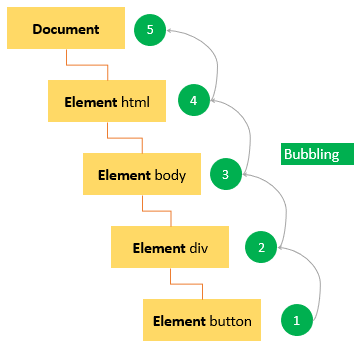
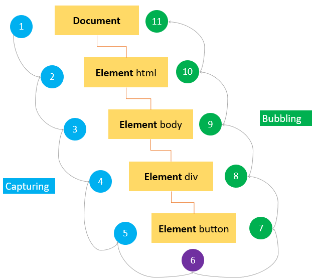

# 이벤트 위임

**이벤트 위임**은 이벤트 **캡처링**과 **버블링**을 활용한 **이벤트 핸들링 패턴**입니다. 이벤트 위임을 사용하면 **요소마다 핸들러를 할당하지 않고, 요소의 공통 부모에 이벤트 핸들러를 단 하나만 할당하여 여러 요소를 한꺼번에 다룰 수 있습니다.**

이벤트 위임을 이용하면 요소마다 핸들러를 할당하지 않아도 되기 때문에 메모리가 절약되고, 코드가 간결해지는 장점이 있습니다.

이벤트 위임의 원리는 이렇습니다.

1. 부모 요소에 하나의 핸들러를 할당해줍니다.
2. 핸들러의 `event.target`을 사용해 어느 요소에서 이벤트가 발생한 것인지 찾아냅니다.
3. 이벤트가 발생한 요소가 원하는 요소일 때 이벤트를 실행시킵니다.

 
 
# 이벤트 버블링

**이벤트 버블링**은 특정 화면 요소에서 이벤트가 발생했을 때 해당 **이벤트가 더 상위의 화면 요소들로 전달되어 가는 특성**을 의미합니다.

버블링의 원리는 이렇습니다.

1. 요소에 이벤트가 발생합니다.
2. 해당 요소의 핸들러가 동작합니다.
3. 이어서 부모 요소의 핸들러 동작합니다.
4. 최상단에 위치한 요소를 만날 때까지 3번의 과정 반복합니다.

 
 
# 이벤트 캡쳐링

**이벤트 캡쳐링**은 버블링과 반대 방향으로 전파되는 특징을 가지고 있습니다. 이벤트 캡쳐링을 이용할 땐 이벤트 리스너에 한가지 옵션을 추가해주어야 합니다. `addEventListener(event, handler, capture)` 세번째 인자에 boolean 값을 넣어주어 버블링 단계에서 동작할지 캡쳐링 단계에서 동작할지 정할 수 있습니다.

 
 
# Reference

[이벤트 위임 - 모던 자바스크립트 튜토리얼](https://ko.javascript.info/event-delegation)

[버블링과 캡쳐링 - 모던 자바스크립트 튜토리얼](https://ko.javascript.info/bubbling-and-capturing)

[이벤트 버블링, 이벤트 캡처 그리고 이벤트 위임까지](https://joshua1988.github.io/web-development/javascript/event-propagation-delegation/)
