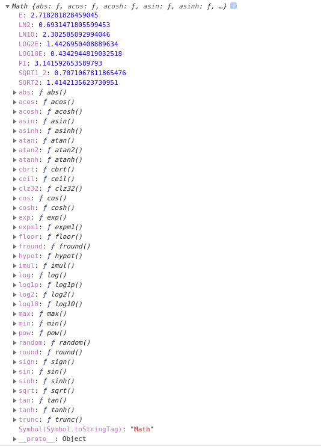

# Math 메소드

Math는 수학 상수와 함수를 위한 프로퍼티, 메소드를 미리 구현해둔 빌트인 객체입니다. 큰수와 작은수를 비교해주기도 하고 랜덤한 수를 받아올 수도 있고 이외에도 여러가지 수학적 기능을 하는 메소드입니다.



보다싶이 많은 프로퍼티와 메소드를 가지고있는 객체입니다. 많은 메소드 중에서 자주 사용할 법한 메소드만 소개해보려 합니다.

## 1. Math.random()

`Math.random()` 메소드는 0 보다 크거나 같고 1보다 작은 수를 랜덤하게 반환시켜주는 메소드입니다.

```jsx
Math.random(); // 0 ~ 0.9999...
Math.random() * 10; // 0 ~ 9.9999...
```

보다싶이 문제점이 하나 있는데 1보다 작은수를 반환해주기 때문에 최대값이 0.999...입니다. 이를 해결 할 방법이 있습니다.

```jsx
Math.round(Math.random() * 10); // 0 ~ 10
Math.random().toFixed(); // '0' ~ '10'
```

`toFixed()` 메소드는 숫자를 반올림하여 문자열로 반환시켜줍니다.

`Math.round()` 메소드는 아래서 확인하세요

## 2. Math.round()

`Math.round()`메소드는 전달받은 값을 반올림하여 숫자로 반환시켜주는 메소드입니다.

```jsx
Math.round(1.3); // 1
Math.round(1.6); // 2
```

## 3. Math.floor()

Math.floor() 메소드는 전달받은 값과 같거나 작은수 중 가장 큰 정수를 리턴하는 메소드입니다. 쉽게 말하자면 소숫점을 버립니다.

```jsx
Math.floor(1.7); // 1
Math.floor(1.2); // 1
Math.floor(-1.3); // -2
```

## 4. Math.ceil()

`Math.ceil()` 메소드는 전달받은 값과 같거나 큰수 중 가장 작은 정수를 리턴하는 메소드입니더. 쉽게 말하자면 값이 실수일때 올림합니다.

```jsx
Math.ceil(1); // 1
Math.ceil(1.3); // 2
Math.ceil(-1.6); // -1
```

## 5. Math.min(), max()

`Math.min(), max()` 메소드는 전달받은 값 중 가장 크고 작은수를 반환시켜주는 메소드입니다. 만약 넘버 타입이 아닌 다른 값이 들어간다면 NaN을 반환합니다.

```jsx
Math.min(1, 5); // 1
Math.max(1, 5, 3, 2); // 5
```

## 6. Math.abs()

`Math.abs()` 메소드는 전달 받은 값의 절대값을 반환합니다.

```jsx
Math.abs(-1); // 1
Math.abs("1"); // 1
Math.abs(10); // 10
```
