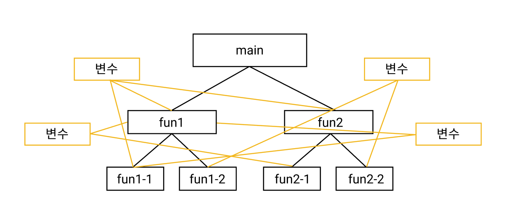
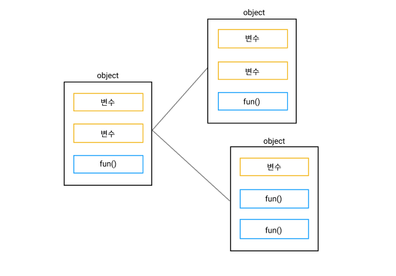
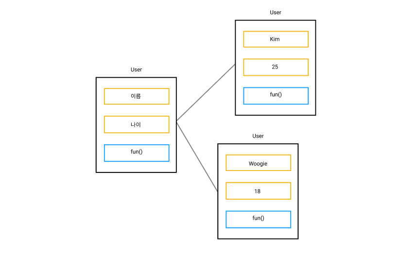

# 객체 지향 프로그래밍 (OOP)

## 1. 객체 지향 프로그래밍이 뭔가요??

**객체 지향 프로그래밍(Object-Oriented Programming)**은 컴퓨터 프로그래밍 패러다임입니다. 프로그래밍 패러다임은 프로그래밍을 하는 여러 가지 스타일과 방법 중 한 가지 방법입니다. CSS의 BEM 방법론 같이 클래스명을 어떻게 작성할지 규칙을 정해둔 것 처럼요 다시 돌아와서 **객체 지향 프로그래밍은 필요한 데이터를 추상화 시키고 상태와 행위를 가진 객체를 만들어 그 객체들 간의 상호작용을 통해 코드를 구성하는 프로그래밍 방법**입니다. 쉽게 말해서 문제를 여러 개의 객체 단위로 나누고 그 객체들이 모여 서로 상호 작용하여 문제를 해결하는 방식입니다.

 
 
## 2. 절차 지향 프로그래밍

객체 지향 프로그래밍을 정확히 알아보기 전 절차 지향 프로그래밍을 먼저 알아볼게요 절차 지향 프로그래밍을 알고 난 뒤 객체 지향 프로그래밍을 바라본다면 왜 사용하는지 명확하게 알 수 있습니다.

절차 지향 프로그래밍은 말 그대로 절차에 의해서 진행되는 프로그래밍 패러다임입니다. 순차적인 처리를 중요시하며 하나의 큰 기능을 처리하기 위해 작은 단위의 기능들로 나누어서 처리하는 방식입니다.

위와 같은 방식으로 절차 적으로 코드가 작성되어 있으며 하나의 큰 문제를 처리하기 위해서 작은 단위의 함수들로 나뉘어져 있습니다. 큰 문제에서 점차 작은 단위로 해결해나가는 방식(Top-Down)이기 때문에 아주 큰 문제일수록 점점 많은 함수들이 꼬리를 물고 이어지게 됩니다. 절차 지향 방식으로 코드를 작성한다면 아래와 같은 단점이 생깁니다.

 
 
### 단점

1. **과도한 전역 변수의 사용**

   전역 변수는 모든 함수가 사용 가능하기 때문에 하나의 기능을 위해 하나의 변수를 바꾼다면 그 변수를 사용하는 모든 함수들에 문제가 생길 수 있습니다. 이렇게 생기는 문제를 **Side Effect**라고 부릅니다.

2. **코드가 복잡해진다**

   상호 작용하는 함수가 많아질수록 어떤 함수들이 서로 연관되어 있는지 찾아내야 하는데 만약 코드의 양이 방대하다면 코드가 복잡해져 이해하기 힘들어 질 수 있습니다.

3. **유지 보수가 어렵다**

   2번과 같은 이유로 코드가 보기 어려워지고 하나를 건드리면 다른 함수들이 영향을 받아 수정, 확장하기가 쉽지 않습니다.

물론 절차 지향 프로그래밍만의 장점도 있습니다.

 
 
### 장점

1. **객체 지향에 비해 실행 속도가 빠릅니다.**

   컴퓨터의 처리 구조와 유사하여 코드를 읽는 시간이 짧아집니다.

2. **작은 프로젝트라면 코드가 간결하고 가독성이 좋다**

   큰 프로젝트가 아니라 작은 프로젝트라면 절차 지향 프로그래밍의 단점은 많이 보완이 됩니다. 서로 연관되는 함수가 적어짐에 따라 코드가 간결해지고 가독성이 좋아집니다.

이렇게 절차 지향 프로그래밍에 알아봤습니다. 절차 지향과 객체 지향은 서로 상반되는 개념이 아닙니다. 그저 프로그래밍 패러다임 중 하나의 패러다임일 뿐이며 상황에 맞게 취향에 맞게 선택하면 되는 것으로 알고 있습니다. 이번엔 객체 지향 프로그래밍을 보다 자세하게 알아봅시다.

 
 
## 3. 다시 객체 지향 프로그래밍

객체 지향 프로그래밍에서는 모든게 객체로 구성되어 있습니다. 위의 그림처럼 관련된 데이터와 기능들을 하나의 객체로 만들어두고 각각의 객체들을 조립해서 큰 기능을 만들어 냅니다. 각각의 객체는 서로 연결되어 있지만 서로 데이터를 주고 받지 않기 때문에 어떤 하나의 객체를 수정한다고 해서 다른 객체에 영향이 가지 않습니다. 이 점에서 절차 지향 프로그래밍과의 차이점이 보이죠?

 
 

**데이터(상태)와 기능(행위)들을 모아둔 객체를 클래스(Class)라고도 부릅니다.** 이 클래스는 재사용이 가능합니다. **클래스는 생성자(constructor)**를 가지고 있고 이 생성자를 통해 데이터를 넣어 줄 수 있습니다. 함수의 인자와 비슷하다고 생각합니다. User라는 클래스에 생성자를 통해 이름과 나이를 전달 시켜 새로운 객체를 생성했습니다. 하나의 클래스로 같은 틀의 객체를 계속 찍어낼 수 있는거죠 마치 공장 처럼요! 그래서 클래스를 공장이라고 비유하기도 합니다.

 
 
### 객체 지향 프로그래밍 4가지의 중요한 특징

객체 지향 프로그래밍에선 4가지의 중요한 특징이 있습니다.

 
 
1. **캡슐화 (Encapsulation)**

    캡슐화 된 약을 보면 안에 어떤 약이 있는지 모르는 것처럼 객체 지향 프로그래밍의 캡슐화도 마찬가지로 외부에서 내부의 정보를 찾아볼 수 없게 만듭니다. 데이터와 기능을 모아둔 객체에서 외부에 보일 필요가 없는 데이터를 숨겨두고 필요한 기능들만 사용할 수 있게 만들어주는 작업입니다.

2. **추상화 (Abstraction)**

   추상화는 내부의 복잡한 내용들을 이해하지 않아도 외부에서 간단하게 사용할 수 있는 것을 말합니다. 자동차를 예시로 들어본다면 우리는 자동차 내부에 엔진이 어떻게 돌아가고 바퀴가 어떻게 굴러가는지 모릅니다. 하지만 핸들과 브레이크 악셀을 가지고 자동차를 운전할 수 있죠 자동차라는 객체가 있다면 그 객체 내부에 엔진 바퀴 등 다양한 기능들이 있지만 사용자는 핸들 브레이크 악셀과 같이 추상화 된 기능들만 사용하기만 하면 됩니다. 사용자들은 추상화 된 기능을 통해 더 쉽게 사용이 가능해집니다.

3. **상속 (Ingeritance)**

   상속은 상속 받은 부모의 특징을 가져오는 개념입니다. 위의 그림이 상속과 같은 개념인데요 User 클래스의 데이터와 기능을 새로운 객체 즉, 자식 객체에 상속을 시켜주고 새로운 객체를 만들어줍니다. 이때 상속 받은 객체는 새로운 기능을 추가하여 업그레이드 된 객체로 만들 수 있습니다.

4. **다형성 (Polymorphism)**

   부모에게 상속 받은 자식의 상황에 맞게 구현될 수 있게 하는 것을 다형성이라고 부릅니다. 위에 예시로 든 자동차를 다시 가져오자면 자동차는 앞으로 가기 같은 기본적인 기능들이 구현되어 있고 이를 자식 객체에 상속 시킵니다. 이때 이름을 벤츠, 페라리, 아우디라는 지어주어 서로 다른 자동차가 되었다 해도 기본적인 기능인 앞으로 가기 기능은 그대로이기 때문에 모두 앞으로 가는 기능을 이용 할 수 있습니다. 다형성이라는 특징 때문에 부모 자동차의 기능을 그대로 물려 받아 다양한 자동차를 만든 수 있었습니다.

 
 
이렇게 이해하기 어려운 4가지의 특징들이 있습니다. 이 특징들을 모두 이용해야 진짜 객체 지향 프로그래밍이라고 불릴 수 있습니다.

 
 
### 객체 지향 프로그래밍의 장,단점

객체 지향 프로그래밍을 이용함으로서 얻을 수 있는 장점과 단점을 정리해봅시다.

 
 
### 장점

1. **유지 보수가 쉬움**

   절차 지향 프로그래밍은 코드를 수정하기 위해 코드를 이해하고 일일히 찾아가며 수정해야 하지만 객체 지향 프로그래밍은 수정 할 기능이 있는 클래스를 찾아 그 곳만 수정해주면 되기 때문에 다른 사람이 만든 코드를 수정하더라도 문제를 쉽게 찾아 수정할 수 있으며 코드 양이 많아져도 코드가 깔끔하기 때문에 보기 편한 코드를 만들 수 있습니다.

2. **코드 재사용**

   객체 지향 프로그래밍은 상속과 다형성이라는 특징 때문에 코드 재사용에 용이합니다. 다른 사람이 만든 클래스를 가져와 이용할 수 있고 기능을 추가하여 확장할 수도 있습니다.

 
 
### 단점

1. **설계 단계에서 많은 생각과 노력이 필요**

   구상하고 바로 코드를 적는 절차 지향에 비해 객체 지향 프로그래밍은 설계 단계에서 커다란 기능을 어떻게 나누고 어떤 식으로 구조를 만들어야 할지 생각하는 노력이 필요합니다.

 
 
 
 
## 끝

객체 지향 프로그래밍은 배워둔다면 다른 프로그래밍 언어에서도 통하는 개념이라 배워둔다면 다른 프로그래밍 언어를 배울 때 보다 쉽게 이해할 수 있을 것 같다고 생각합니다. 만약 자바스크립트로 코드를 처음 배운다면 절차 지향 방식에 익숙해져 있고 객체 지향 방식의 개념이 어려울 수 있습니다. 하지만 객체 지향 프로그래밍을 포기할 순 없고 결국 익숙해져야 한다고 생각합니다. 아마 객체 지향에 익숙해지고 제대로 사용할 수 있게 된다면 그 매력에 빠져있지 않을까 싶습니다.
