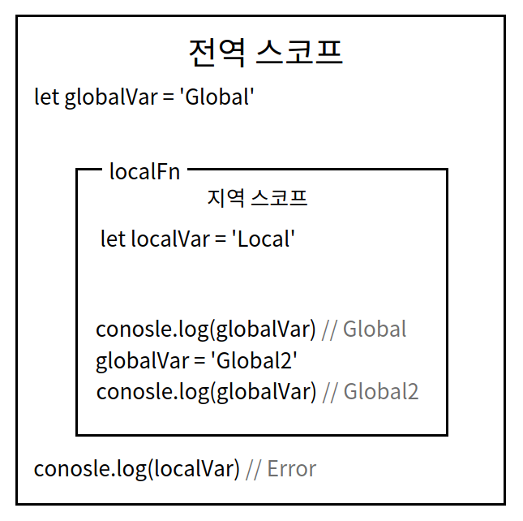

# 스코프 ( Scope )

Scope를 쉽게 정의하자면 변수가 영향을 미치는 범위 즉, **변수의 유효 범위**라고 할 수 있습니다. 자바스크립트의 스코프는 **전역 스코프**와 **지역 스코프** 두가지가 있습니다.

> 전역 스코프 <br />
> 변수 선언 시 코드 내 어느 곳에서든 사용이 가능하다.

> 지역 스코프 <br />
> 변수 선언 시 함수나 블럭문 내에서만 사용이 가능하다.

<br />

스코프를 코드와 그림을 통해 살펴봅시다.

```jsx
let globalVar = "Gloabal"; // 전역 변수

function localFn() {
  let localVar = "Local"; // 지역 변수

  console.log(globalVar); // Global

  globalVar = "Global2";
  console.log(globalVar); // Global2
}

console.log(localVar); // Error: localval is not defined
```

<br />



**전역 스코프**에 선언된 변수들을 **전역 변수**라 부릅니다. 전역 변수 어디서든지 사용이 가능하고 지역 스코프 내에서 전역 변수의 값을 재할당 해줄 수도 있습니다.

반면 **지역 스코프**에 선언된 변수는 **지역 변수**라하며 함수 블록문( `{}` ) 밖에선 사용할 수 없습니다. localVar라는 지역 변수는 localFn이라는 함수 내에서만 사용이 가능하단거죠 만약 전역 스코프에서 지역 변수를 호출한다면 당연히 에러가 나올겁니다.

지역 스코프에는 두가지의 스코프가 더 존재해요 **함수 레벨 스코프**와 **블록 레벨 스코프**가 있습니다. 이 두 스코프 모두 기본적으로 지역 스코프의 성질을 물려받았지만 둘은 큰 차이점이 있습니다.

<br />

# 함수 레벨 스코프

함수 레벨 스코프는 함수 코드 블록 내에 선언된 변수는 함수 코드 블록 내에서만 사용이 가능합니다. 하지만 이 함수 레벨 스코프는 다른 if 블록문이나 for 블록문 같은 다른 블록문들은 함수가 아니므로 이 스코프의 영향을 받지 않아요

```jsx
function fn(){
	var a = 1
}

fn()
console.log(a) // a is not defined

if(...){
	var ifVar = 'ifVar'
}

for(...){
	var forVar = 'forVar'
}

console.log(ifVar) //'ifVar'
console.log(forVar) // 'forVar'
```

위와 같이 함수 내에서는 지역 스코프를 유지하지만 if와 for문 같은 블럭문에서는 지역 스코프를 무시해버리는 문제가 생깁니다.

이를 해결하고자 ES6 버전에서 변수 키워드인 `let` 키워드와 `const` 키워드를 지원해주기 시작합니다. 이 둘은 사용하면 블록 레벨 스코프를 사용 할 수 있습니다.

<br />

## 블록 레벨 스코프

위와 같은 문제를 해결하고자 ES6 버전에서 변수 키워드인 `let` 키워드와 `const` 키워드를 지원해주기 시작합니다. 이 둘은 사용하면 블록 레벨 스코프를 사용 할 수 있습니다. 블록 레벨 스코프는 말 그대로 `{}` 안에서 유효한 스코프입니다.

```jsx
if(...){
	let ifVar = 'ifVar'
}

for(...){
	const forVar = 'forVar'
}

console.log(ifVar) // ifVar is not defined
console.log(forVar) // forVar is not defined
```

<br />

# 스코프 더 깊게 보기

스코프를 대강 이해하셨다면 좀 더 복잡한 스코프를 만나보며 스코프가 어떻게 유지되는지 확인해 봅시다.

```jsx
let greeting = "Hello";

function greetSomeone() {
  let firstName = "Josh";
  return greeting + " " + firstName;
}

greetSomeone(); // 'Hello Josh'
firstName; // firstName is not defined
```

`greeting`은 전역 변수로서 `greetSomeone` 함수 내에서도 사용이 가능하므로 함수 호출 시 `'Hello Josh'` 가 나오게 되고 `firstName`은 함수 레벨 스코프에 선언된 변수이니 지역 변수에 해당하고 전역에서는 해당 변수를 찾지 못합니다.

```jsx
let name = "Richard";

function showName() {
  name = "Jack";
  console.log(name);
}

console.log(name); // `Richard`
showName(); // 'Jack'
console.log(name); // `Jack`
```

`name` 은 전역 변수로서 어디서든 사용 가능하고 재할당도 가능합니다. 고로 `showName`함수 안에 `name = "Jack"`는 전역 변수에 재할당을 해주게 되는겁니다.

```jsx
let name = "Richard";

function showName() {
  let name = "Jack";
  console.log(name);
}

console.log(name); // `Richard`
showName(); // 'Jack'
console.log(name); // `Richard`
```

그럼 `showName`함수 내에 새로운 `name`이라는 변수를 선언하면 결과가 어떨까요?? 전역 변수인 `name`과 지역 변수인 `name`은 이름은 같지만 변수명이 중복 된 경우 지역 변수를 우선하여 선언됩니다.

<br />

# 잡설

스코프라는 개념을 처음 본다면 무슨 소린지 이해가 안갈수도 있지만 프로그래밍을 할거라면 꼭 알아야하는 개념입니다. 이번에 스코프에 대해서 정리해보니 역시 자바스크립트의 `var`키워드는 그냥 사용하지 않는것이 마음 편하다 생각이 들게됩니다. 모두 `let`과 `const`를 이용하세요
