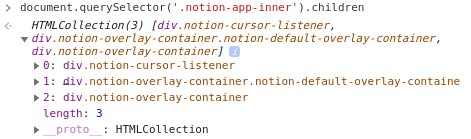

# 유사 배열 객체 (Array-Like-Object)

자바스크립트를 사용하다보면 분명 배열과 같은 형태를 지녔음에도 배열로서 접근이 안되는 배열을 만나봤을거에요 그러한 배열들은 보통 아래와 같은 형식을 가지고 있습니다.



이와 같은 형태의 배열을 유사 배열 객체라고 부르며 배열이 아닌 배열인척 하는 객체입니다. 이를 객체 형태로 바꿔서 작성해보자면 아래와 같은 형태가 되겠죠?

```jsx
let arr = {
	0: '0'
	1: '1'
	2: '2'
	length: 3
}
```

문자열, HTMLcollection, arguments, NodeList 등이 위와 같은 형태를 지니고있는 유사 배열 객체입니다.

유사 배열 객체에는 항상 length가 포함되어있고 배열 메소드를 전부 사용할 수가 없습니다. 배열 메소드중 immutable한 메소드 (slice, split, indexOf 등)는 사용이 가능하고 mutable한 메소드 (push, pop, sort 등)은 사용이 불가능합니다. 추가적으로 iterator 메소드(map, filter, reduce, forEach)도 사용이 불가능해요!

```jsx
let str = "String";

str.slice(); // 'String'
str.indexOf("r"); // 2
str.push("1"); // str.push is not a function
str.map(() => {}); // str.map is not a function
```

유사 배열 객체를 진짜 배열로 바꾸는 방법이 있습니다. ES6에 추가된 배열 메소드로 `Array.from()`을 이용하면 타입이 배열로 바뀌게 되요!

```jsx
let str = "String";
let isRealArray = Array.from(str);
console.log(isRealArray); // ['S','t','r','i','n','g']

isRealArray.push("hi"); // ['S','t','r','i','n','g','hi']
```
