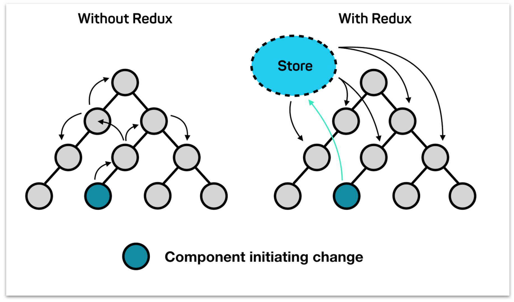
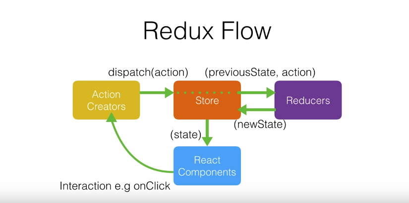

# Redux??

리덕스는 상태를 효율적으로 관리할 수 있도록 도와주는 상태 관리 라이브러리 입니다. 요즘의 웹 앱 어플리케이션은 관리해야 할 상태들이 많아지고 복잡성이 늘어남에 따라 보다 효율적이고 안정적인 상태 관리를 위해 리덕스와 같은 상태 관리 라이브러리를 사용합니다. 그 중 리덕스는 가장 높은 사용률을 가지고 있습니다. 보통 리액트에서 자주 사용되어 리액트를 위한 라이브러리라고 착각하지만 자바스크립트 환경이라면 사용가능한 라이브러리입니다. 이번 글은 리액트를 기준으로 작성합니다.

<br />
 
# 상태 관리가 왜? 필요한가요??



리액트의 데이터 흐름은 단방향이기 때문에 상위 컴포넌트에서 자식 컴포넌트로 상태를 전달 시키는 구조로 되어 있습니다. 만약 위의 사진처럼 복잡해진 컴포넌트들 관계 속에 상태를 변화 시켜 주려한다면 왼쪽의 모양 처럼 올라가고 내려가고 많은 컴포넌트를 거쳐 원하는 컴포넌트에 상태를 전달 시켜줍니다. 이 과정 속에 상위 컴포넌트가 리렌더링 된다면 그 자식 컴포넌트들도 불필요한 리렌더링이 발생하게 됩니다. 이러한 효율적인 문제 때문에 리덕스를 사용하기도 합니다.

그리고 복잡해진 컴포넌트 구조에 상태를 전달 시켜주면 코드가 지저분해지고 복잡해지는 문제가 있습니다. 리덕스는 하나의 스토어에 저장하고 불러오며 불필요하게 상태를 다른 컴포넌트에 전달 시킬 이유가 사라지며 단계 별로 파일을 만들어 관리하기 때문에 깔끔해지고 직관적인 코드를 작성하는데 이점이 있습니다.

<br />
 
# 리덕스의 흐름



리덕스는 위와 같이 단계 별로 진행됩니다. 단계 하나하나 개념적으로 작성해보도록 할게요!

<br />
 
## Action

상태의 변화가 필요할 때 저장소(Store)로 데이터를 보내기 위한 작업을 액션이라고 부릅니다. 액션은 하나의 객체로 구성되어 있고 그 안에는 필수적으로 Type이라는 필드를 가지고 있어야 합니다. Type과 더불어 변경 시켜 줄 데이터도 추가할 수 있습니다.

```jsx
{
	type: "ADD",
	num: 10
}
```

<br />
 
## Store

스토어는 리덕스를 관리하는 하나의 저장소입니다. 리덕스는 단 하나의 스토어를 가지는 것이 원칙이며 스토어 안에는 현재의 상태와 리듀서 함수 그리고 몇 가지 내장 함수들이 있습니다.

<br />
 
### Dispatch

디스패치는 액션을 스토어에 전달 시켜주는 스토어의 내장 함수입니다. 디스패치가 액션을 발생 시켜 스토어에게 상태 변화가 필요하다는 것을 알려줍니다. 스토어는 전달 받은 액션을 가지고 리듀서 함수를 실행시킵니다.

<br />
 
### Subscribe

구독은 함수를 전달 받아 디스패치 되었을 때 마다 함수를 실행시켜 주는 스토어의 내장 함수입니다. 이때 함수에는 리듀서에 의해 변한 데이터를 전달시켜 줍니다.

<br />
 
## Reducer

리듀서는 상태 변화를 이르키는 함수입니다. 리듀서는 현재의 상태와 액션을 파라미터로 전달 받습니다.

전달 받은 현재 상태와 액션을 참고하여 새로운 상태를 만들어 반환합니다. 구독을 했다면 디스패치 되어 리듀서에서 변경된 상태를 가져갑니다.

```jsx
const reducer = (state, action) => {
	swich(action.type){
		case 'ADD':
			return state += 1
		default:
			return state
	}
}
```

리듀서는 보통 swich문을 이용해 액션 타입에 맞는 로직을 작성합니다.

<br />
 
## 정리

다시 단계별로 어떤 일이 일어나는지 정리해보자면 타입과 데이터를 가진 **액션 객체**를 **디스패치를 통해 액션을 발생** 시켜 **스토어**에 알려주고 스토어는 전달 받은 액션을 토대로 **리듀서 함수를 호출**시키고 현재 상태와 전달 받은 액션을 파라미터로 전달 받아 **새로운 상태를 반환**시켜 **다시 스토어에 저장**됩니다.
