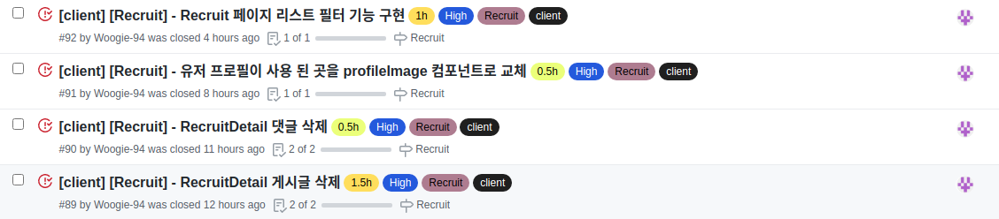

# Final Project #10

오늘은 지나고 보니 적은양의 결과물만 있는 것 같은 느낌이 들었다. 계속 어떻게 해야 효율적인가 생각만 하다보니 코드를 치는 시간이 줄어들었고 결과적으로 결과물이 적어졌다는 느낌을 받는 듯 하다. 하지만 이런 효율에 대한 고민을 하는 것이 좋은 습관이지 않을까? 라는 생각이 들기도 한다.

 
 
# 오늘 한 것

 
 
## 게시글 & 댓글 삭제

이 부분은 크게 어렵지 않았다 서버 측에서 전부 처리해 주기 때문에 해당 데이터의 id만 보내주면 말끔히 사라진다.

 
 
## 유저 프로필 이미지를 profileImage 컴포넌트로 교체

profileImage는 팀원이 만든 컴포넌트인데 댓글이나 여러 곳에서 사용하게 될 프로필 사진을 한 컴포넌트를 재사용하여 사용하게끔 만들었다. 간단하게 크기 마진 등을 props로 넣어주고 작성한 혹은 작성된 유저의 정보까지 넣어주어 이미지를 그려준다.

 
 
## 필터 기능 구현

처음에는 데이터를 불러와 그 데이터를 필터해서 화면에 출력하면 되겠다 싶었는데 한가지 간과한 사실이 있었다. 인피니티 스크롤을 이용하여 24개의 데이터만 가져오는데 24개의 데이터중 필터 된 값이 없으면 아무것도 생기지 않는 것이다. 그래서 어쩔 수 없이 서버에 필터 기능을 넣어달라 요청을 하게 되었다.

서버에서 준비가 다 되고 API 문서 토대로 작성했는데 자꾸 400에러가 뜨길래 뭐가 문제인가 싶었는데 단순한 오타가 문제였다! 모든 문제를 해결하고 필터가 잘 되는 것을 확인했는데 또 이어 문제가 생겨버렸다. 이번 문제는 인피니티 스크롤 관련된 문제였는데 데이터가 끝이 나면 더 이상 호출을 막아야 했다. 해서 데이터의 마지막임을 아는 방법 마지막 요소의 id가 1인가를 확인하는 방법 밖엔 없었다. 하지만 필터를 하게 된다면 id가 1인 요소가 필터가 될 가능성이 매우 높다. 결국 마지막임을 확인 할 방도가 없어 서버 측에게 마지막임을 알려주는 값도 같이 담아서 보내달라고 요청한 상태이다.

 
 
# 내일은

내일은 프로젝트 리스트 생성 설정 부분을 최대한 하루만에 다 끝내보도록 하려 한다!
