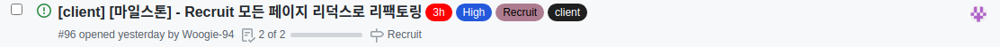

# Final Project #11

오늘 많은 작업을 할 예정 이였는데 예상치 못한 복병에 크게 당하고 말았다. 모든 비동기 코드와 상태 관리를 리덕스 툴킷을 이용하게 리팩토링을 진행했는데 순조롭게 진행하다가 마지막에 게시 글 리스트를 다루는 부분에서 큰 문제가 생겼다.

게시글 리스트는 인피니티 스크롤을 이용하여 구현했는데 인피니티 스크롤이 가능하려면 출력 된 게시 글들은 남아있고 새로 불러온 게시 글을 아래에 추가하는 방식으로 구현해야 했다. 하지만 리덕스를 이용하여 상태를 가져 오게 되면 원래 있던 게시 글 까지 새로 가져와 버려서 스크롤이 맨 위로 올라가 버리는 문제가 생겨버렸다. 여러가지 시도를 해보며 해결 방안을 모색해봤지만 결국 리덕스로 관리하지 않고 컴포넌트 내에서 데이터를 호출하여 상태에 저장하고 쓰는 방식으로 가기로 결정했다.

이 부분에서 시간을 너무 소요돼서 어제 예정했던 일정대로 진행하지 못하였다. 이런 일이 또 안 일어날 것이라는 보장이 없다. 예상치 못한 곳에서 시간을 많이 잡아먹고 계속해서 일정이 밀린다면 나 뿐만이 아니라 같이 프로젝트를 하는 팀원들 까지 피해가 가므로 모든 일정을 지금보다 빠르게 소화해야겠다고 생각이 들었다.

 
 
# 오늘 한 것

리덕스를 이용하여 비동기 코드와 상태 관리를 하기 위해 리팩토링을 진행하였다.

 
 
# 내일은??

회고 작성이 끝난다면 바로 스켈레톤 로딩을 구현하고 프로젝트 부분을 스타일링 할 것이다. 그리고 서버측에서 프로젝트 API가 마무리 되는대로 작업을 진행하고 그 사이의 시간 동안 앞서 만든 기능들을 점검하며 부족한 부분들을 찾아내고 보완하는 시간을 가지지 않을까 예상한다.
