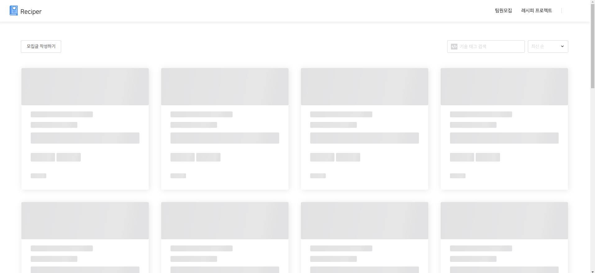
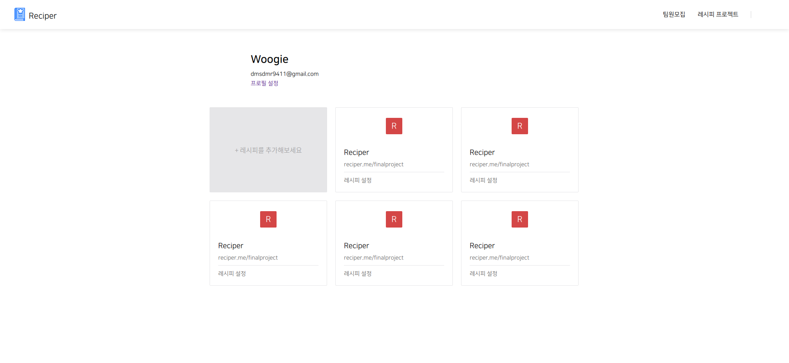

# Final Project #12

오늘은 예정대로 Skeleton Loading을 구현하고 나머지 페이지들 css 작업을 시작했다. 오늘은 진짜 순탄하게 갈 줄 알았는데 Skeleton Loading을 구현하는 와중에 머리가 터져버리는 문제가 생겨버렸다 내가 코드를 잘 못친 탓이니까 내 잘못이겠지... ㅠ

스켈레톤을 구현하는데 문제는 없었다. 하지만 인피니티 스크롤과 충돌이 있었다. 오류가 뜨는건 아니였지만 자바스크립트가 제공하는 intersection observer API를 이용해 인피니티 스크롤을 구현하여 화면 최하단에 옵저버 타겟을 심어뒀는데 스켈레톤에서 카드로 바뀌는 찰나의 순간에 옵저버 타켓이 위로 올라와서 감지가 되는 문제였다. 이를 어떻게 해결해야 할지 모르겠어서 일단은 보류해두고 css 작업을 하고 있다.

 
 
# 오늘 한 것

## Skeleton Loading 구현

이런식으로 뼈대를 그려주고 데이터 요청이 끝나면 실제 카드가 새로 생기는 형식의 로딩 방법이다. 보기엔 아주 이쁘고 맘에 드는데 문제 때문에 아주 슬프다...

 
 
## Project 페이지 css

Project 리스트가 보이는 페이지 css를 완료했다.

 
 
# 내일은??

project 쪽 API가 거의 완료되었다하여 아마 그걸 하지 않을까 싶다.
