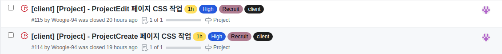
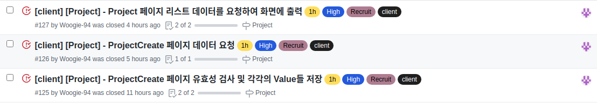
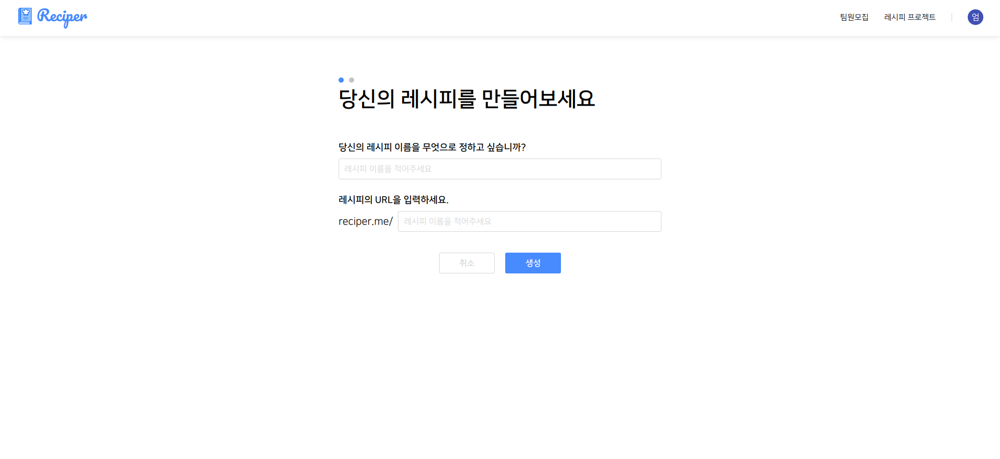
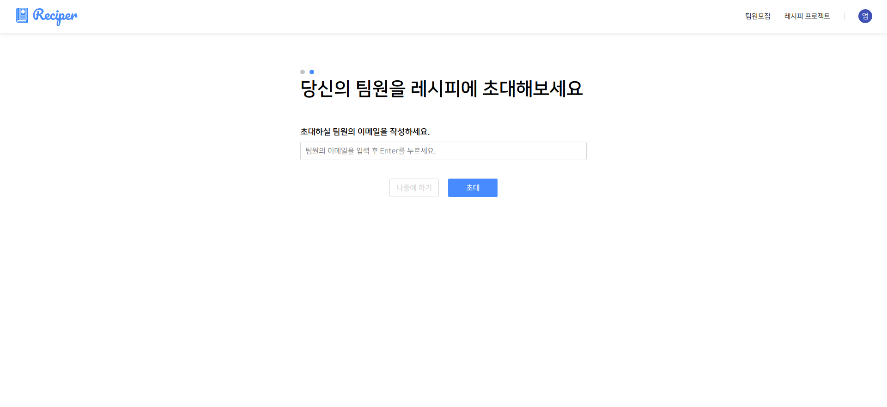
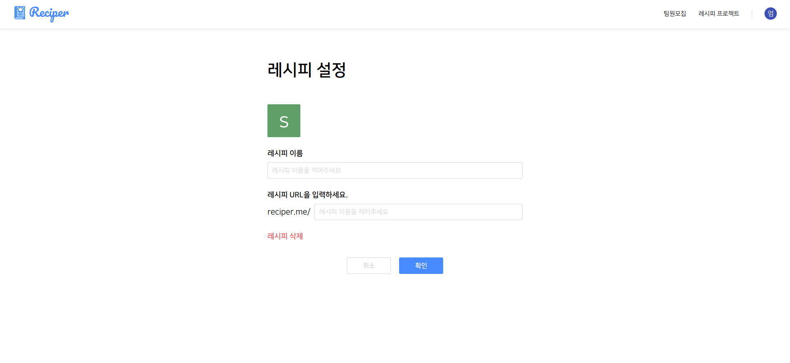

# Final Project #13

오늘은 Project에 관련된 3페이지를 서버까지 연결하여 끝냈다. 조금씩 세세하게 건드릴 부분만 남아있고 이 부분이 끝난다면 모든 페이지를 돌아보며 세세하게 추가해야 할 것들을 처리할 것 같다. 오늘은 크게 이슈가 없이 순탄하게 지나갔기 때문에 딱히 쓸 말은 없다.

 
 
# 오늘 한 것

오늘은 총 5개의 이슈를 처리 했다.

 
 
## ProjectCreate 페이지 CSS & 데이터 요청

디자인도 크게 힘들지 않았고 코드 로직을 짜는데도 어렵진 않았다. url에 사용하는 값에 특수문자나 공백이 들어가면 안되서 유효성 검사를 구현하였고 이메일도 마찬가지로 이메일 형식이 아니면 추가가 되지 않게 만들었다.

 
 
## ProjectEdit 페이지 CSS 및 데이터 요청

이 부분도 작성된 데이터를 가져와 input에 채워주고 수정된 value를 다시 서버로 보내주는 페이지이다.

 
 
# 내일은??

내일은 project 페이지들의 세세한 사항들을 보완 수정할 것이고 로그인부터 전반적으로 이상한 점이 없나 확인 후에 보완하지 않을까 싶다.
