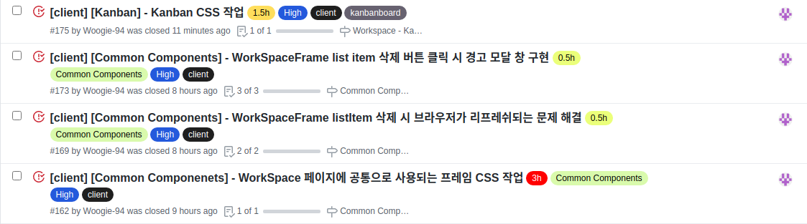

# Final Project #15

오늘은 드디어 우리 프로젝트의 핵심인 WorkSpace 부분을 시작했다. 먼저 모든 WorkSpace 공간에 사용되는 프레임을 제작해야 해서 새벽에 css 작업과 여러 기능들을 구현 했고 나중에 다시 돌아와 버그를 고치는 일이 없도록 여러 상황을 테스트해 최대한 버그가 생기지 않도록 신경을 썼다. 하지만 나중에 무언가 버그가 터지겠지... 그리고 나선 KanBan 보드를 디자인 했다. css 작업은 그렇게 오래 걸리지 않는데 항상 작명과 기능 구현을 어떻게 해야 하나 고민하느라 시간이 훌쩍 가는 것 같다.

 
 
# 오늘 한 것

 
 
## WorkSpaceFrame

WorkSpace 공간은 모두 이 프레임을 사용하게 되고 커다란 빈 공간이 각각에 맞는 컨텐츠가 들어갈 공간이 된다. 아이콘을 고르는 과정에서 먼저 설치해둔 아이콘 라이브러리인 React Icons를 살펴 봤는데 같은 주제의 아이콘들이 있었지만 생긴게 너무 맘에 들지 않아 굳이 다른 라이브러리를 설치하여 다른 아이콘을 가져 왔다.

앞서 개발한 부분에서 느낀 점이 있는데 개발을 다 했다 생각해도 다음에 보면 무언가 문제가 생기거나 부족한 부분이 보여서 수정하느라 계속해서 흐름이 끊기는 상황이 발생했는데 이번에는 최대한 이런 문제를 줄이려고 여러 상황을 테스트하고 문제 될 점이 없을지 사용자에게는 편할지 생각하며 만들었다.

 
 
## Kanban

Kanban 페이지도 마찬가지로 디자인 시안대로 작성했다. 디자인 시안에는 테스크 박스 추가하는 부분이 없어서 즉석으로 만들었다. 이제 Beautiful DND 라이브러리를 이용하여 드래그 앤 드랍 기능을 구현해야 한다.

 
 
# 내일은??

아마 내일은 칸반에 모든 시간을 쏟을 것 같다 내일 하루 만에 끝내고 싶은 마음이 굴뚝 같지만 아마 그렇게까진 못하지 않을까 싶다!
