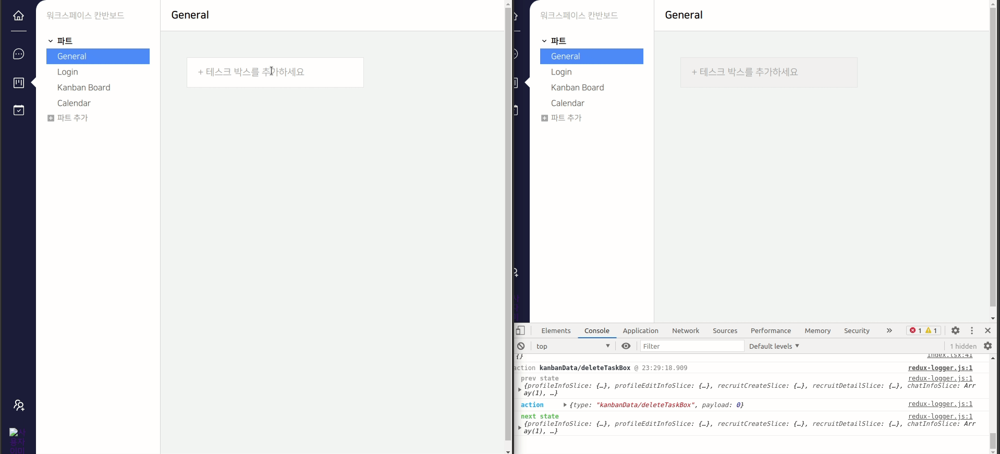

# Final Project #17

새벽부터 하루 종일 실시간 협업을 위해 칸반 페이지를 Socket.io를 이용해 변화가 있을 때 마다 칸반 페이지에 있는 모두에게 실시간으로 반응이 가게끔 만드는 작업을 했다. 서로 변화가 일어날 때 바로바로 체크해야 해서 백엔드 분과 페어프로그래밍으로 진행했다.

 
 
# 오늘 한 것

새벽부터 자는 시간 쉬는 시간을 제외하고 15시간 이상을 소요하여 기능을 구현했다. 쉽게 가는 방법도 있었지만 만일의 버그를 막기 위해 꼼꼼한 길을 택해서 좀 어려웠던 것 같다. 쉬운 길을 택하지 않은 이유는 만일 내가 Task를 드래그 중일 때 페이지 전체에 변화가 생긴다면 에러가 생기지 않을까 하는 생각이 들어서 데이터 전체를 바꾸지 않고 변화가 있는 부분만 갈아 끼우는 방식을 택했다. 역시 이게 어려운 길이였고 구현 중이 많이 지치기도 했다.

 
 
# 내일은??

이제 다른 사람이 드래그 중인 아이템에 드래그 중임을 표시하고 선택을 못하게 막는 기능을 구현할 예정이다!
