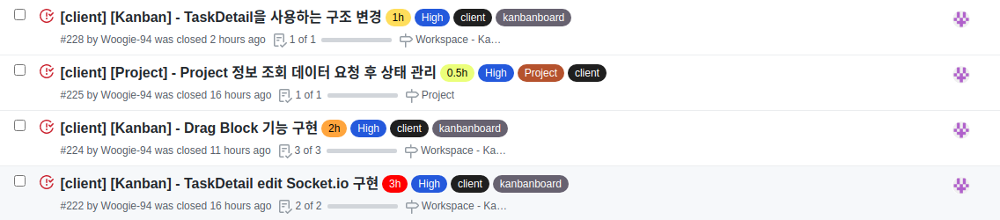

# Final Project #18

오늘은 하루 목표를 정해두고 무엇을 할 지 팀원들과 공유를 하고 하루를 시작했다. 오늘 내가 맡은 것은 TaskDetail 페이지 내의 모든 소켓을 구현하는 일이다. 결과로 말하자면 모두 구현에 성공했지만 마지막에 드래그를 막는 부분에서 한가지 오류를 찾게 되어 수정해야 하는 단계이다.

 
 
# 오늘 한 것

 
 
## Socket.io를 이용해 kanban 실시간 통신 완료

전날 추가 삭제 드래그앤드랍 등 실시간 통신을 완료하였고 오늘은 Task 수정과 다른 유저가 아이템을 이동 및 수정 하였을 때 드래그 이벤트를 막아야 할 것 같아 추가로 구현하였다.

드래그를 막는 부분에서 조금 애를 먹었는데 구현하는 로직은 크게 어렵지 않았지만 여러 예외 상황들을 처리하려다 보니 하나를 해결하면 다른 하나가 문제가 되고 문제를 막으면 또 다시 해결한 문제가 막히는 등 머리가 아주 어지러워졌다.

구현을 하면서 이 전에 만들어둔 액션을 재사용 했는데 코드를 다시 돌이켜 보니 Task를 추가하는 액션에 드래그 로직이 들어가는 등 보기에도 어지럽고 정신 없는 코드가 된 것 같아 수정을 하고 싶은 생각이 들었다.

 
 
# 내일은??

kanban의 모든 기능을 완성 시킬 예정!!!
