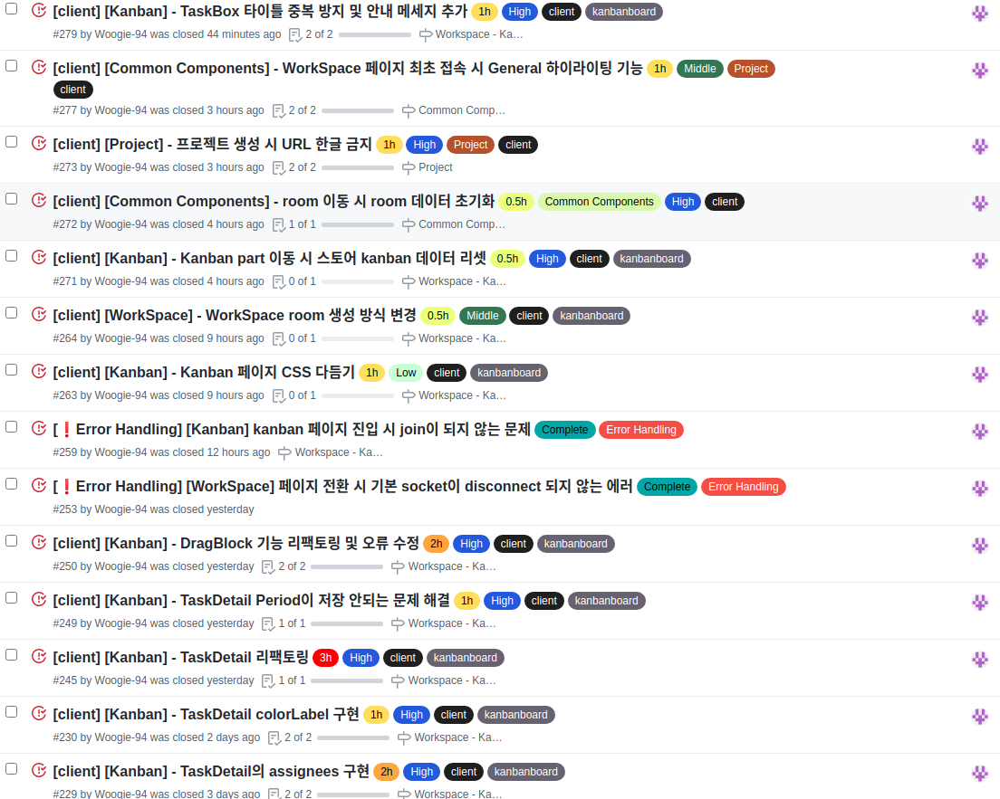

# Final Project #19

계속 꼬리에 꼬리를 무는 에러들과 기한이 얼마 남지 않았다는 압박감에 최근에 TIL을 올리지 않았다. 몇일 동안 에러만 처리한 게 아니라 엄청 많은 기능과 세세한 부분들을 추가, 수정이 이뤄졌다. 매번 에러를 만나거나 뜻하지 않은 상황을 마주하면 테스트 코드의 중요성과 단위 테스트의 필요성을 느끼게 된다.

단위 별로 문제 없음을 확인하고 넘어가야 하는데 곧 무너질 모래 성을 쌓는 것 마냥 기반을 다지지 않고 하나 하나 쌓다 보니 하나가 잘못 되어도 연속적으로 문제가 생기는게 아닌가 싶다.

 

# 몇일 간 한 것

이렇게 해서 Kanban 페이지의 모든 기능을 만들었다

 

# 내일은??

캘린더 부분을 시작하지 않을까 싶다. 그 전에 서버 에러를 두개 더 발견해서 해당 부분을 전달하고 시작해야 한다.
