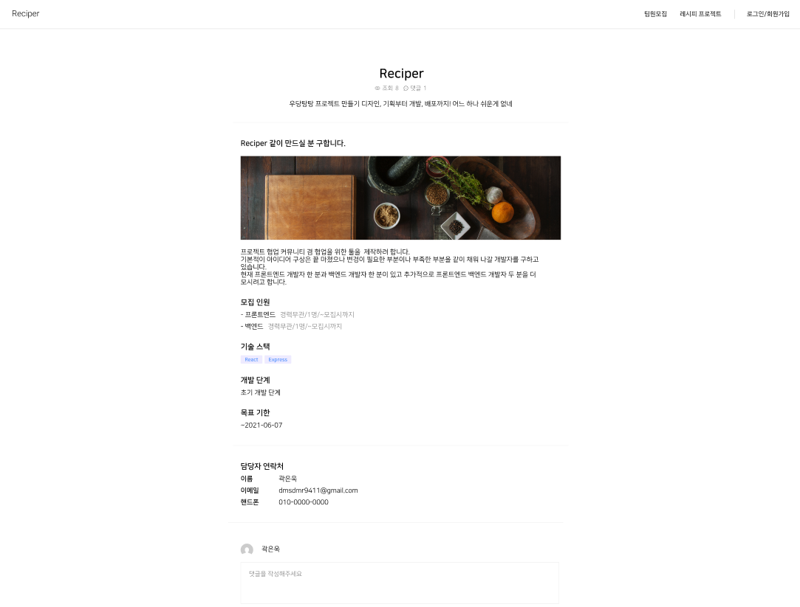
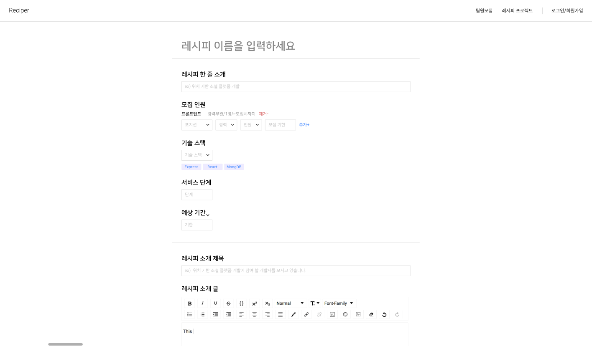
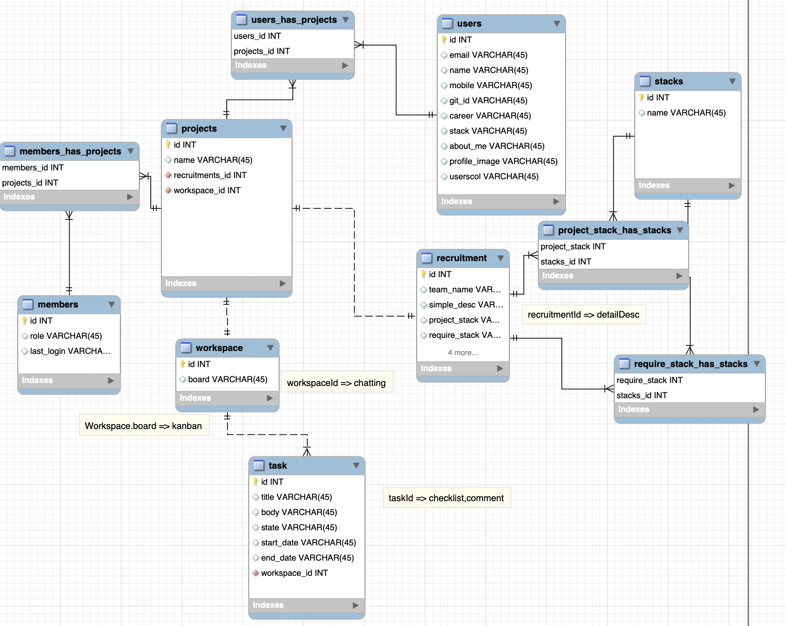

# Final Project # 2

오늘도 역시 어제에 이어 디자인 작업을 했다. 디자인에 시간을 많이 쓰는 것 같아서 두명은 따로 스키마 모델을 작업하러 갔다. 디자인 작업은 두명이서 한 페이지를 하는 거 보다 각자 한 페이지씩 만들고 결과를 보고 조율하는 식으로 작업을 진행했다.

 
 
# 회의 내용

## 디자인

디자인엔 자신이 없어서 최대한 색상을 안쓰고 심플하게 디자인했다. 디자인은 해보지 않은 분야여서 자신이 없었다. 그래서 최대한 심플하게 하자는 의견을 어필했고 위와 같은 작업물이 나왔다.

 
 
## 스키마 모델

나머지 두분이서 만드신 스키마 모델이다. Mysql과 MongoDB을 상황에 맞게 섞어서 사용할 것 같다.
