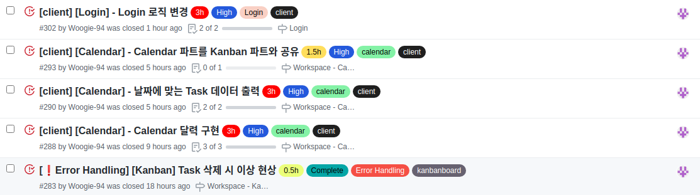

# Final Project #20

오늘은 예정대로 Calendar 페이지를 시작했다. Calendar에 사용 될 달력 데이터와 Task를 뿌려주기 위해 날짜에 맞게 하나하나 쪼개서 달력 데이터 날짜에 맞게 넣어줘야 했다. 달력 데이터를 만들기 위해 Day.js 라이브러리를 이용했고 Task 데이터를 가져오기 위해 Kanban에서 사용한 Socket을 이용해 동일한 데이터를 가져오도록 Socket을 재 사용 했다.

그리고 백엔드 팀원들이 리프레쉬 토큰을 이용해 토큰을 재발급 하는 로직을 작성하기 위해 로그인 부분을 다시 확인하였는데 아주 심각한 문제가 있음을 발견하였다.

로그인이 성공적으로 요청 되었음을 알기 위해 로컬스토리지에 상태를 저장했고 스토리지에 해당 값이 들어 있으면 다른 로직이 실행되게 끔 작성 했었다. 하지만 의도와는 달리 렌더링 시 로컬스토리지를 늦게 가져와 원하는 상황이 이뤄지지 않아 일단은 setInterval을 주어 계속해서 시도하게 만들어두고 다른 페이지로 넘어갔었다.

```jsx
useEffect(() => {
  setInterval(() => {
    setSuccess(window.localStorage.getItem("loginInfo"));
  }, 0);
}, []);
```

프로젝트 초반에 작성한 부분이라 일단 넘어 갔는데 다시 보니 문제가 생기지 않을까 싶어서 여러가지 시도를 해봤는데 역시나 로컬스토리지로 접근하는 방식 자체가 잘 못 되었다는 판단이 되었고 결국 로그인 부분을 리덕스 썽크로 비동기 요청을 하고 요청이 끝나면 로그인이 되었다는 것을 알릴 수 있도록 상태를 저장하여 다른 곳에서도 감지할 수 있도록 변경하였다.

다행히 한번에 성공했고 다음부턴 로컬스토리지를 저런 방식으로 사용하지 않아야 한다는 것을 알게 되었다.

<br />
 
# 오늘 한 것



5개의 이슈를 처리 했고 아주 중요한 로그인 부분을 완벽하게 수정해서 만족스럽다. 하지만 오늘 목표인 calendar 부분을 조금 덜해서 덜 만족 스러우니 쌤쌤이다!

<br />
 
# 내일은??

진짜 진짜 Calendar 70% 이상 완료!!
