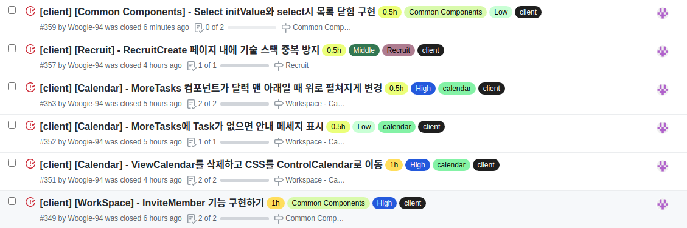
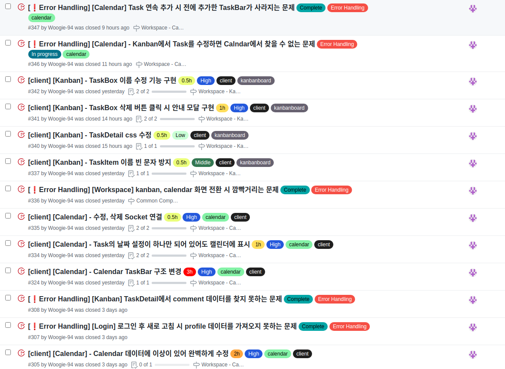
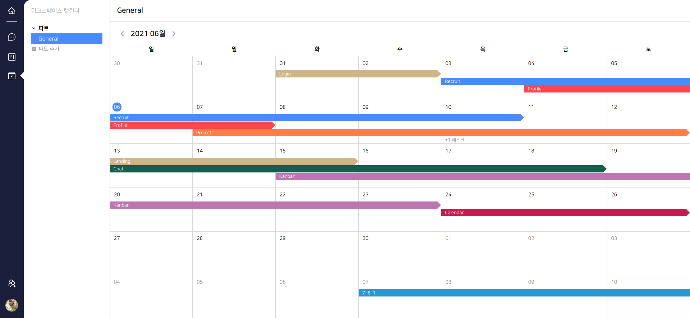
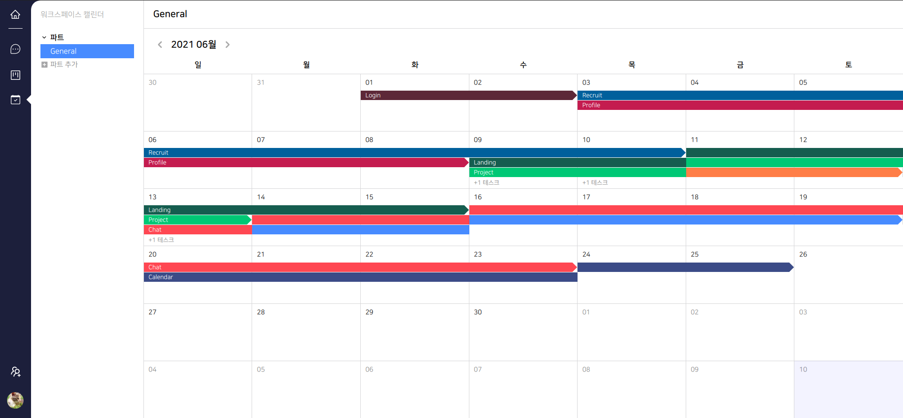
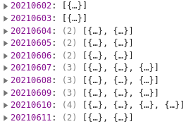
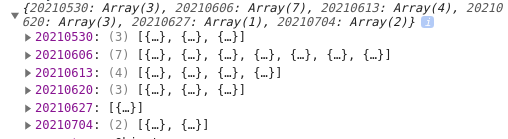
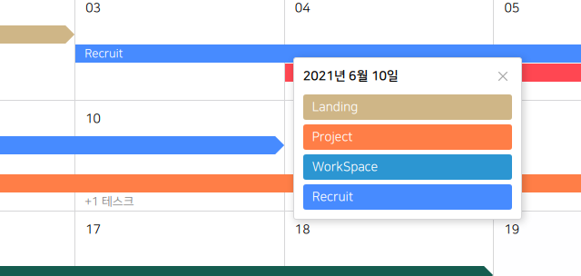
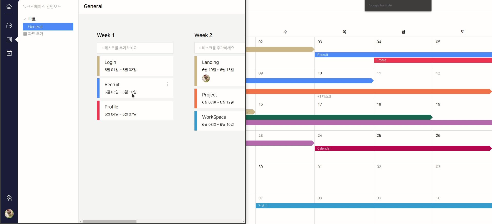
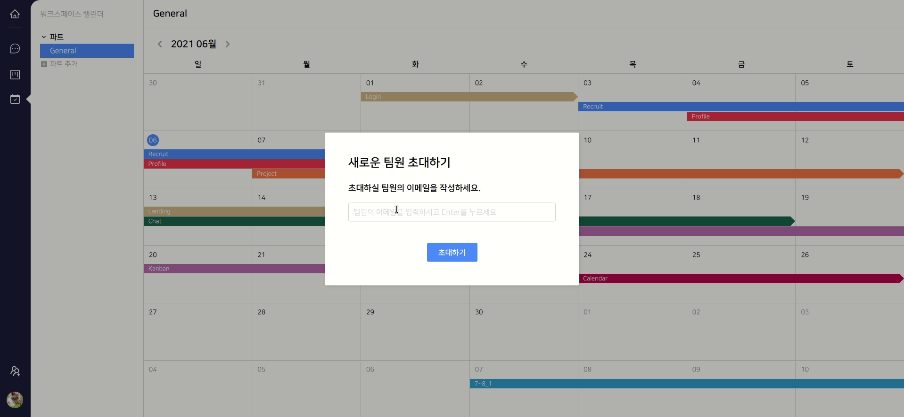

# Final Project #21

하루에 4시간씩 잠을 자며 프로젝트 막바지를 달리고 있다. 처음부터 너무 여유를 부리며 달려오지 않았나 싶다. 잠을 자는 시간 외에는 계속 어떻게 코드를 작성할지 생각 뿐이라 회고를 쓸 생각조차 못하고 5일이나 흘러 버렸다. 처음에 매일매일 회고를 쓰자는 다짐을 어디로 사라졌는지 모르겠다.

5일 이라는 시간 동안 나는 엄청 많은 것을 해냈다. 일단은 Calendar 페이지 구현에 성공했고 마무리 단계여서 프로젝트 전체를 돌아다니며 부족하거나 보완해야 할 것들을 찾아내 수정했다. 물론 아직 다 끝나진 않았다. 목표는 일요일까지 모든 것을 완료하는 것이다.

 
 
# 그동안 한 것

엄청나게 많은 이슈를 처리 했다. 그 중 중요한 부분만 쏙쏙 뽑아서 작성해보겠다.

 
 
# Calendar

우성 제일 큰 성과는 Calendar 구현에 성공 했다는 것이다. Calendar 페이지는 크게 어려움이 없을 것이라 생각을 했지만 나의 크나 큰 착각 이였다. 실제로 구현하는데 크게 어려움을 느끼진 못했다 하지만 데이터 구조를 잡는 부분이 나의 발목을 잡아버린 것이다.

 
 
### 문제 발생

Calendar를 처음 구현했을 때는 이런 모양 이였다. Day라는 일 단위 컴포넌트에 날짜에 맞는 Task를 하나씩 넣어줌으로 서 멋진 Calendar를 만들 수 있겠구나 싶었지만 index가 달라져 TaskBar가 한 줄로 이어지지 않고 아주 난잡하고 지저분하게 될 것이란 생각조차 하지 못했다.

결국 데이터 구조를 바꾸는 방법 밖에는 없다고 판단하여 결국 처음부터 코드를 다시 훑어보며 무엇이 문제이고 어떻게 구조를 잡아야 할지 생각하는데 시간을 많이 소비했다. 거진 저녁부터 다음 날 아침까지 붙잡고 있었으니 하루를 날린 셈 이였다.

 
 
### 문제 해결

문제는 위에서도 언급했지만 간단하게 말하면 일 단위 데이터에 날짜가 포함되는 Task를 넣어주어 index가 달라 짐에 따라 TaskBar의 위치도 달라지는 게 문제였다.

일 단위 데이터에 Task 데이터를 넣은게 문제라면 주 단위 데이터로 관리하면 되지 않을까 문득 떠올라 그대로 코드를 작성했다. 주 단위에 포함된 Task를 모아 시간 순으로 배열에 넣어주고 Calendar에 index 별로 position을 주어 층을 만들어 주었고 주의 시작 날짜와 Task 시작 날짜 그리고 끝나는 날짜를 고려하여 좌우 위치와 Bar의 크기를 잡아주었다. 그리고 주 단위 컴포넌트 높이의 한계가 있으므로 3번째 Task까지 보여주게 만들었다.

그럼 4개 이상의 Task가 들어가면 어떻게 해결해야 하나 싶어 잘못된 구조였던 일 단위 데이터를 다시 가져와 몇 개의 테스크가 더 있는지 표시를 해주고 해당 날짜를 눌렀을 때 포함된 Task를 모달 형식으로 띄우게 만들었다.

 
 
### 아쉬운 점

솔직히 아직 완벽한 구조는 아니다. 지금 보면 한 라인에 한 개의 Bar만 보이는데 더 완벽한 모양은 끝난 Task가 있고 그 뒤로 들어 갈 Task가 있으면 한 라인으로 쭉 보여주는 것이 완벽한 모양이다. 하지만 프로젝트의 기한은 정해져 있고 끝이 거의 왔기 때문에 일단 여기서 타협을 하고 넘어가지만 조만간 다시 시도해볼 예정이다!

그리고 일 단위 컴포넌트를 누르면 나오는 MoreTasks에서 Task를 누르면 해당 Task의 Detail을 띄우고 싶다. 이것도 역시 시간과의 문제 때문에 타협하고 넘어갔지만 제일 넣어야하는 1순위가 아닐까 싶다.

 
 
### 잘한 점

Calendar의 데이터는 기본적으로 Kanban의 데이터를 가져오기 때문에 Kanban의 데이터가 바뀌면 Calendar의 모양도 바뀌게 되어 있다. 그렇다면 Kanban에 데이터가 실시간으로 수정되어 있다면 Calendar도 마찬가지로 실시간 수정이 되어야 한다 생각해 Calendar에서 사용한 Socket을 재 사용해 실시간으로 바뀌게 만들었다.

 
 
# InviteMember

WorkSpace 내에서도 멤버를 추가할 수 있도록 초대 기능을 만들었다. 이전에 사용한 로직을 재 사용했기 때문에 크게 어렵거나 문제가 될만한 건 없었다.

 
 
# 내일은??

내일은 로그인 하지 않은 유저가 접근할 수 없는 페이지들에 AuthChecker 기능을 넣어 접근하지 못하게 만들고 로그인 시 약간의 시간이 걸리는데 이를 로딩 애니메이션을 이용해 사용자가 지겹지 않도록 만들어 줄 예정이다.
