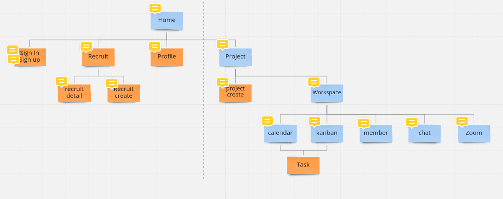
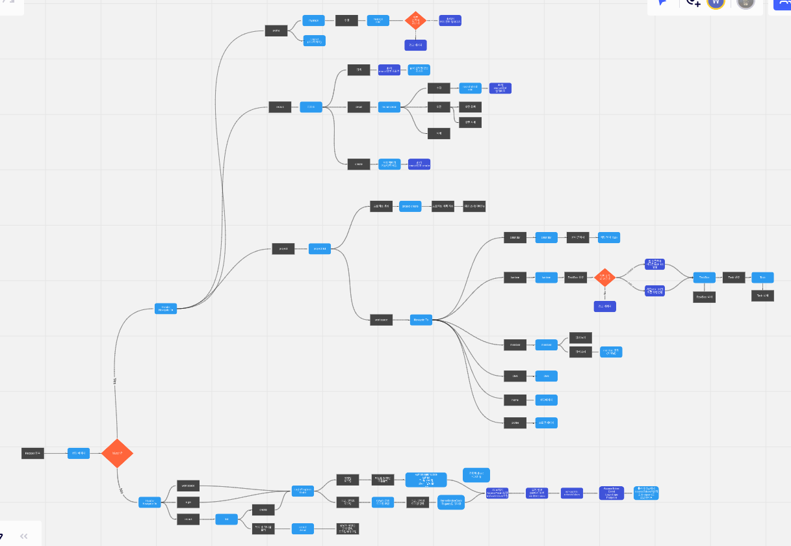
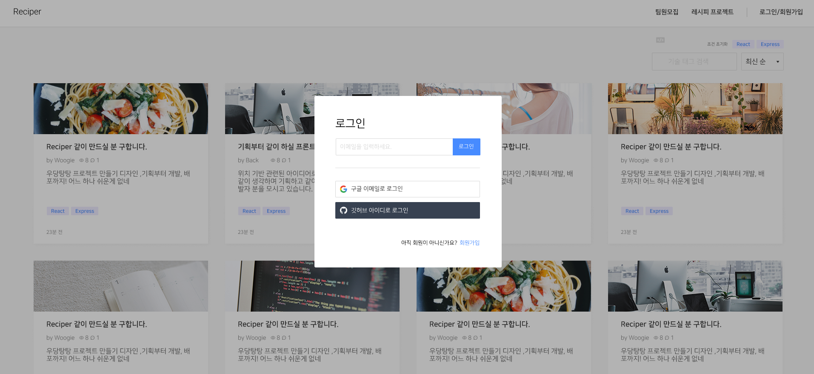
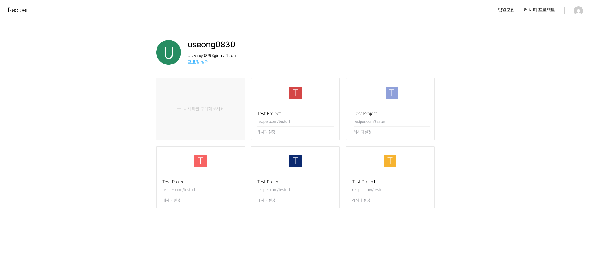
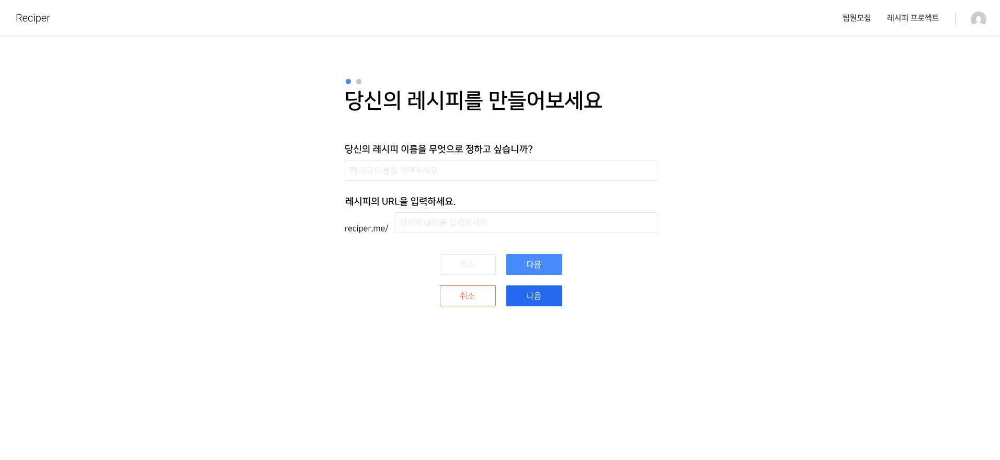
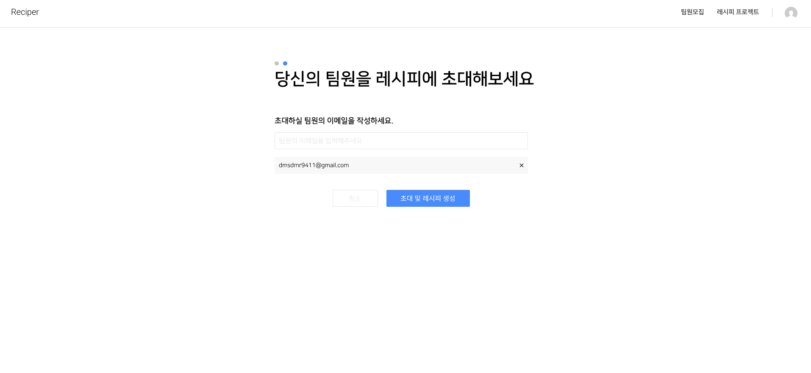

# Final Project #3

오늘부터 다시 파이널 프로젝트에 대한 회의를 진행했다. 이전의 경험이 있어서인지 퍼스트 프로젝트보다 빠르게 진행하여 시간을 단축 시킨 느낌이 든다. 파이널 프로젝트는 퍼스트에서 축적된 경험을 토대로 보다 완성도 높은 프로젝트가 완성되지 않을까 기대감과 동시에 기획한 아이디어의 볼륨이 너무 커서 기간 내에 완성하지 못하면 어쩌지라는 걱정이 들기도 한다.

 
 
# 오늘 한 것

## 사이트 맵 점검

퍼스트 프로젝트 전에 만들어둔 사이트 맵을 시간이 지난 시점에서 다시 한번 점검해보는 시간을 가졌다. 퍼시트 프로젝트를 통해 프로젝트를 진행하면서 얻은 경험이나 새로운 시선으로 점검을 해보는게 맞다고 생각했다. 역시 몇 군데 수정이 이루어졌다.

 
 
## 플로우 차트

사이트 맵을 수정하고 나선 사이트가 어떻게 흘러갈지 유저의 흐름대로 플로우 차트를 그리는 시간을 가졌다. 플로우 차트를 복잡하게 작성할 수도 있었지만 그냥 우리의 생각을 정리한다는 생각을 가지고 간단하게 작성했다. 엄청 자세하게 차트를 그렸다면 크기가 결과물의 두 배는 되지 않았을까??

 
 
## 디자인

이번에 작업한 디자인은 로그인 모달창과 진행 중인 프로젝트를 보여주는 페이지, 그리고 프로젝트를 만드는 페이지 총 3페이지를 작업했다. 이번 작업은 프론트 팀원과 같이 의논하며 작업했다. 아마 디자인은 내일까지 쭉 할 것 같다.

 
 
# 내일은?

내일은 파트너 기업에서 자기 회사를 발표하고 해당 기업에서 프로젝트를 하는 기업 협업 프로젝트 발표 시간이 있는 날이지만 우린 이미 4명의 팀원들이 다 같이 파이널 프로젝트를 진행할 생각이라 아마 발표를 듣지 않고 디자인 작업이나 우리 프로젝트에 필요한 시간을 각자 가질 것 같다. 나는 계속 디자인 작업을 하지 않을까 싶다.
