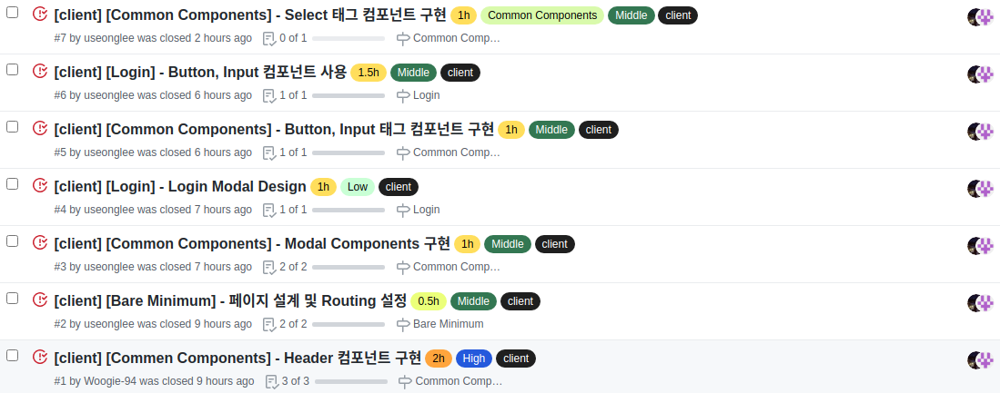
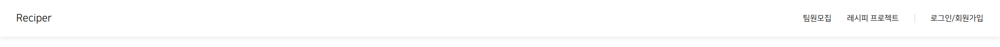
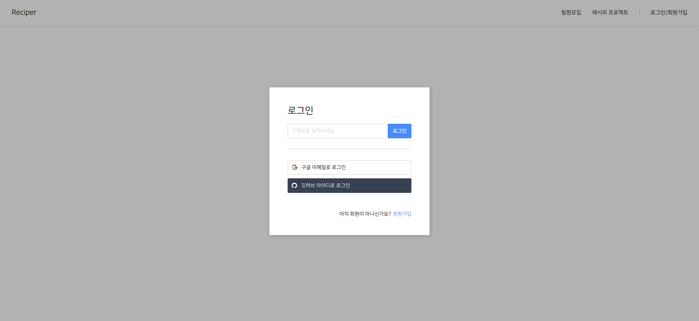

# Final Project #5

오늘은 드디어 코드를 치는 시간이 시작 됐다. 기획도 물론 재미는 있지만 너무 어려웠고 힘들어서 지친다는 느낌을 받았는데 개발을 시작하니 역시 개발이 재밌는게 맞구나라는 생각이 들었던 하루였다. 오늘은 프론트 팀원과 둘이서 페어를 하며 진행했다. 페어 프로그래밍을 진행하니 도중 도중 딴 짓을 안하게 되어서 속도가 오히려 빨랐던 것 같다.

<br />
 
# 오늘 한 것

## 이슈 목록



오늘은 총 7개의 이슈를 해결 했다. 순서대로 적어보겠다.

<br />
 
## Header



많은 페이지에서 사용 될 Header 컴포넌트를 만들었다. 로그인 버튼을 누르면 로그인 모달이 나오도록 구현 했고 모달도 이곳 저곳 활용 될 컴포넌트라 재 사용성을 고려하여 제작하였다. 추후에 로그인 상태가 저장되면 로그인/회원가입 부분을 프로필로 바꾸는 로직을 추가로 작성 할 예정이다.

<br />
 
## 페이지 설계 및 Routing 설정

원래는 초기 설정할 때 같이 작업해줘야 했는데 빼 먹은 부분이 있어 추가로 이슈를 생성하고 작업했다. 초기 설정도 이슈로 만들고 작업했어야 했는데 개발 할 생각에 신이 나서 인지 까먹고 작업을 해버렸다.

<br />
 
## Modal

위에서 언급 한 것처럼 Modal도 재사용 가능하게 컴포넌트를 제작했다.

```jsx
import React, { ReactNode } from "react";
import { Dimed } from "./styles";

interface Props {
  children: ReactNode;
  setShowModal: React.Dispatch<React.SetStateAction<boolean>>;
}

const Modal = ({ children, setShowModal }: Props): JSX.Element => {
  return (
    <>
      <Dimed onClick={() => setShowModal(false)} />
      {children}
    </>
  );
};

export default Modal;
```

대단한 로직은 아니지만 재사용성을 고려하여 컴포넌트를 제작했다는 점에서 아주 만족하고 있다. 오늘은 이것 외에도 재사용성을 고려한 컴포넌트들을 다수 제작했다.

<br />
 
## Login Modal



Modal 컴포넌트에 제작한 Login Modal을 children으로 넣어주면 위와 같이 완성된다. 디자인 시안을 먼저 작업해둬서 CSS 작업은 진짜 빠르게 진행된 것 같다.

<br />
 
## Button, Input 컴포넌트

디자인 작업을 할 때 여러 곳에 사용 될 인풋과 버튼들을 재사용을 고려하여 최대항 통일 시켜 디자인 작업을 진행했다. 하나의 버튼과 인풋 컴포넌트로 이곳 저곳 사용 할 수 있도록 제작하기 위해 그렇게 설계를 하였는데 아주 성공적이라 생각하고 있다. 어디서든 컴포넌트를 불러 와 지정된 props만 전달 해 준다면 사용이 가능하다.

<br />
 
## Select 컴포넌트

Select 컴포넌트는 HTML 태그인 select의 디자인을 바꾸려고 찾아 봤지만 방법이 없어 그냥 새로 제작을 하는 편에 맞겠다 싶어 구현을 했다. Select 컴포넌트도 재사용을 고려하여 제작하였다.

<br />
 
# 내일은??

내일은 본격적으로 본 페이지의 css 작업을 시작할 것 같다.
