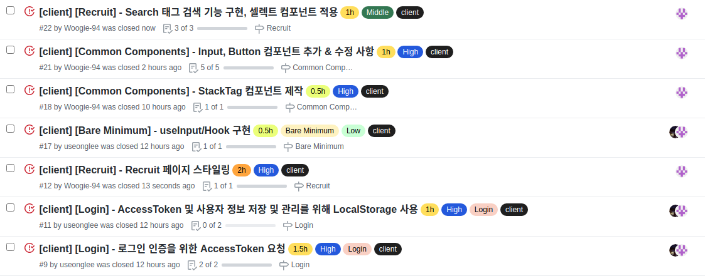
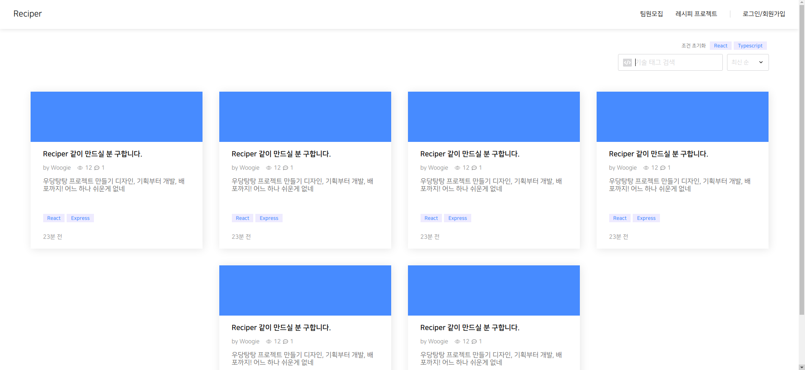

# Final Project #6

5월 12일 오늘은 어제 서버와 간단히 연결 시킨 로그인 로직을 조금 더 다듬는 것부터 시작했다. 이 시간은 프론트 팀원 한 분과 페어로 진행했으며 이후로는 각자 분배한 페이지의 스타일을 하러 갔다. 오늘은 큰 기능들 보단 어제 만든 기능들을 수정 & 추가하며 css 작업을 주로 한 날이였다. 어제 성공적으로 만들었다 생각했던 공용 컴포넌트가 막상 사용하려고 보니 한 두 가지 부족한 것들이 보였다. 간단한 것들이라 수정 작업을 거쳤지만 역시 아직은 보는 눈이 아직 낮다는 생각이 들었다.

  
 
# 오늘 한 것

오늘도 어쩌다 보니 이슈 7개를 처리 했다. 오늘도 순서대로 보겠다.

  
 
## 로그인

#9 #11 번 이슈에 해당하는 부분인데 어제 성공적으로 서버와 연결에 성공하는 것을 확인 후 각자 할 일을 마루리 했던 터라 accesstoken을 따로 저장하는 로직을 작성하지 않았다. 로그인 로직 부분을 다듬으면서 추가하면 되겠다 싶어서 한번에 두 가지 일을 척척 해냈다.

  
 
## Recruit 페이지 스타일링

디자인 시안대로 작업했는데 폰트 크기가 실제 웹에서 보니까 너무 작은 것들이 있었다. 앞으로 픽셀 크기는 최소 마지노선을 14px로 잡고 디자인을 해야겠다.

Card를 flex로 나열해보니 문제가 생겼다. 바로 저 중간에 박혀있는 애매모호한 2개의 card다 저 문제는 급한 문제는 아니라 생각하여 차근차근 해결해 나가려 한다.

  
 
## StackTag 컴포넌트 구현

공용 컴포넌트 제작 때 미쳐 생각하지 못했던 컴포넌트가 있었는게 그것이 StackTag였다. 사이트 이곳 저곳에서 많이 사용 될 예정인데 이걸 까먹어버리다니... 딱히 엄청난 기능이 있지 않아서 만드는데 5분 밖에 걸리지 않았다.

  
 
## Input, Button, Select 기능 추가 및 수정

어제 성공적으로 만들었다 생각한 공용 컴포넌트가 막상 사용하려고 보니 빼 먹은 부분이나 추가해야 하는 부분이 보였다. input과 button이 나열되어 있으면 마진을 주어 떨어트려야 하는데 이 부분을 조절하는 옵션이 없어서 추가해주었고 이벤트 함수를 전달 받아 사용하게 끔 제작해야 했는데 이 부분도 미쳐 생각하지 못해 따로 추가를 하였다.

Select 기능은 박스를 눌렀을떼 option을 담은 박스가 생기는데 이 박스가 다시 Select 박스는 누르기 전까지 사라지지 않아 지저분해 보였다. 어떻게 사용자가 누르지 않아도 닫히게 만들 수 있을까 생각을 하다 마우스 이벤트를 주어서 Select 영역 밖으로 나가게 되면 닫히게 만들면 되겠단 생각이 들어서 바로 코드로 옮겨 적었다. 하지만 우리 디자인은 Select 박스와 option 박스의 공백이 있었고 option 박스에 마우스가 올라가기 전에 닫혀버리는 문제가 생겼다. 이를 해결하기 위해 30분 넘게 사투를 벌였지만 결국 공백을 없애는 방향으로 타협을 했다.

  
 
## Search 태그 검색 기능 구현

기술 태그 input 창에 기술 태그를 적고 엔터를 누르면 태그가 생성되어 글 목록 중 태그에 맞는 글들만 필터를 해주는 기능인데 아직 서버와 연결할 단계는 아니라 태그가 생성되는 부분까지 구현을 하였다.

  
 
# 내일은??

일단 오늘 자기 전까지 Recruit 페이지 스타일링을 모두 끝내고 내일 부턴 서버와 연결하는 작업을 하지 않을까 싶다.
