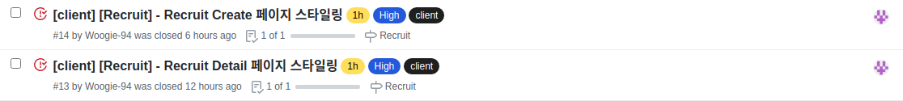
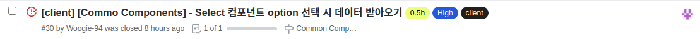
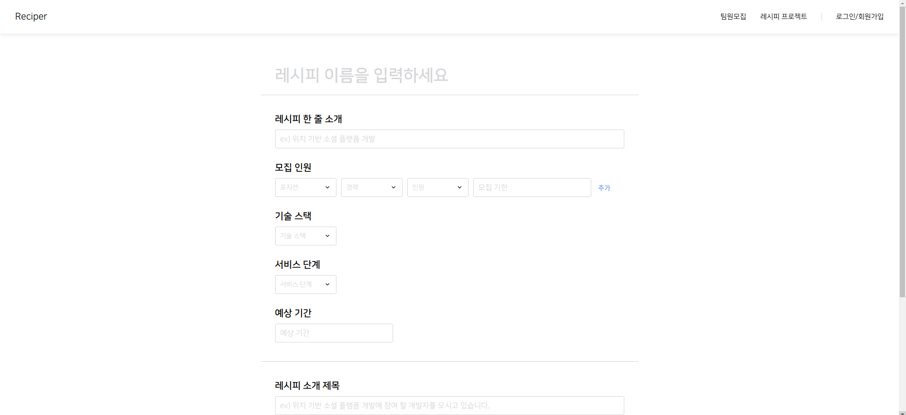
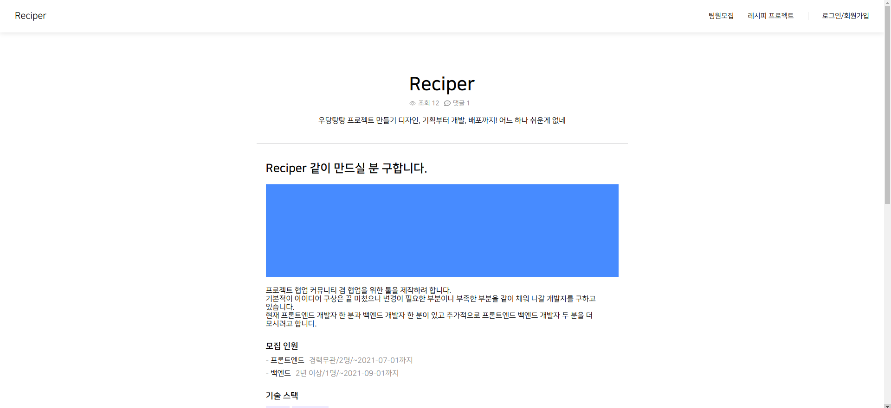

# First Project #7

5월 13일 오늘은 드디어 서버와 연결을 하는 로직을 작성했다. 하지만 입력 폼 예외 처리, 기술 스택 검색 기능 만들기 등등 세세하게 필요한 기능들이 눈에 들어와서 서버와 연결 시 이상이 없음만 확인하고 바로 이것 저것 추가 기능을 만드느라 바빴던 하루였다.

 
 
# 오늘 한 것

총 3개의 이슈를 해결 했고. 이슈 외에도 많은 걸 했다. 서버와 단순하게 연결하여 주고 받는 데이터에 이상이 없는지 체크하여 자잘한 문제들을 해결하였고 작성 페이지에 세세한 사항을 수정하고 있는 중이다.

 
 
## 페이지 스타일링

두 페이지의 디자인을 마무리 했다. 자꾸 CSS 작업을 하면서 로직을 어떻게 짜야하는지 구상하느라 시간이 좀 더딘 부분이 있었다. 그리고 스타일 컴포넌트 명을 짓는데 시간이 많이 소요되기도 했다. 디자인 시안대로 구현하면 되는 거라 어렵지도 않고 오래 걸리지도 않을 것이라 생각했지만 작명이 나의 발목을 잡았다. 다음엔 작명하는 시간까지 고려 해에겠다.

 
 
## Select 컴포넌트 value 끌어 올리기

Select 컴포넌트를 만들었지만 생각해보니 선택한 value를 가져오는 로직을 짜두지 않았다. 해서 급하게 추가를 했다.

 
 
## StackSearch 컴포넌트 구현하기

기능 중에 스택을 선택하여 스택 태그를 만드는 부분이 있는데 스택을 자유롭게 작성하게 하면 개판이 나지 않을까 싶어 조금 제한을 두기 위해 정해진 스택 데이터에 있는 스택을 태그로 만들 수 있게 구상을 했다. 그럼 필요한게 스택 데이터 였고 프로그래머스 라는 사이트의 데이터를 가져와서 사용하고 있다. 해당 기능을 지금 개발 중이고 대소문자 구분하지 않고 필터링 되는 것과 값을 내보내는 로직만 작성하면 완성이다.

 
 
## 서버와 연결

일단 리덕스로 비동기 코드를 작성하기 전에 서버와의 에러를 최소화 하기 위해 대충 로직을 작성하여 데이터를 주고 받는데에 이상이 없는지를 체크하였다. 역시 자잘한 문제들이 있었고 모두 해결하여 나중에는 마음 편하게 내 로직을 짜면 된다.

 
 
# 내일은??

작성 페이지에 필요한 세세한 기능들을 모두 추가하는 시간이 조금 걸릴 것 같진 않다. 이게 해결 되더라도 리덕스로 비동기 코드를 작성해야하고 디테일 페이지와 리스트 페이지도 서버와 연결을 해야한다. 이번주 안에 최대한 해결하자고 했는데 시간이 점점 지날 수록 가능 할까? 라는 걱정이 들기 시작했다. 그러지 않기 위해 빠르게 결과물을 만들 수 있도록 더 많이 집중을 해야겠다.
