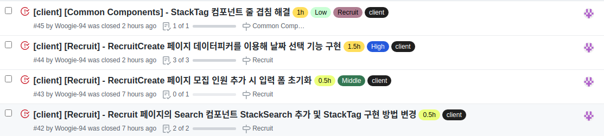
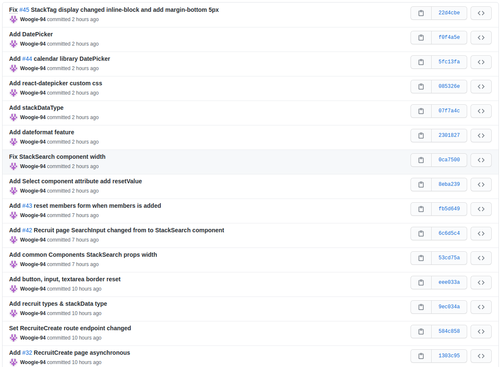
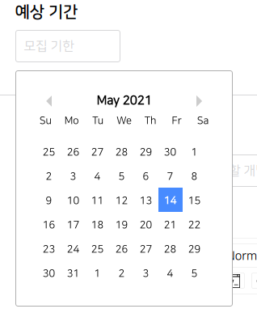
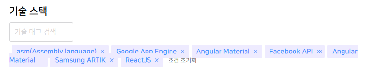
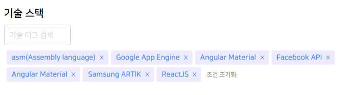

# Final Project #8

5월 14일 오늘도 역시 글 작성 기능에서 머물고 있다. 생각보다 세세하게 구현해야 하는 내용들이 많아서 시간이 지체되는 것 같다 계속해서 이렇게 된다면 사용자가 더 편해지지 않을까?라는 생각에서 하나 둘 추가가 된다. 이제 작성 기능은 거의 끝이 보이고 있고 인피니티 스크롤을 이용한 게시글 리스트 출력과 게시글 필터 기능 그리고 게시글 댓글 기능까지 남아있는 이슈들이 많이 있다. 이번 주 내로 끝내려면 각성해야한다!

 
 
# 오늘 한 것

오늘은 이슈 4개를 처리 했다. 이거 외에도 자잘자잘하게 수정한 사항들이 많으며 현재는 에디터를 손 보고 있는 중이다.

 
 
## Recruit 페이지에 StackSearch 컴포넌트 추가

처음 Recruit 페이지를 디자인 할 때 StackSearch 컴포넌트가 존재하지 않아 인풋으로 디자인만 맞춰둔 상태였다. 추가만 해야하는게 아니라 입력에 맞게 StackTag 컴포넌트도 출력해야 하고 삭제도 해야 해서 간단하게 코드를 작성하였다.

 
 
## RecruitCreate 페이지 모집 인원 폼 초기화

원래 추가 버튼을 누르면 폼들이 초기화되지 않고 남아있는 형태였는데 사용자 입장에서 너무 불편할 것이라고 느껴 바로 수정하였다.

 
 
## 데이터피커를 이용한 날짜 선택 기능

데이터피커라는 라이브러리를 사용하여 만들었다. 저번 프로젝트 때도 사용했어서 해당 부분을 참고하여 로직을 구성했다. 하지만 저번 프로젝트와 다른 점은 타입을 모르겠어서 any로 처리한 부분을 고쳤다는 점이 있다.

 
 
## StackTag 줄 겹침 문제 해결

StackTag가 줄이 넘어가게 되면 위의 사진처럼 겹쳐버리는 문제를 발견했다. 왜 두 줄일 될 때 어떻게 될지 생각을 못 했는지 모르겠다. StackTag는 span 태그로 구현되어 있어서 각자 크기를 가지고 있지 않아서 일어난 문제로 보였다. 해서 display를 inline-block으로 바꾸고 css를 조금 수정해주니 문제가 해결 되었다.

 
 
# 내일은??

내일은 진짜 진짜 작성 기능을 마무리한다. 무조건이다!! 그리고 나선 남은 두 페이지 중 하나를 끝내 버릴 생각이다.
