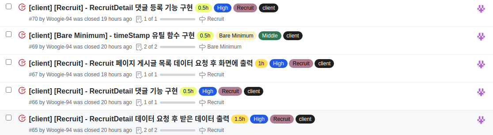
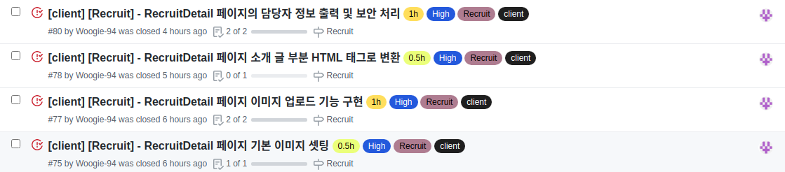

# Final Project #9

Recruit 페이지의 세세한 기능들은 전부 다 처리 했고 이제 인피니티 스크롤을 이용한 데이터 출력과 게시글 삭제 댓글 삭제 정도가 남아있다! 인피니티 스크롤은 자바스크립트가 지원하는 옵저버 api를 이용하여 만들 생각이고 데이터가 들어오는데 시간이 조금 걸리기 때문에 로딩도 구현해야 한다.

 
 
# 오늘 한 것

새벽과 오후에 처리한 이슈들이다. 특히 나는 새벽에 집중이 잘되는 편인데 완전 삘 받아서 쉴 틈 없이 이슈들 을 처리했다. 이슈가 너무 많아서 페이지 별로 정리해보려 한다.

 
 
## RecruitDetail 페이지

이번에 가장 시간을 쏟은 페이지인데 기본적인 데이터를 바탕으로 화면 출력부터 댓글 기능 이미지 업로드와 기본 이미지 string으로 저장된 html 태그들을 다시 html로 바꿔서 사용하고 비로그인 상태일 때 작성자의 개인 정보를 가려주는 사소한 보안 처리까지 완료하였다.

 
 
## Recurit 페이지

일단 데이터에 이상이 없고 모든게 잘 불러오는지 확인하기 위해 대충 연결하였고 이제 인피니티 스크롤을 구현하여 필요한 수 만큼 요청을 보내 가져와서 뿌려 줄 예정이다!

 
 
## timeStamp 유틸

게시글과 댓글이 얼마 전에 작성되었는지 확인하기 위해 함수를 하나 만들었고 이곳 저곳에 활용 될 것 같아 유틸 폴더에 넣어서 요긴하게 사용 중이다.

 
 
# 내일은??

일단 새벽에 인피니티 스크롤을 마무리하고 필터 기능을 넣어줘야 한다. 이게 빨리 끝나면 모든 비동기 코드를 리덕스 썽크로 바꿔주는 일을 할 것이다.
