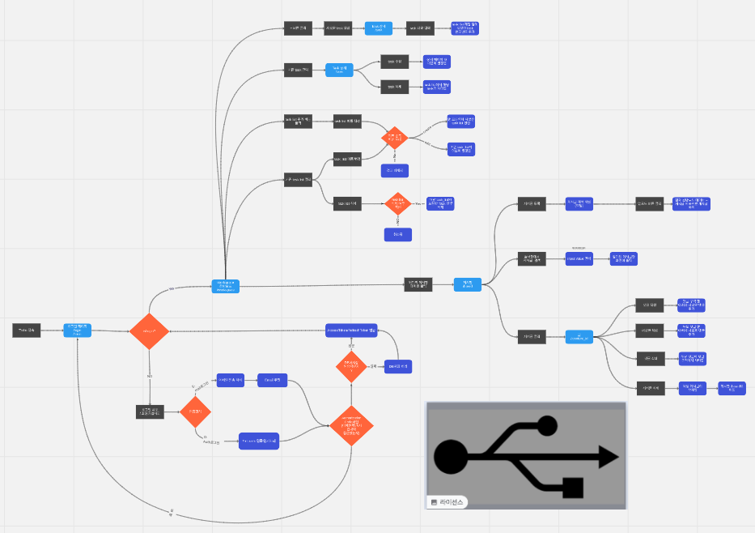
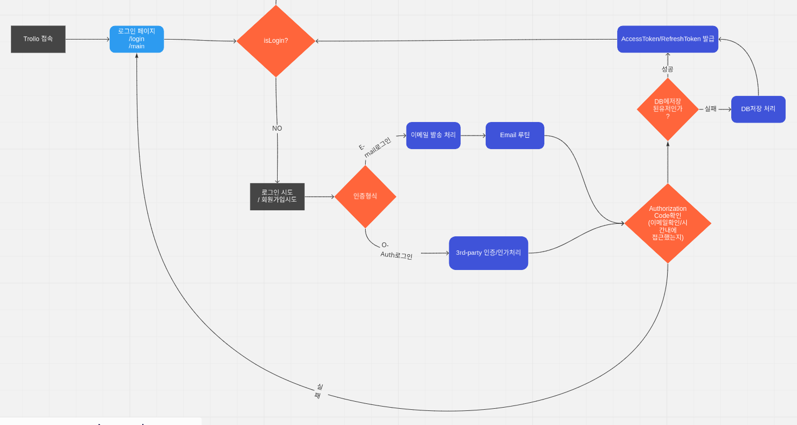
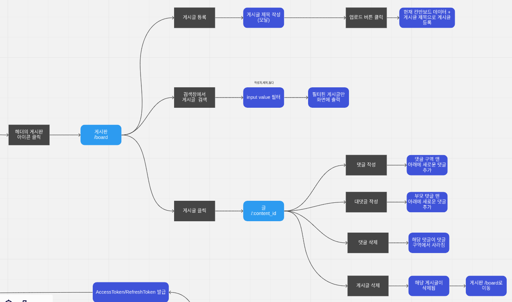
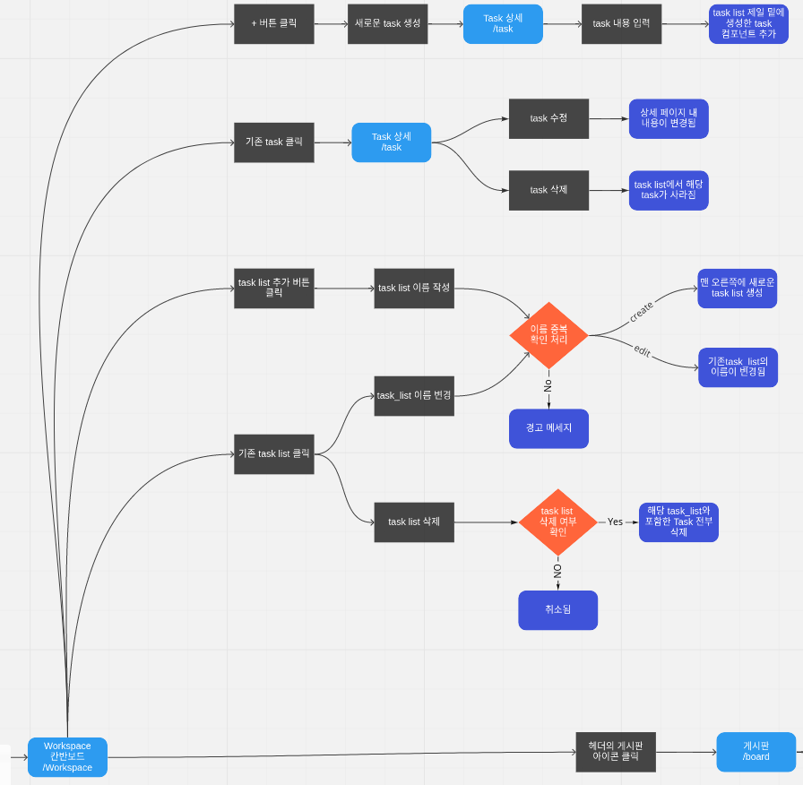
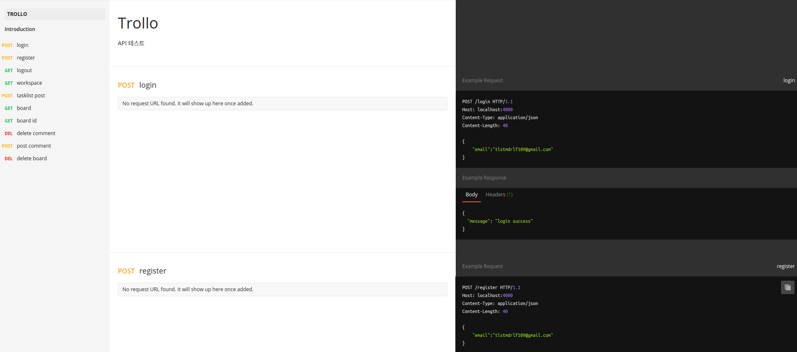
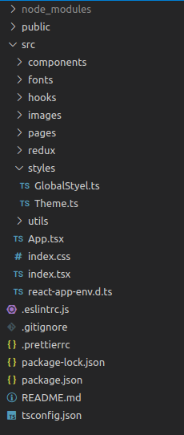

# First Poject #2

오늘부터 본격적으로 프로젝트를 시작했다. 아직 작성하지 못한 플로우 차트와 api 문서를 마저 만들고 프로젝트 초기 설정을 해주었다. 기획을 하면서 느끼는건 실제 개발을 하는 것 보다 힘든 작업이라는 것을 느꼈고 꼼꼼하게 기획을 해야 개발을 할 때 꼬이지 않겠구나 생각이 들었다. 이제 셋팅이 끝나고 개발을 시작하는데 코드는 어떻게 작성해야 할 지 벌써 막막하다.

 
 
# 오늘 한 것

## Flow Chart

퍼스트 프로젝트를 흐름대로 어떻게 작동하는지 플로우 차트를 그렸다. 이 과정에서 어떤 것들을 고려해야 하고 어떤 상황이 나올지 예측하는 시간을 가진 것 같다.

퍼스트 프로젝트는 간단한 프로젝트라고 생각했는데 플로우 차트로 그려보고 나니 아주 간단한 프로젝트는 아닌 것 같다.

 

### Login

### Board

### TaskList

 
 
## API 문서

백엔드 분들이 REST API를 문서화해서 작성했다.

 
 
## 프로젝트 초기 셋팅

프로젝트에 필요한 패키지을 설치했고 eslint와 prettier를 설정했다. 그리고 폴더 구조를 미리 짜뒀는데 컴포넌트 내에선 어떻게 쪼개야 할지 고민이 된다.

 
 
# 내일은?

아마 먼저 배포를 해두고 기능들이 작업되는 대로 계속 배포 테스트를 진행할 것 같아 초기 셋팅을 끝마친 상태로 배포를 진행할 것 같다. 그리고 각자 이슈를 만들어 본격적인 코드 작업에 들어가지 않을까 싶다.
