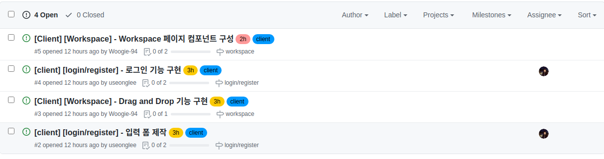
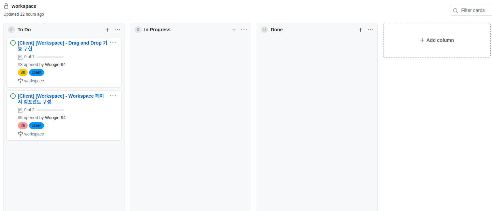

# First Project #3

어제 기획을 다 끝 마치고 드디어 코드를 치는 시간을 가졌다. 이제 진짜 개발을 한다는 느낌이 들지만 드래그 앤 드랍 구현이라는 커다란 벽이 날 괴롭히고 있다 ㅠ...

# 오늘 한 것

## Git 이슈 카드

GIt을 이용해 이슈 관리를 하기 위해 Git 이슈에 대한 연습을 했다.

## Beautiful DND 배우기

프로젝트 기능 중에 드래그 앤 드랍을 해야 하는 부분이 있어 드래그 앤 드랍 라이브러리인 Beautiful DND를 사용하기 위한 학습을 했다. 분명 쉽게 보였는데 전혀 쉽지 않아 당황했다. 아마 내일 쯤이면 기능은 만들지 않을까 싶다. 대신 백엔드와 연결을 하려면 막막하다...

# 내일은??

계속 dnd 기능을 개발할 것 같다. 아마 다 끝난다 해도 백엔드와 연결도 해야 해서 후우... 당분간은 드래그앤 드롭 지옥에...
