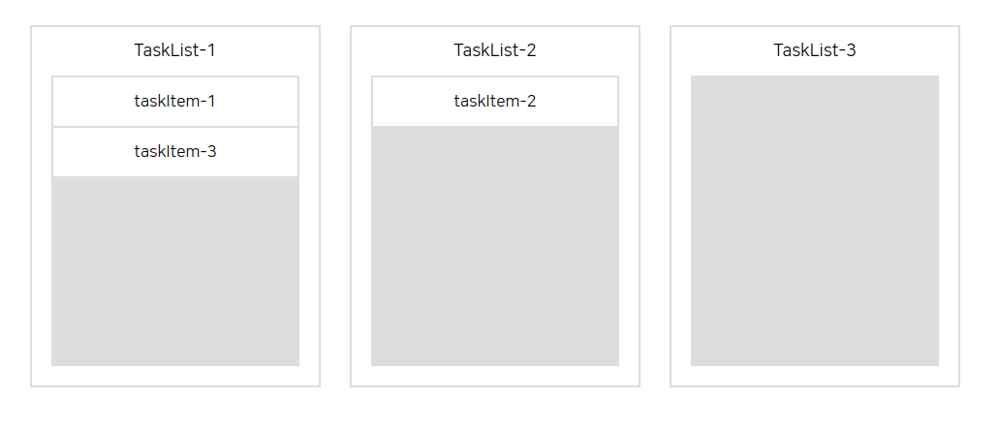
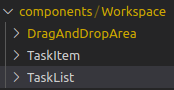
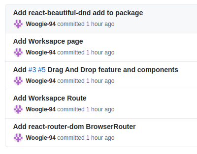

# First Project #4

오늘도 역시 드래그 앤 드랍을 뿌셨다. 어제와 다른 점은 기능 구현에 성공했다는 것이다. 하지만 데이터 구조가 효율적이지 않다 판단하여 데이터 구조를 조금 바꾸었고 드래그 앤 드랍을 하다보면 데이터가 계속해서 변하게 되는데 이때 원래 데이터의 불변성을 지키기 위해 로직을 재구성 해야한다.

<br />
 
# 오늘 한 것

## Beautiful dnd



현재는 데이터를 변경 중이라 기능이 제대로 작동하진 않지만 기능 구현에 성공하긴 했다. 디자인은 나중에 다시 바꾸기로!


컴포넌트 구조는 위와 같이 만들었다. 드래그 앤 드랍 영역을 정해주고 TaskList와 TaskItem을 쪼개주어 관리를 하고 있다.



오늘의 commit 내용입니다.

<br />
 
## !!! Error !!!

드래그 앤 드랍 기능을 구현 중에 크나큰 에러를 만났다. 바로 수직 드랍이 안되는 에러였다. 에러 메세지는 따로 없었으니 기능이 구현되지 않아 이유를 찾아보니

```jsx
<Droppable droppableId='TaskItem' type="TaskItem">
```

해당 부분의 droppableId가 모두 동일한 id를 참조하고 있어서 draggable이 갈 곳을 잃어버린 것으로 추정하고 있다. 해서 해당 부분에 index를 넣어줌으로서 서로 다른 영역을 구분 지어 주었다.

```jsx
<Droppable droppableId={`TaskItem-${index}`} type="TaskItem">
```

<br />
 
# 내일은??

내일도 역시 dnd 기능 구현에 시간을 쏟을 예정이다. 기능 구현에는 성공했지만 아직 해야 할 것들은 아주 많다. 효율적인 데이터 관리가 필요하고 백엔드와 연결이 필요하다. 그리고 최종적으로 리덕스로 다시 바꿔줘야 한다. 물론 디자인도!
