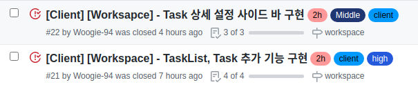
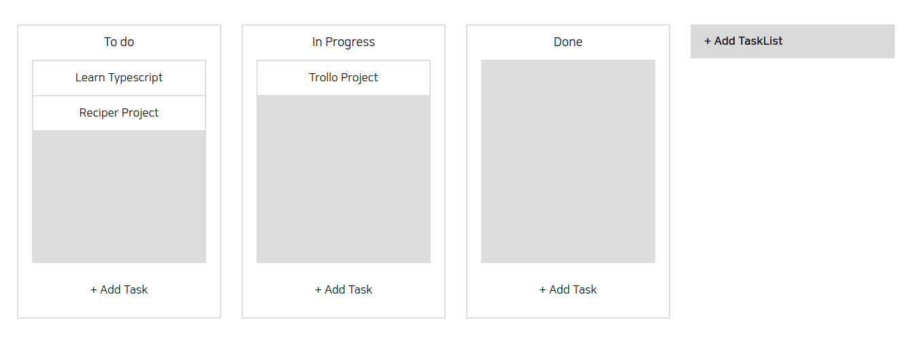
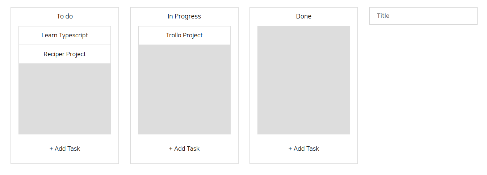
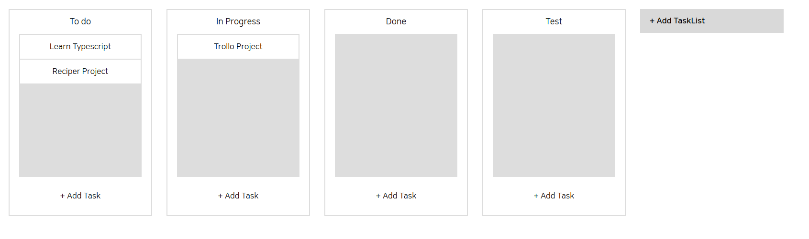
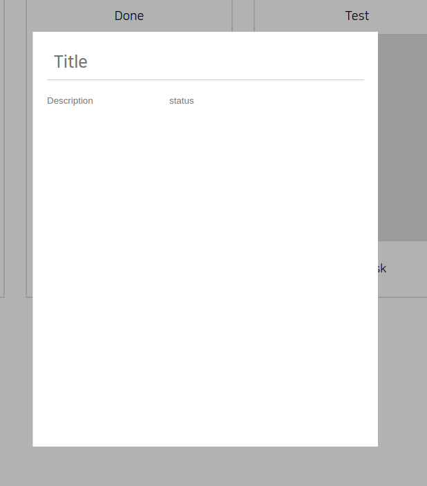
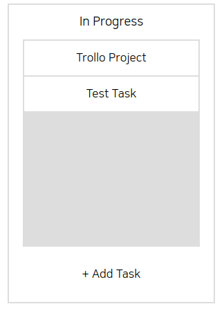

# First Project #5

오늘도 역시 dnd 기능을 계속해서 만들었다. TaskList와 Task를 추가하는 기능과 Task의 상세 설정을 위한사이드 바를 만들었다. 현재 사이드 바는 중앙 모달 형식으로 배치하는 것이 더 낫다고 판단해서 바뀐 상태다.

 
 
# 오늘 한 것

위에서 말한 이슈 두개를 처리했다.

 
 
## 깃 푸시 실수!!

어제 팀원 한 분의 eslint와 prettier가 제대로 동작하지 않던 상태로 코드를 작업했는데 이를 모르고 dev 브랜치로 병합을 해버렸다. 팀원 분의 eslint와 prettier를 고쳐주고 모든 파일을 다시 저장하고 푸시 해주었다. 모두 고친 파일들을 가지고 오느라 팀원 분의 브랜치로 가서 pull을 진행하고 아무 생각 없이 거기서 코드를 작성하고 push를 해버리는 멍청한 짓을 해버렸다.

해결은 git reset —mixed를 이용해서 모든걸 add하기 전으로 돌아갔다. 순간 식은 땀이 줄줄 났다.

 
 
## TaskList, Task 추가 기능, Task 설정 창

위와 같이 만들었고 디자인은 나중에 완전 바꿀 예정이다.

Add TaskList를 누르면 title을 적을 수 있는 input 창이 나오고 해당 input에 타이틀을 입력하고 엔터를 치면 아래와 같이 추가된 리스트가 생긴다.

add Task를 누르면 아래와 같은 모달창이 뜨는데 여기서 Task 정보를 입력할 수 있다. 입력 폼은 내일 구현할 예정이다.

여기서 설정 모달 창을 닫게 되면 아래 처럼 새로운 Task가 생긴다.

 
 
# 내일은??

Task 설정 창을 손 볼 예정이다. 생각해보니 Task를 클릭하면 설정 창이 나와야 하므로 처음부터 설정 창을 띄워서 작성하게 하지 말고 title만 정해주는건 어떨까 싶다.
