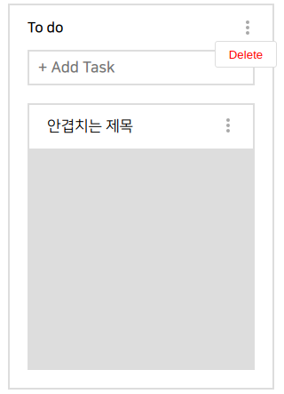

# First Project #8

오늘은 어제 학습한 리덕스 툴킷을 이용해 코드를 수정했다. 역시 리덕스를 사용하니 props가 확연하게 줄어들고 한 곳에서 로직을 볼 수 있어서 보기 편해졌다. 이제 task 기간을 정해주는 기능과 체크리스트, 그리고 task 삭제 기능만 만들면 기능적인 부분은 모두 끝난다. 그리고 최종적으로 비동기 처리에 관한 리덕스 코드를 작성하면 된다!

# 오늘 한 것

## Redux Toolkit으로 리팩토링

```jsx
import { createSlice, PayloadAction } from "@reduxjs/toolkit";
import { RootStateOrAny } from "react-redux";

export interface TaskListData {
  title: string;
  tasks: string[];
}
export interface TaskItemData {
  [index: string]: {
    title: string,
    description: string,
    start_date: string,
    end_date: string,
    checkList: { content: string, checked: boolean }[],
  };
}
export interface TaskData {
  taskList: TaskListData[];
  taskItem: TaskItemData;
}
export interface ReorderPayload {
  [index: string]: number;
}
export interface AddTaskPayload {
  index: number;
  title: string;
}
export interface ChangeTaskDetailPayload {
  [index: string]: string;
}
export interface DeleteTaskDataPayload {
  index: number;
  type: string;
}

const taskInitalState: TaskData = {
  taskList: [
    {
      title: "To do",
      tasks: ["taskItem-1"],
    },
    {
      title: "Done",
      tasks: [],
    },
  ],
  taskItem: {
    "taskItem-1": {
      title: "안겹치는 제목",
      description: "타입스크립트 공부하기",
      start_date: "0",
      end_date: "0",
      checkList: [
        { content: "기본 타입 완벽 이해", checked: false },
        { content: "기본 타입 완벽 이해", checked: false },
      ],
    },
  },
};

export const taskSlice = createSlice({
  name: "TaskData",
  initialState: taskInitalState,
  reducers: {
    reorderTaskList: (
      state,
      { payload }: PayloadAction<ReorderPayload>
    ): void => {
      const { startIndex, endIndex } = payload;
      const targetData = state.taskList.splice(startIndex, 1);
      state.taskList.splice(endIndex, 0, ...targetData);
    },
    reorderTaskItem: (
      state,
      { payload }: PayloadAction<ReorderPayload>
    ): void => {
      const {
        currentIndex,
        targetIndex,
        currentListIndex,
        targetListIndex,
      } = payload;
      const currentTasks: string[] = state.taskList[currentListIndex].tasks;
      const targetTasks: string[] = state.taskList[targetListIndex].tasks;

      const current = currentTasks.splice(currentIndex, 1);
      targetTasks.splice(targetIndex, 0, ...current);
    },
    addTaskList: (state, { payload }: PayloadAction<string>): void => {
      const taskListFrame: TaskListData = {
        title: payload,
        tasks: [],
      };

      state.taskList.push(taskListFrame);
    },
    addTask: (state, { payload }: PayloadAction<AddTaskPayload>): void => {
      const { index, title } = payload;
      const taskName = String(Object.keys(state.taskItem).length + 1);

      const taskFrame = {
        [taskName]: {
          title,
          description: "",
          start_date: "0",
          end_date: "0",
          checkList: [],
        },
      };

      state.taskList[index].tasks.push(taskName);
      state.taskItem = { ...state.taskItem, ...taskFrame };
    },
    changeTaskDetail: (
      state,
      { payload }: PayloadAction<ChangeTaskDetailPayload>
    ): void => {
      const { taskName, title, description } = payload;

      const taskDetailFrame = {
        [taskName]: {
          title,
          description,
          start_date: "0",
          end_date: "0",
          checkList: [],
        },
      };

      state.taskItem = { ...state.taskItem, ...taskDetailFrame };
    },
    deleteTaskData: (
      state,
      { payload }: PayloadAction<DeleteTaskDataPayload>
    ): void => {
      const { index, type } = payload;
      if (type === "tasklist") {
        state.taskList[index].tasks.forEach(
          (itemId) => delete state.taskItem[itemId]
        );
        state.taskList.splice(index, 1);
      }
      if (type === "taskitem") {
        // tasklist[listindex].tasks.splice(itemindex, 1)
        console.log();
      }
    },
  },
});

export const {
  reorderTaskList,
  reorderTaskItem,
  addTaskList,
  addTask,
  changeTaskDetail,
  deleteTaskData,
} = taskSlice.actions;

export const taskSelector = (state: RootStateOrAny): TaskData => state.TaskData;
```

타입스크립트로 리덕스를 사용하면 타입 지정 때문에 자바스크립트보다 코드 량이 배로 많아지는걸 느꼈는데 툴킷을 이용하여 코드 량을 좀 줄일 수 있었다. action과 reducer를 한번에 작성 가능하게 도와주는 slice 덕이다.

그리고 툴킷에는 immer라는 라이브러리가 내장되어 있는데 이 라이브러리가 대신 불변성을 고려해줘서 splice와 push같은 메소드를 아무렇지 않게 사용할 수 있었다. 툴킷의 가장 큰 장점이 아닐까 생각이 된다.

# TaskList 삭제 기능



이제 사용하지 않을 TaskList는 삭제가 가능하도록 기능을 구현 했다. 버튼을 누르면 숨어있던 메뉴가 나오게 되고 삭제 버튼을 누르면 list가 사라지도록 만들었다. list안에 있는 task들은 어떻게 처리할까 하다가 전부 삭제해주기로 결정했다.

# 내일은??

내일은 완전 엄청나게 집중할 예정이다. 위에서 언급한 task 삭제, task 기간 설정, 체크리스트, 비동기 처리까지 모두 할 예정이다.
