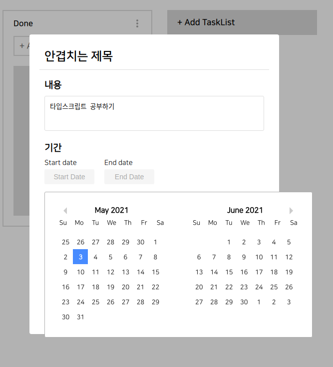
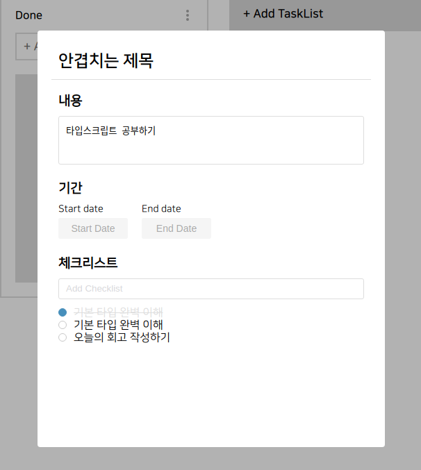

# First Project #9

오늘은 드디어 workspace 페이지에 필요한 기능적인 부분들을 전부 끝냈다. 이제 서버와 통신하여 받고 넘겨주고만 잘 하면 된다. 원래는 오늘 시도해보려 했는데 오늘 만든 두 기능이 예상 외로 오래 걸려서 시도하지 못했다.

<br />
 
# 오늘 한 것

## 기간 설정



Task에 기간을 설정할 수 있는 기능을 만들었습니다. DatePicker를 이용해 달력을 구현하여 일정을 쉽게 정할 수 있도록 도와줬습니다.

해당 기능 구현 중에 문제가 하나 생겼는데 DatePicker를 이용해 값을 저장하면 `Mon May 03 2021 22:28:27 GMT+0900 (대한민국 표준시)`와 같은 값이 저장이 됩니다. 이 값의 타입은 Date 타입도 아니고 string 타입도 아니여서 어떤 타입인지 찾아보았지만 딱히 찾은 것이 없어서 아래와 같은 함수를 만들어서 string 타입으로 변환하여 값을 저장했습니다.

```jsx
const formetDate = (date: Date, type: string): string => {
  if (date === null) {
    return type === "start" ? start_date : end_date;
  }
  const yyyy: number = date.getFullYear();
  let mm: string | number = date.getMonth() + 1;
  mm = mm >= 10 ? mm : `0${mm}`;
  let dd: string | number = date.getDate();
  dd = dd >= 10 ? dd : `0${dd}`;

  return `${yyyy}-${mm}-${dd}`;
};
```

<br />
 
## Checklist



다음으로 만든 기능은 체크리스트이다. 이 부분의 코드는 어렵지 않게 작성했지만 style을 입히기 위해서 조금 고생했다. 리스트를 클릭하면 checked가 바뀌면서 위와 같이 체크가 된 형태로 바뀌는 것을 구현하기 위해서 여러가지 방법을 사용해 봤다.

<br />
 
# 내일은??

내일은 진짜 진짜 서버와 통신하는 것 까지 완료해서 해당 페이지에 대한 부분을 끝낼 생각이다. 물론 css도 가다듬고 코드도 깔끔하게 고쳐주고 이것저것 상세하게 바꿔주어야 하는게 남아있겠지만 기능적인건 모두 끝나는 것으로 만족!
