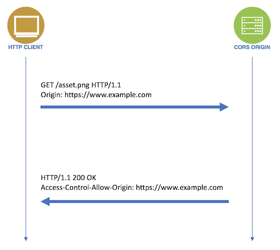

## CORS??

CORS(Croos Origin Resource Sharing)은 도메인 및 포트가 다른 서버로 요청했을 때 브라우저가 보안 상의 이유로 API 접근을 차단하는 문제입니다. 브라우저는 기본적으로 SOP(Same-Origin Policy) 정책을 이용하여 서로 같은 origin이여야 접근할 수 있도록 만들어져 있습니다. 이때 **같은 origin은 프로토콜, 호스트, 포트가 모두 같은 경우를 same-origin이라고 합니다.** 간단히 예를 들면 클라이언트는 3000 포트를 서버는 5000 포트를 이용하면 서로 다른 포트를 이용 중이라 같은 orifgin이 아니므로 CORS 이슈가 발생하게 됩니다.

<br />

## CORS는 어떻게 발생되나??



브라우저는 HTTP Header를 통해 CORS를 확인 합니다. 요청 Header의 origin과 응답 Header의 origin이 같은지 비교해서 CORS에 성립하는지 확인 합니다.

<br />

## 간단한 CORS 해결법

response의 `Access-Control-Allow-Origin` 의 값을 `*` 같은 기호를 넣어 모든 접근을 허용해 주거나 접근하고자 하는 origin을 적어주면 됩니다. 대신 접근하고자 하는 origin은 하나의 origin만 넣어줄 수 있습니다.

```jsx
const defaultCorsHeaders = {
  "access-control-allow-origin": "*",
};

response.writeHead(200, defaultCorsHeaders);
```
