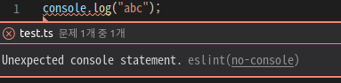

# Eslint & Prettier

이번엔 코드를 간편하게 작성하도록 도와주도록 문법을 검사하고 포맷팅 시켜주는 Eslint와 Prettier를 알아 봤다. 이번 글은 리액트 + 타입스크립트를 기준으로 작성했습니다.

<br />
 
# Eslint

사람들은 저마다 각기 다른 코드 스타일이 있고 여러 사람들과 협업을 하다 보면 다른 코드 스타일 때문에 코드가 지저분해지고 읽기 힘들어질 수도 있습니다. 이럴때 Eslint를 이용하여 코드 작성에 규칙을 부여함으로서 마치 한 사람이 코드를 작성한 것과 같은 효과를 줄 수 있습니다.

Eslint는 사용자가 직접 정의한 설정대로 코드를 점검하고 에러가 있으면 에러가 난 부분에서 바로 에러를 표시 해줍니다.


<br />
 
## Eslint 설치

이번 글은 리액트 + 타입스크립트를 기준으로 작성함으로 먼저 CRA을 이용해 리액트와 타입스크립트를 설치 합니다.

```jsx
$ npx create-react-app setting --template typescript
```

그리고 eslint를 설치하기 위해 아래와 같이 작성해 줍니다.

```jsx
$ npm i -D eslint @typescript-eslint/parser @typescript-eslint/eslint-plugin eslint-plugin-react
```

여기서 `-D`는 `--save-dev`의 축약어 입니다. 설치된 패키지는 개발 단계 내에서만 필요하기 때문에 `devDependencies`에 설치가 되도록 합시다.

설치한 패키지는 아래와 같은 기능을 합니다.

- [`@typescript-eslint/eslint-plugin`](https://www.npmjs.com/package/@typescript-eslint/eslint-plugin) ESLint와 TypeScript를 같이 사용할 수 있도록 도와줌
- [`@typescript-eslint/parser`](https://www.npmjs.com/package/@typescript-eslint/parser) TypeScript를 ESTree-compatible(호환)로 변환하여 ESLint에서 사용할 수 있도록 해줌
- [`eslint-plugin-react`](https://github.com/yannickcr/eslint-plugin-react) React에서 ESLint 명세 규정

패키지들을 설치하고 난후 `.eslintrc.js` 파일을 생성하기 위해 아래와 같은 명령어를 작성합니다.

```jsx
$ node_modules/.bin/eslint --init
```

해당 명령어를 실행하면 아래와 같은 질문들이 나옵니다.

```jsx
? How would you like to use ESLint? …
  To check syntax only
▸ To check syntax and find problems
  To check syntax, find problems, and enforce code style
? What type of modules does your project use? …
▸ JavaScript modules (import/export)
  CommonJS (require/exports)
  None of these
? Which framework does your project use? …
▸ React
  Vue.js
  None of these
? Does your project use TypeScript? ‣ No / Yes
? Where does your code run? …  (Press <space> to select, <a> to toggle all, <i> to invert selection)
✔ Browser
✔ Node
? What format do you want your config file to be in? …
▸ JavaScript
  YAML
  JSON
The config that you've selected requires the following dependencies:

eslint-plugin-react@latest @typescript-eslint/eslint-plugin@latest @typescript-eslint/parser@latest
? Would you like to install them now with npm? ‣ No / Yes
```

상황에 맞게 질문에 답을 해주면 아래와 같은 `.eslintrc` 파일이 생깁니다.

```jsx
// .eslintrc.js
module.exports = {
  env: {
    browser: true,
    es2021: true,
  },
  extends: ["eslint:recommended", "plugin:react/recommended", "plugin:@typescript-eslint/recommended"],
  parser: "@typescript-eslint/parser",
  parserOptions: {
    ecmaFeatures: {
      jsx: true,
    },
    ecmaVersion: 12,
  },
  plugins: ["react", "@typescript-eslint"],
  rules: {},
};
```

이 중에 `"eslint:recommended"`를 지우면 정상적으로 eslint가 작동합니다.

이제 eslint를 이용해 규칙을 설정하기 위해선 `rules` 안에 설정 값들을 넣어주면 됩니다.

```jsx
"rules": {
	'no-console': 'error',
}
```

해당 설정을 넣고 ts 파일을 생성해 console 명령어를 이용해보면 에러가 나타납니다.



[Eslint Rules](https://eslint.org/docs/rules/) 설정 값들이 정리되어 있는 사이트를 보면 엄청나게 다양한 설정들이 있습니다. 취향에 맞게 골라 사용하면 됩니다.

<br />
 
# Prettier

Prettier는 코드 포멧터로 개발자가 작성한 코드를 정해진 코딩 스타일을 따르도록 자동적으로 변환 시켜주는 아주 편리한 도구입니다. Eslint와 함께 쓰면 아주 좋은 시너지를 내기 때문에 보통 이 둘을 같이 사용하는 편입니다.

<br />
 
## Prettier 설치
