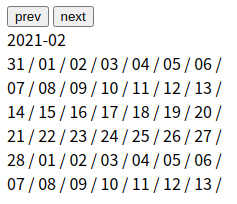

# Calendar_VanilaJS # 1

본격적으로 첫 ToyProject인 Calendar를 만들기 시작했다. 자바스크립트로 달력을 만들기 전에 시간, 날짜를 다루는 방법에 대해서 여러가지 찾아다닌 결과 Moment라는 라이브러리를 사용하기로 했습니다.

[Moment.js로 달력 만들기](https://www.notion.so/Moment-js-543ef5a2c4684ca9a3aba024303273df)

<br />
 
## 오늘의 결과물



오늘 하루 작업한 결과물입니다. Moment로 날짜들을 가져와 달력을 만들어 주었고, 이전 달과 다음 달로 이동 할 수 있게 만들었습니다. 아직 디자인은 건들지 않아서 많이 투박한 상태이지만 기본적인 달력 로직의 뼈대는 완성 되었고 HTML 구조와 CSS에 따라 조금씩 건들여주기만 하면 될 것 같습니다.

<br />
 
## Calendar 코드

저는 한 파일에 여러 기능의 코드들이 담겨져 있는걸 좀 불편해합니다. 그래서 Moment.js를 다루는 작업은 따로 calendar.js라는 파일을 만들어 이 파일 안에서만 이루어질 수 있게 파일을 분리 시켜놨습니다.

```jsx
// calendar.js
const today = moment();

function createCalendarData() {
  let startWeek = today.clone().startOf("month").week();
  let endWeek = today.clone().endOf("month").week() === 1 ? 53 : today.clone().endOf("month").week();
  let blankWeek = endWeek - startWeek === 4 ? endWeek + 1 : endWeek;
  let calendarArr = [];

  for (let week = startWeek; week <= blankWeek; week++) {
    calendarArr.push(
      Array(7)
        .fill(0)
        .map((_, i) => {
          return today.clone().week(week).startOf("week").add(i, "day");
        })
    );
  }

  return calendarArr;
}

function nextMonth() {
  today.add(1, "month");
  createCalendarData();
}

function prevMonth() {
  today.add(-1, "month");
  createCalendarData();
}
```

코드를 간략히 설명하자면 `startWeek`와 `endWeek`로 moment에 지정 된 날짜의 시작 주와 마지막 주를 담아주었습니다. `blankWeek`라는 변수는 매달 주의 범위가 다르기 때문에 달력에 들어가는 행이 매번 달라지기 때문에 항상 6개의 행이 될 수 있게끔 만들어주었습니다.

`startWeek`와 `blankWeek`의 차이 만큼 반복문을 돌아
