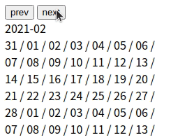
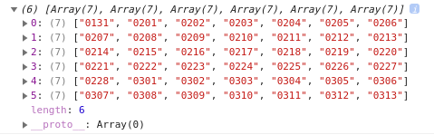

# Calendar_VanilaJS # 1

본격적으로 첫 ToyProject인 Calendar를 만들기 시작했다. 자바스크립트로 달력을 만들기 전에 시간, 날짜를 다루는 방법에 대해서 여러가지 찾아다닌 결과 Moment라는 라이브러리를 사용하기로 했습니다.

[Moment.js로 달력 만들기](https://www.notion.so/Moment-js-543ef5a2c4684ca9a3aba024303273df)

<br />
  
## 오늘의 결과물



오늘 하루 작업한 결과물입니다. Moment로 날짜들을 가져와 달력을 만들어 주었고, 이전 달과 다음 달로 이동 할 수 있게 만들었습니다. 아직 디자인은 건들지 않아서 많이 투박한 상태이지만 기본적인 달력 로직의 뼈대는 완성 되었고 HTML 구조와 CSS에 따라 조금씩 건들여주기만 하면 될 것 같습니다.

<br />
  
## Calendar 코드

<br />
  
### calendar.js

저는 한 파일에 여러 기능의 코드들이 담겨져 있는걸 좀 불편해합니다. 그래서 Moment.js를 다루는 작업은 따로 calendar.js라는 파일을 만들어 이 파일 안에서만 이루어질 수 있게 파일을 분리 시켜놨습니다.

```jsx
// calendar.js
const today = moment();

function createCalendarData() {
  let startWeek = today.clone().startOf("month").week();
  let endWeek = today.clone().endOf("month").week() === 1 ? 53 : today.clone().endOf("month").week();
  let blankWeek = endWeek - startWeek === 4 ? endWeek + 1 : endWeek;
  let calendarDataList = [];

  for (let week = startWeek; week <= blankWeek; week++) {
    calendarDataList.push(
      Array(7)
        .fill(0)
        .map((_, i) => {
          return today.clone().week(week).startOf("week").add(i, "day");
        })
    );
  }

  return calendarDataList;
}

function nextMonth() {
  today.add(1, "month");
}

function prevMonth() {
  today.add(-1, "month");
}
```

코드를 간략히 설명하자면 `startWeek`와 `endWeek`로 moment에 지정 된 날짜의 시작 주와 마지막 주를 담아주었습니다. `blankWeek`라는 변수는 매달 주의 범위가 다르기 때문에 달력에 들어가는 행이 매번 달라지기 때문에 항상 6개의 행이 될 수 있게끔 만들어주었습니다.

<br />
  
```jsx
// calendar.js
for (let week = startWeek; week <= blankWeek; week++) {
  calendarDataList.push(
    Array(7)
      .fill(0)
      .map((_, i) => {
        return today.clone().week(week).startOf("week").add(i, "day");
      })
  );
}
```

`startWeek`와 `blankWeek`의 차이 만큼 반복문을 돌아 배열을 생성해줍니다. 이때 이 배열을 달력의 주 단위가 되고 이중 반복문으로 7번을 돌아 일 단위 데이터를 주 단위 배열에 담아주게끔 만들었습니다.



최종적으로 calendarDataList에 담기는 데이터는 위의 사진과 같습니다.

<br />
  
```jsx
// calendar.js
function nextMonth() {
  today.add(1, "month");
}

function prevMonth() {
today.add(-1, "month");
}

````

`nextMonth`와 `prevMonth`는 다음 달과 저번 달로 넘어 갈 수 있게 만들어주는 함수입니다. `today.add(1, "month")`를 이용해서 moment에 지정 된 개월 수를 하나씩 늘어나거나 줄어들게 만들었습니다.

<br />

### script.js

이번엔 moment로 조리한 날짜 데이터들을 화면에 뿌려주는 작업을 하는 코드입니다.

```jsx
// script.js
const calendarCon = document.querySelector(".calendar");
const nextBtn = document.querySelector(".next_btn");
const prevBtn = document.querySelector(".prev_btn");

window.onload = () => {
  paintingCalendar();
};

const paintingCalendar = () => {
  const calendarData = createCalendarData();
  calendarCon.textContent = today.format("YYYY-MM");

  calendarData.map((week, weekIdx) => {
    createWeekComponent();
    week.map((day) => {
      createDayComponent(day, weekIdx);
    });
  });
};

const createWeekComponent = () => {
  const weekElement = document.createElement("div");
  weekElement.classList.add("week_component");

  calendarCon.append(weekElement);
};

const createDayComponent = (day, weekIdx) => {
  const weekContainer = document.querySelectorAll(".week_component");
  const dayElement = document.createElement("span");
  dayElement.classList.add("day_component");
  dayElement.textContent = day.format("DD") + " / ";

  weekContainer[weekIdx].append(dayElement);
};

const removeCalendar = () => {
  const dayElement = document.querySelectorAll(".week_component");

  for (let i = 0; i < dayElement.length; i++) {
    calendarCon.removeChild(dayElement[i]);
  }
};

nextBtn.addEventListener("click", () => {
  removeCalendar();
  nextMonth();
  paintingCalendar();
});

prevBtn.addEventListener("click", () => {
  removeCalendar();
  prevMonth();
  paintingCalendar();
});
````

<br />
  
여러가지 함수들이 있는데 필요한 순서대로 보자면 먼저 주 단위 컴포넌트를 만들어주는 함수와 일 단위의 컴포넌트를 만들어주는 함수가 있습니다.

```jsx
// script.js
const calendarCon = document.querySelector(".calendar");

const createWeekComponent = () => {
  const weekElement = document.createElement("div");
  weekElement.classList.add("week_component");

  calendarCon.append(weekElement);
};

const createDayComponent = (day, weekIdx) => {
  const weekContainer = document.querySelectorAll(".week_component");
  const dayElement = document.createElement("span");
  dayElement.classList.add("day_component");
  dayElement.textContent = day.format("DD") + " / ";

  weekContainer[weekIdx].append(dayElement);
};
```

`createWeekComponent` 함수에서는 주 단위를 담당 할 엘리먼트를 생성해주고 calendar 엘리먼트 안에 넣어줍니다. `createDayComponent` 함수는 일 단위를 담당 할 엘리먼트를 생성해주고 인자로 날짜 데이터와 각자 들어갈 주 단위 엘리먼트의 자리를 받아옵니다. 각각의 엘리먼트에 날짜를 텍스트로 출력하고 각자 자리에 맞는 주 단위 엘리먼트에 넣어지게 됩니다.

<br />
  
```jsx
// script.js
window.onload = () => {
  paintingCalendar();
};

const paintingCalendar = () => {
const calendarData = createCalendarData();

calendarData.map((week, weekIdx) => {
createWeekComponent();
week.map((day) => {
createDayComponent(day, weekIdx);
});
});
};

````

엘리먼트를 생성 했다면 이젠 화면에 뿌려줄 차례입니다. `paintingCalendar` 함수는 calendar.js에서 이차원 배열 형태로 되어있는 배열을 가져와 함수 내에서 반복을 돌아 각자 위치에 맞는 엘리먼트 함수를 호출해줍니다. 이때 `createDayComponent(day, weekIdx)`에 인자로 들어가는 `weekIdx`는 일 단위 컴포넌트가 각자 위치에 맞는 주 단위 컴포넌트에 들어가게끔 주소를 넘겨줬다고 보면 됩니다.

그리고 브라우저가 로드되면 `paintingCalendar` 함수를 호출함으로서 화면에 뿌려줍니다.

<br />

```jsx
// script.js
const nextBtn = document.querySelector(".next_btn");
const prevBtn = document.querySelector(".prev_btn");

const removeCalendar = () => {
  const dayElement = document.querySelectorAll(".week_component");

  for (let i = 0; i < dayElement.length; i++) {
    calendarCon.removeChild(dayElement[i]);
  }
};

nextBtn.addEventListener("click", () => {
  nextMonth();
  removeCalendar();
  paintingCalendar();
});

prevBtn.addEventListener("click", () => {
  prevMonth();
  removeCalendar();
  paintingCalendar();
});
````

마지막으로 이전 달과 다음 달로 넘어가게 만드는 코드입니다. 다른 달의 달력을 보여줘야하기 때문에 기존에 있던 달력을 초기화 시키고 새로 덮어주는 방법으로 만들었습니다. `removeCalendar` 함수가 그 역할을 합니다. 달력 안에 있는 모든 주 단위 컴포넌트를 삭제해주는 함수죠

다음으론 각각의 버튼에 클릭 이벤트를 걸어주어 클릭 시 calendar.js에 있던 `nextMonth` 함수와 `prevMonth` 함수를 호출해 날짜를 조작해 줍니다. 위에 말한대로 `removeCalendar` 함수를 호출해 달력을 초기화 시켜주고 새롭게 `paintingCalendar` 함수를 호출해 바뀐 날짜를 기준으로 새로운 달력을 화면에 뿌려주게 됩니다.

<br />
  
## 다음은?

아마 자바스크립트 구조는 대략 만들었기 때문에 다음에는 HTML과 CSS를 활용해 디자인을 할 거 같습니다. 태그의 클래스명은 BEM 방법론을 이용해서 만들어 볼 생각이고 CSS는 CSS Preprocessor인 Sass를 이용할 거 같습니다. 생각해둔 디자인이 있기 때문에 그에 맞게 디자인 한다면 오래 걸릴 작업은 아닐 거 같습니다.
