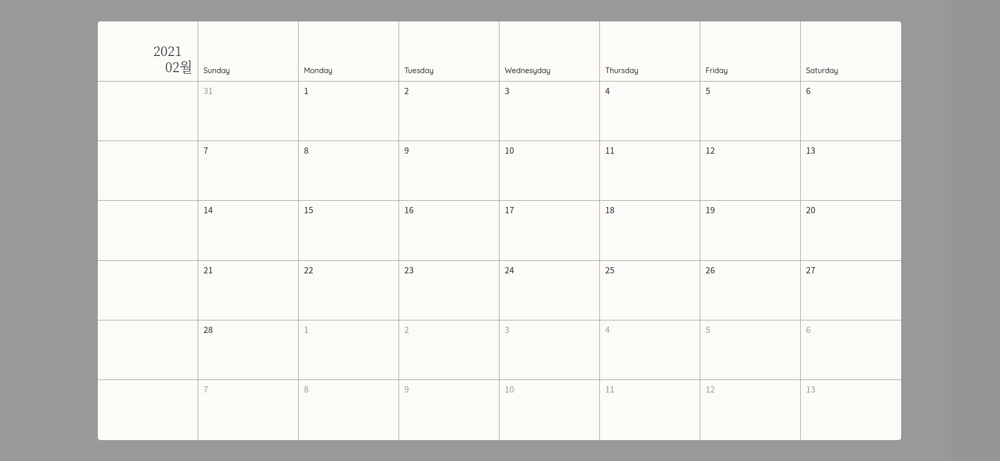
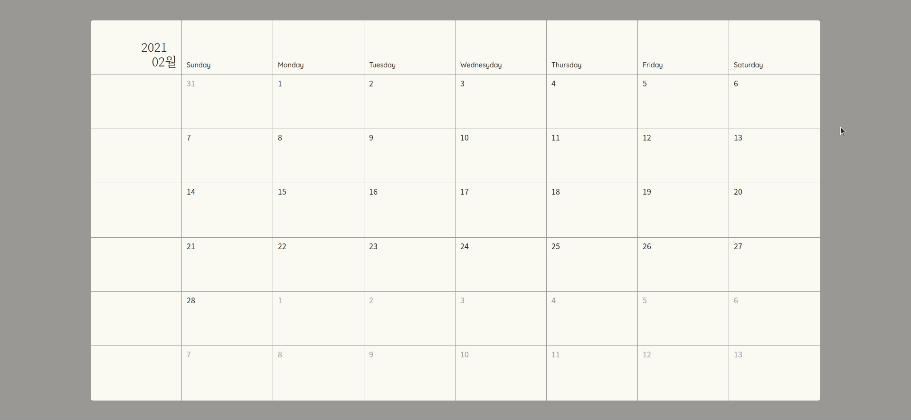
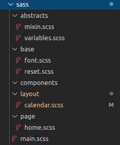

# Calendar_VanilaJS # 2



오늘은 어제 만든 Calendar를 디자인했습니다. 심플하고 간결한걸 좋아하기 때문에 최대한 심플하게 디자인을 뽑아냈습니다. 디자인을 구현하기 위해 사용한 스택은 SASS와 CSS 방법론인 BEM 방법론을 이용해서 만들었습니다.

SASS와 BEM 방법론은 처음 사용해본 게 아니지만 아직도 제대로 사용하고 있는 건지 헷갈립니다. 프로그래밍 언어처럼 잘못 사용했다면 에러가 표시되면 좋겠지만 그렇지 않다 보니 정확하게 사용하고 있는지 알 수가 없습니다. 조금 더 알아보고 다음 프로젝트에서 다시 제대로 사용해봐야겠습니다.

Calendar 프로젝트는 오늘로 끝이 났습니다. 만드는데 2일이 소요됐지만 이것저것 다른 것들을 하며 만들어서 큰 시간이 걸리진 않았습니다. 앞으로 배울 리액트나 타입스크립트 버전으로 계속 업그레이드 하는 프로젝트이기 때문에 일부러 간단한 프로젝트를 선택한거고 시간이 된다면 Calendar 투두 리스트를 접목 시켜 다이어리처럼 만들면 어떨까 생각도 듭니다.

<br /> 
 
## 오늘의 결과물



이 Calendar에 투두리스트를 접목 시켜서 만들면 어떨까 하는 생각에 디자인을 다이어리처럼 만들어봤습니다. 컨텐츠가 달력밖에 없으므로 달력에 집중할 수 있게 달력 외의 색깔은 어두운 톤을 사용하여 달력에 시선이 안전하게 머물도록 유도했습니다. 달력 색깔은 완전 흰색보단 아주 약간의 베이지 색을 추가해서 종이 재질 느낌이 나게 만들어 보았는데 만족스러운 색감이 나왔습니다.

<br /> 
 
## Calendar HTML

```html
<!DOCTYPE html>
<html lang="kr">
  <head>
    <meta charset="UTF-8" />
    <meta name="viewport" content="width=device-width, initial-scale=1.0" />
    <link rel="stylesheet" href="./style.css" />
    <script src="https://cdnjs.cloudflare.com/ajax/libs/moment.js/2.24.0/moment.min.js"></script>
    <script src="./service/calendar.js"></script>
    <title>Calendar</title>
  </head>
  <body>
    <div class="calendar_btn calendar_btn__prev"></div>
    <div class="calendar">
      <div class="calendar__week">
        <div class="calendar__day calendar_month">
          <p class="calendar_month__yy"></p>
          <p class="calendar_month__mm"></p>
        </div>
        <div class="calendar__day calendar__dayname">Sunday</div>
        <div class="calendar__day calendar__dayname">Monday</div>
        <div class="calendar__day calendar__dayname">Tuesday</div>
        <div class="calendar__day calendar__dayname">Wednesyday</div>
        <div class="calendar__day calendar__dayname">Thursday</div>
        <div class="calendar__day calendar__dayname">Friday</div>
        <div class="calendar__day calendar__dayname">Saturday</div>
      </div>
    </div>
    <div class="calendar_btn calendar_btn__next"></div>
  </body>
  <script src="./script.js"></script>
</html>
```

HTML 구조는 대강 이렇습니다. `calendar`라는 div 태그에 주 단위 엘리먼트들이 들어가게 되는 구조입니다.

<br /> 
 
## Calendar CSS

CSS는 CSS Preprocesseor인 Sass를 이용했습니다. Sass는 폴더 관리를 잘못하면 프로젝트 폴더가 더러워지는 경우가 있길래 7-1 패턴을 참고하여 Sass 파일들을 관리했습니다.



Sass의 7-1 패턴은 7개의 주제를 가진 폴더를 만들어 그 안에 주제에 맞는 Sass 파일들을 만들어 작성하고 main이 될 파일에 전부 import 해주는 방식의 패턴입니다. 저는 7개의 주제가 전부 필요하지 않아서 5가지만 골라서 작성해보았는데 실제로 사용한 폴더는 결국 layout과 base그리고 page뿐이더라고요 규모가 작은 프로젝트여서 다른 것들을 쓸 필요가 없지 않았나 생각합니다.

가장 중요한 calendar.scss 파일을 봅시다.

```scss
.calendar {
  width: 80%;
  height: 90%;
  color: #292929;
  font-family: "Noto-L";
  background-color: rgb(252, 251, 248);
  border-radius: 5px;

  &__week {
    display: flex;
    justify-content: left;
    width: 100%;
    height: 14.28571%;
    border-bottom: 1px solid #999;

    &:last-child {
      border: none;
    }

    .calendar_month {
      font-family: NotoKR_L;
      font-size: 1.6rem;
      text-align: right;
      padding-top: 37px;

      &__yy {
        padding-right: 20px;
      }

      &__mm {
        margin-top: -5px;
      }
    }
  }

  &__day {
    width: 12.5%;
    height: 100%;
    padding: 5px 10px;
    border-right: 1px solid #999;

    &:last-child {
      border: none;
    }
  }

  &__dayname {
    font-size: 0.9rem;
    text-align: left;
    font-family: QM;
    padding-top: 85px;
  }
}

.day_data_components {
  cursor: pointer;

  &--on {
    &:hover {
      background-color: rgba($color: #000000, $alpha: 0.05);
      transition: 0.3s;
    }
  }

  &--off {
    color: #999;
    cursor: inherit;
  }
}

.calendar_btn {
  width: 5%;
  height: 100vh;

  &:hover {
    background-color: rgba($color: #000000, $alpha: 0.2);
    transition: 0.3s;
  }
}
```

최대한 뎁스를 늘리지 않기 위해 생각하며 작업했고 레이아웃은 Flex Box를 이용하여 만들었습니다. 원래는 float과 position을 이용한 레이아웃이 익숙했는데 Flex Box를 사용해보니 훨씬 간단해지는 장점이 있는 것 같아 앞으로는 Flex Box를 애용할 것 같습니다.

<br /> 
 
## 다음 프로젝트?

아마 Calendar에 To do List를 접목 시켜 다이어리를 만들지 않을까 싶습니다. 다이어리를 만든다면 데이터를 어떻게 저장할 것인지 생각해 봐야 하는데 아직 백엔드는 배우지 않았으니 로컬스토리지에 담아 두었다가 백엔드 지식을 배우고 난 후에 업그레이드 해보는 형식은 어떨까 생각했습니다. 다음 주부터 이머시브 코스가 시작해서 시간 여유가 있을진 모르겠지만 빠른 시일내에 만들어보고 싶네요
