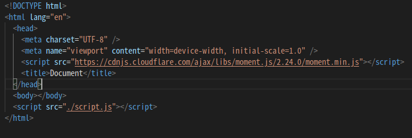
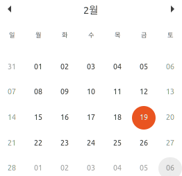

# Moment.js로 달력 만들기

[Moment.js Link](https://momentjs.com/)

저는 Moment.js라는 라이브러리를 이용해서 달력을 만들 겁니다. 자바스크립트에서 제공해주는 new Date()를 써도 괜찮으나 다루기가 쉽지 않고 시간이 너무 소요될거 같아 Moment를 이용하려 합니다.

[(Library) Moment.js 개발 중단](https://medium.com/@yeon22/library-moment-js-%EA%B0%9C%EB%B0%9C-%EC%A4%91%EB%8B%A8-ec64e6709261)

간단한 토이프로젝트라 Moment를 이용하지만 큰 프로젝트나 실무에서는 위와 같은 이유로 더 이상 사용하지 않나봅니다. 원하신다면 다른 방법으로 만드셔도 괜찮습니다!

<br />
 
## 설치

Moment를 사용하려면 먼저 설치를 해야 합니다.

```python
$ npm install moment --save
```

> Moment를 설치할 때는 꼭! 달력을 만들 폴더 내에서 설치해주세요!

그리고선 Moment를 불러와야 합니다. HTML 파일 head 부분에 아래 태그를 넣어주시면 됩니다.

```python
<script src="https://cdnjs.cloudflare.com/ajax/libs/moment.js/2.24.0/moment.min.js"></script>
```



위와 같은 형태가 될겁니다!

<br />
 
## 사용

달력을 만들 JS파일을 하나 만들어 주시고 거기서 Moment를 불러와서 사용해봅시다.

```jsx
const today = moment();
console.log(today);
// M {_isAMomentObject: true, _isUTC: false, _pf: {…}, _locale: P, _d: Fri Feb 19 2021 04:18:41 GMT+0900 (대한민국 표준시), …}
```

### format

moment를 콘솔에 출력하면 이상한 외계어가 나오는데 이때 `format` 메소드를 이용해서 날짜만 가져올 수 있습니다.

```jsx
const today = moment(); // 2021-2-19
console.log(today.format());
// 2021-02-19T04:28:48+09:00
const today = moment("2019"); // 날짜를 지정할 수 있습니다.
console.log(today.format());
// 2019-02-19T04:28:48+09:00

// format() 안에 데이터 형식을 지정해 줄 수 있습니다.
console.log(today.format("YYYYMMDD")); // 20210219
console.log(today.format("YYYY-MM-DD")); // 2021-02-19
console.log(today.format("YYYY")); // 2021
console.log(today.format("MMD")); // 0219
console.log(today.format("MD")); // 219
```

### startOf & endOf

`startOf`와 `endOf`를 이용하면 지정된 날짜를 기준으로 시작 날짜와 마지막 날짜를 구할 수 있습니다.

```jsx
const today = moment();
console.log(today.format()); // 2021-2-19

console.log(today.startOf("month").format()); // 2021-2-01
console.log(today.endOf("month").format()); // 2021-2-28

console.log(today.format()); // 2021-2-28
// startOf나 endOf를 하면 원본을 훼손하기 때문에 today의 날짜가 바뀝니다.
// 꼭!! clone() 메소드를 이용해서 작성하세요!!

const today2 = moment();
console.log(today2.clone().startOf("week").format()); // 2021-2-14
console.log(today2.clone().endOf("week").format()); // 2021-2-21
```

### week

`week`를 이용하면 이번 년도에서 몇 번째 주인지 구할 수 있습니다.

```jsx
const today = moment(); // 2021-2-19
console.log(today.clone().week()); // 8
console.log(today.clone().startOf("month").week()); // 6
console.log(today.clone().endOf("month").week()); // 10
console.log(today.clone().startOf("year").week()); // 1
console.log(today.clone().endOf("year").week()); // 1
// 1년에 주가 52주면 마지막 주는 내년의 첫 주인 1을 반환합니다.

const today2 = moment("2016"); // 2016-2-19
console.log(today2.clone().endOf("year").week()); // 53

// week()에 숫자를 넣으면 해당 주의 시간을 반환합니다.
console.log(today.clone().week(1).format()); // 2021-1-1
console.log(today.clone().week(13).format()); // 2021-3-26

// 응용하면 해당 주의 첫 날을 가져올 수 있습니다.
// 2월의 첫 주와 마지막 주를 넣어주면 2월 달력안에 있는 모든 일자가 나옵니다. 아래 사진 참고
console.log(today.clone().week(6).startOf("week").format()); // 2021-1-31
console.log(today.clone().week(10).endOf("week").format()); // 2021-3-06
```



### add

`add` 메소드의 인자로 더해줄 숫자와 기준을 전달 시킬 수 있습니다.

```jsx
const today = moment(); // 2021-2-19
console.log(today.clone().add(1, "day").format()); // 2021-2-20
console.log(today.clone().add(40, "day").format()); // 2021-3-31
console.log(today.clone().add(2, "month").format()); // 2021-4-19
console.log(today.clone().add(1, "year").format()); // 2022-2-19

// 음수를 넣을 경우 반대로 내려갑니다!
console.log(today.clone().add(-1, "day").format()); // 2021-2-18
console.log(today.clone().add(-2, "month").format()); // 2020-12-19
console.log(today.clone().add(-1, "year").format()); // 2020-2-19
```

<br />
 
## 응용

위에 적어둔 메소드들로 달력을 만드시면 됩니다! 아래는 힌트?

```jsx
const today = moment(); // 2021-2-19
let startWeek = today.clone().startOf("month").week(); // 6
let endWeek = today.clone().endOf("month").week(); // 10

for (let week = startWeek; week <= endWeek; week++) {
  // week = 6 ~ 10
}

let day = today.clone().week(startWeek).startOf("week").add(1, "day").format();
console.log(day); // 2021-2-20
```
