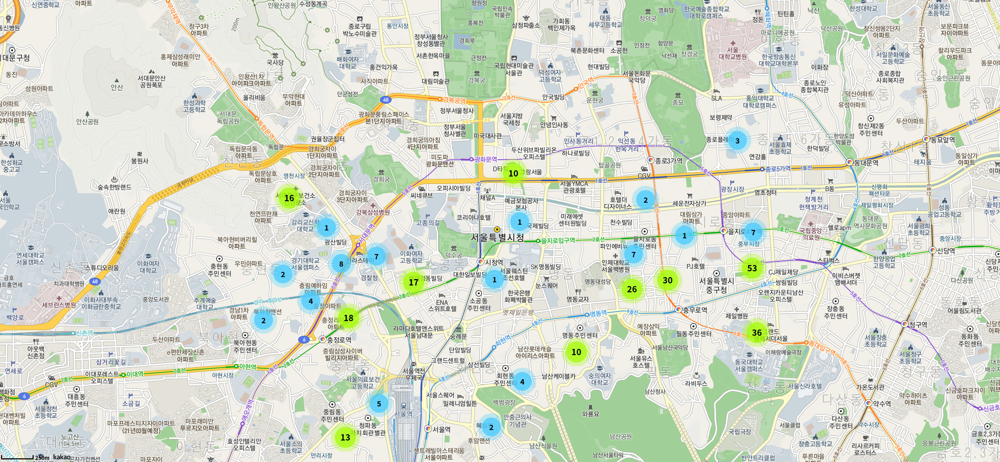
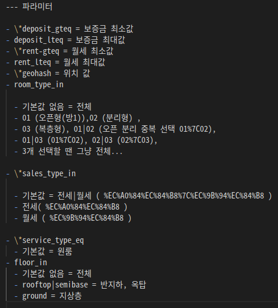
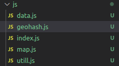

# zigbang # 1



첫날은 직방 api의 파라미터가 어떤게 어떻게 사용되고 있는지 알아보고 카카오 지도 api와 어떻게 연결해서 사용 할지 구상하느라 많은 시간이 소요됐습니다.



직방 api가 따로 제공되는 api가 아니라 그냥 멋대로 가져다 쓰는 api라 가이드가 전혀 없어서 직접 알아내야 하는 수 밖에 없었습니다.

여기서 문제가 되는 파라미터가 geohash인데요 위도와 경도의 값을 geohash로 변환 시켜서 전달해줘야 해서 이 geohash로 변환할 수 있는 라이브러리가 있나 검색을 통해 찾아 봤는데 대부분 nodejs에서 사용할 수 있는 라이브러리 뿐이더라고요 결국 geohash로 변환해주는 코드만 따로 들고 와서 사용했습니다.

## Js 파일들...

두 가지의 api와 geohash로 변환해 주는 코드를 한 파일에 넣으려 하니 너무 복잡해지고 보기가 힘들어져서 총 5개의 파일로 구분 지어 뒀습니다.



### data.js

data 파일은 직방 api에서 가져온 값들을 처리하고 넘겨주거나 파라미터에 이용 될 값들을 받아와서 새롭게 데이터를 뿌려주는 역할을 하는 파일입니다.

```jsx
const getItemList = async (geo = "wydm9", ...args) => {
  try {
    return await fetch(
      `https://apis.zigbang.com/v2/items?deposit_gteq=0&domain=zigbang&geohash=${geo}&rent_gteq=0&sales_type_in=%EC%A0%84%EC%84%B8%7C%EC%9B%94%EC%84%B8&service_type_eq=%EC%9B%90%EB%A3%B8`
    ) //
      .then((res) => res.json())
      .then((data) => data);
  } catch (err) {
    console.error(err);
  }
};

const itemListDataFn = async (sendData, position) => {
  const t = await getItemList(position).then((data) => data);
  sendData(t);
};

getItemList();
```

현재는 파라미터를 변경 시키지 않고 geohash 값만 넣어 테스트하고 있어요 깔끔한 코드를 위해 async와 await를 사용했습니다.

### map.js

map 파일은 카카오 지도 api를 다루는 파일이에요 카카오 지도에서 이뤄지는 이벤트나 마커 등등 여러가지 기능을 모아둔 파일이고 지도에서 추출한 필요한 값들을 다른 파일에 전달 시키기도 합니다.

```jsx
const container = document.getElementById("map");
const options = {
  center: new kakao.maps.LatLng(37.566826, 126.9786567),
  level: 5,
  maxLevel: 6,
};

const map = new kakao.maps.Map(container, options);

// kakao map event
kakao.maps.event.addListener(map, "center_changed", debounce(mapCenterChangeEvent, 300));

function getCenterPosition() {
  // 지도의 위치를 변경할 때 위치 정보를 가져오는 함수입니다.
  const level = map.getLevel() - 5;
  const reverseLevel = 5 - level;
  const latlng = map.getCenter();

  return [latlng, reverseLevel];
}

function mapCenterChangeEvent() {
  // 지도의 위치를 변경할 때의 로직을 담은 함수입니다.

  const geohash = new Geohash();
  const position = getCenterPosition();

  const transGeohash = geohash.encode(position[0].Ma, position[0].La, position[1]);

  itemListDataFn(getData, transGeohash);
}

function createMarker(position) {
  const clusterer = new kakao.maps.MarkerClusterer({
    map: map,
    averageCenter: true,
    minLevel: 2,
    minClusterSize: 1,
  });

  const markers = position.map((position) => {
    return new kakao.maps.Marker({
      position: new kakao.maps.LatLng(position.lat, position.lng),
    });
  });

  console.log(markers);

  clusterer.addMarkers(markers);
}
```

지금은 클러스터를 손보고 있는데 클러스터의 옵션을 손보면서 제가 원하는 방식에 맞출겁니다.

### index.js

index 파일은 두 api에서 나온 모든 데이터를 이용해서 데이터를 다루고 화면에 뿌려주는 파일입니다.

```jsx
function getData(data) {
  // map center change event logic...
  const items = data.items;
  createMarker(items);
}
```

현재는 화면에 뿌려주는 작업 단계가 아닌 데이터를 다루는 작업을 위주로하고 있어서 별 내용은 없습니다.

### util.js

util 파일은 여러 파일에서 재 사용 할 수 있는 기능을 넣어둔 파일입니다.

```jsx
const debounce = (func, delay) => {
  let timeoutId = null;

  return (...args) => {
    clearTimeout(timeoutId);
    timeoutId = setTimeout(func.bind(null, ...args), delay);
  };
};
```

### geohash.js

직방 api에 넣어줄 위치 정보를 변환해주는 파일입니다. 해당 코드는 인터넷에서 참고했습니다.

```jsx
class Geohash {
  constructor() {
    this.base32 = "0123456789bcdefghjkmnpqrstuvwxyz";
  }

  encode(lat, lon, precision) {
    if (typeof precision == "undefined") {
      for (let p = 1; p <= 12; p++) {
        const hash = Geohash.encode(lat, lon, p);
        const posn = Geohash.decode(hash);
        if (posn.lat == lat && posn.lon == lon) return hash;
      }
      precision = 12;
    }

    lat = Number(lat);
    lon = Number(lon);
    precision = Number(precision);

    if (isNaN(lat) || isNaN(lon) || isNaN(precision)) throw new Error("Invalid geohash");

    let idx = 0; // index into base32 map
    let bit = 0; // each char holds 5 bits
    let evenBit = true;
    let geohash = "";

    let latMin = -90,
      latMax = 90;
    let lonMin = -180,
      lonMax = 180;

    while (geohash.length < precision) {
      if (evenBit) {
        const lonMid = (lonMin + lonMax) / 2;
        if (lon >= lonMid) {
          idx = idx * 2 + 1;
          lonMin = lonMid;
        } else {
          idx = idx * 2;
          lonMax = lonMid;
        }
      } else {
        const latMid = (latMin + latMax) / 2;
        if (lat >= latMid) {
          idx = idx * 2 + 1;
          latMin = latMid;
        } else {
          idx = idx * 2;
          latMax = latMid;
        }
      }
      evenBit = !evenBit;

      if (++bit == 5) {
        geohash += this.base32.charAt(idx);
        bit = 0;
        idx = 0;
      }
    }
    return geohash;
  }
}
```
