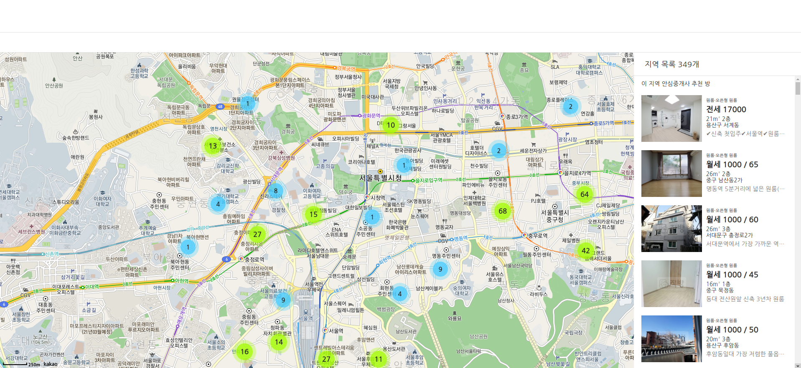
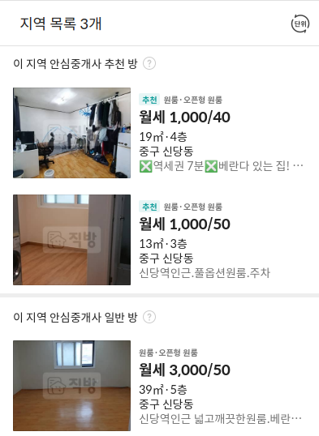
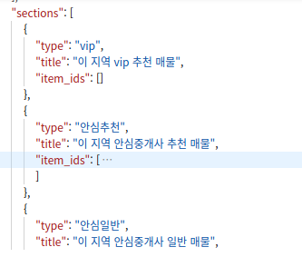

# zigbang # 2



카카오 API에 위치 정보를 뿌려주는 기능을 다 만들고 보니 많은 데이터를 처리할 때 렉이 생기는걸 발견했다. 위치 정보를 geohash로 변환하여 그 범위 만큼 가져오다 보니 불필요하게 화면에 보이지 않는 영역의 데이터까지 가져오는게 문제였다. 지도에 표시되는 범위를 지정해주어 그 범위 안에 있는 데이터만 화면에 출력 되도록 로직을 수정했더니 렉이 두 배가량 사라졌다. 하지만 매물이 많은 지역에 가면 아직 2~3초 가량의 렉이 발생한다. 이 부분은 일단 나머지 기능들을 완성 시키고 다시 한번 손 볼 예정이다.

```jsx
// map.js
function createCluster(data) {
  const sectionsData = data.sections.map((section) => section.item_ids.map((el) => el));
  const bounds = map.getBounds(); // 지도 범위 추출
  // 범위 안의 데이터 필터
  const boundsFilterList = data.items.filter((el) => bounds.ha < el.lng && bounds.oa > el.lng && bounds.qa < el.lat && bounds.pa > el.lat);

  const markers = boundsFilterList.map((position) => {
    const latlng = new kakao.maps.LatLng(position.lat, position.lng);
    return new kakao.maps.Marker({ position: latlng });
  });

  clusterer.clear();
  clusterer.addMarkers(markers);
}
```

지도 렉을 어느정도 해결하고 매물 리스트를 만들었다. 직방의 API를 두 가지 사용하고 있는데 하나는 지도의 범위와 여러가지 설정 값들을 통해 그에 해당하는 매물 정보의 id와 위치 정보를 가져오는 API와 id를 이용해 매물의 상세 정보를 확인할 수 있는 API가 있다. 첫 번째 API에서 가져온 id 정보를 두 번째 API에 전달해 매물 정보를 하나하나 접근했다.



직방의 매물 리스트를 보면 추천 방이나 일반 방 처럼 구분 되어 올라와 있는 것을 확인했다.



다행히 API에도 매물이 구분되어 있는 것을 확인했다. 하지만 일단 매물 정보와는 다르게 id 값만 들어 있어서 범위 내에 있는 데이터를 구분할 수가 없었다. 결국 지도에 표시해주는 데이터와 id를 비교하여 같은 값들을 저장 시키고 index.js 파일로 전달 시켜줬다.

```jsx
// map.js
function createCluster(data) {
  const sectionsData = data.sections.map((section) => section.item_ids.map((el) => el));
  const bounds = map.getBounds();
  const boundsFilterList = data.items.filter((el) => bounds.ha < el.lng && bounds.oa > el.lng && bounds.qa < el.lat && bounds.pa > el.lat);

  //-----------
  const boundsFilterRecommendData = [];
  const boundsFilterNomalData = [];
  const boundsFilterUptoData = [];

  boundsFilterList.forEach((listData) => {
    if (sectionsData[1].includes(listData.item_id)) boundsFilterRecommendData.push(listData.item_id);
    if (sectionsData[2].includes(listData.item_id)) boundsFilterNomalData.push(listData.item_id);
    if (sectionsData[3].includes(listData.item_id)) boundsFilterUptoData.push(listData.item_id);
  });
  //------------

  const markers = boundsFilterList.map((position) => {
    const latlng = new kakao.maps.LatLng(position.lat, position.lng);
    return new kakao.maps.Marker({ position: latlng });
  });

  clusterer.clear();
  clusterer.addMarkers(markers);

  // index.js로 data 전달
  getRoomData([boundsFilterRecommendData, boundsFilterNomalData, boundsFilterUptoData]);
}
```

필터 된 데이터를 API에 넘겨주고 받아온 데이터를 이용하여 화면에 뿌려주는 작업을 했다.

```jsx
// data.js
const getRoomItem = async (itemId) => {
  try {
    return await fetch(`https://apis.zigbang.com/v2/items/${itemId}`)
      .then((res) => res.json())
      .then((data) => data);
  } catch (err) {
    console.error(err);
  }
};

// index.js
function getRoomData(data) {
  // map.js createCluster 함수에서 데이터를 받아 옴
  const roomContainer = document.querySelector(".room__list");
  const roomListcounter = document.querySelector(".room__count");
  const listCount = data.reduce((a, c) => a + c.length, 0);
  roomContainer.textContent = "";
  roomListcounter.textContent = `지역 목록 ${listCount}개`;

  listCount
    ? data.forEach((data, type) => {
        roomContainer.appendChild(createRoomeListTypeContainer(type));
        const RoomeListTypeContainer = document.querySelectorAll(".room__item-container");

        if (data.length === 0) RoomeListTypeContainer[type].style.display = "none";

        data.forEach((item) => {
          getRoomItem(item).then((data) => {
            RoomeListTypeContainer[type].appendChild(createRoomListComponents(data));
          });
        });
      })
    : roomContainer.appendChild(createRoomEmptyComponents());
}

// 컴포넌트 생성 함수들
function createRoomeListTypeContainer(type) {
  let typeText = "";
  if (type === 0) typeText = "이 지역 안심중개사 추천 방";
  if (type === 1) typeText = "이 지역 안심중개사 일반 방";
  if (type === 2) typeText = "이 지역 안심중개사 최신 방";

  const containerEle = document.createElement("div");
  containerEle.classList.add("room__item-container");

  const typeTextEle = document.createElement("p");
  typeTextEle.classList.add("room__item-container-type");
  typeTextEle.textContent = typeText;

  containerEle.appendChild(typeTextEle);
  return containerEle;
}

function createRoomListComponents(data) {
  const itemData = data.item;
  const roomItemContainerEle = document.createElement("div");
  roomItemContainerEle.classList.add("room__items");

  const roomItemImgBoxEle = document.createElement("div");
  roomItemImgBoxEle.classList.add("room__item-img");
  roomItemImgBoxEle.style.backgroundImage = `url(${itemData.image_thumbnail}?w=3000)`;

  const roomItemInfo = (data) => {
    const infoEle = document.createElement("div");
    infoEle.classList.add("room__item-info");

    const roomType = document.createElement("p");
    roomType.classList.add("room__item-info-type");
    if (data.room_type_code === "01") roomType.textContent = `${data.service_type}·오픈형 원룸`;
    if (data.room_type_code === "02") roomType.textContent = `${data.service_type}·분리형 원룸`;
    if (data.room_type_code === "03") roomType.textContent = `${data.service_type}·복층형 원룸`;

    const cost = document.createElement("p");
    cost.classList.add("room__item-info-cost");
    if (data.sales_type === "월세") cost.textContent = `${data.sales_type} ${data.보증금액} / ${data.월세금액}`;
    else cost.textContent = `${data.sales_type} ${data.보증금액}`;

    const area = document.createElement("p");
    area.classList.add("room__item-info-area");
    area.textContent = `${parseInt(data.전용면적_m2)}m² ${data.floor}층`;

    const address = document.createElement("p");
    address.classList.add("room__item-info-address");
    address.textContent = `${data.address}`;

    const title = document.createElement("p");
    title.classList.add("room__item-info-title");
    title.textContent = `${data.title}`;

    infoEle.appendChild(roomType);
    infoEle.appendChild(cost);
    infoEle.appendChild(area);
    infoEle.appendChild(address);
    infoEle.appendChild(title);
    return infoEle;
  };

  roomItemContainerEle.appendChild(roomItemImgBoxEle);
  roomItemContainerEle.appendChild(roomItemInfo(itemData));
  return roomItemContainerEle;
}

function createRoomEmptyComponents() {
  const container = document.createElement("div");
  container.classList.add("room__empty");

  const img = new Image();
  img.src = "./image/ic_content_empty.png";

  const text1 = document.createElement("p");
  text1.textContent = "검색조건에 맞는 매물이 없습니다.";

  const text2 = document.createElement("p");
  text2.textContent = "매매/전월세 설정과 필터값을 변경해보세요.";

  container.appendChild(img);
  container.appendChild(text1);
  container.appendChild(text2);

  return container;
}
```

데이터가 이중 배열로 되어있고 배열 하나하나 다른 정보가 담겨 있어 구분하기 위해서 인덱스로 이용해 컴포넌트 생성 함수에 넘겨주어 각각의 컴포넌트에 역할을 부여했다. 두 번째 반복을 돌아서 각각의 매물의 id를 가져와 data.js에 있는 api에 접근해 리턴 시킨 데이터를 받아와 사용했다. 매물 들을 각각 역할에 맞는 컴포넌트에 넣기 위해서 위에서 구분하기 위해 사용된 인덱스를 이용하여 각자 맞는 자리에 들어가게 만들었다.

그리고 보고 있는 지도 범위 내에 매물이 아예 없다면 매물이 없다는 것을 알려주기 위한 컴포넌트를 뿌려주기 위해 매물의 개수를 파악하고 개수가 0개 라면 empty 컴포넌트를 뿌려주게 만들었다.

```jsx
// index.js
const listCount = data.reduce((a, c) => a + c.length, 0);

listCount
  ? data.forEach((data, type) => {
      roomContainer.appendChild(createRoomeListTypeContainer(type));
      const RoomeListTypeContainer = document.querySelectorAll(".room__item-container");

      if (data.length === 0) RoomeListTypeContainer[type].style.display = "none";

      data.forEach((item) => {
        getRoomItem(item).then((data) => {
          RoomeListTypeContainer[type].appendChild(createRoomListComponents(data));
        });
      });
    })
  : roomContainer.appendChild(createRoomEmptyComponents());
```

오늘은 이 정도 만들었고 다음에 만들건 전세 값이 1000만원 이상 넘어가면 1,000으로 바꿔 화면에 출력하는 로직과 마지막 기능인 월세 값 전세 값 등등 여러가지 설정을 건들 수 있는 기능을 만들어 보려 한다. 아마 이 기능이 제일 어렵지 않을까 생각이 든다. ㅠ...

아래는 코드 전체입니다.

```jsx
// data.js
const getItemList = async (geo, ...args) => {
  try {
    return await fetch(
      `https://apis.zigbang.com/v2/items?deposit_gteq=0&domain=zigbang&geohash=${geo}&rent_gteq=0&sales_type_in=%EC%A0%84%EC%84%B8%7C%EC%9B%94%EC%84%B8&service_type_eq=%EC%9B%90%EB%A3%B8`
    ) //
      .then((res) => res.json())
      .then((data) => {
        createCluster(data);
        return data;
      });
  } catch (err) {
    console.error(err);
  }
};

const getRoomItem = async (itemId) => {
  try {
    return await fetch(`https://apis.zigbang.com/v2/items/${itemId}`)
      .then((res) => res.json())
      .then((data) => data);
  } catch (err) {
    console.error(err);
  }
};

getItemList("wydm9");

// map.js
const container = document.getElementById("map");
const options = {
  center: new kakao.maps.LatLng(37.566826, 126.9786567),
  level: 4,
  maxLevel: 5,
};
const map = new kakao.maps.Map(container, options);
const clusterer = new kakao.maps.MarkerClusterer({
  map: map,
  averageCenter: true,
  minLevel: 2,
  minClusterSize: 1,
  gridSize: 80,
});

// kakao map event
kakao.maps.event.addListener(map, "center_changed", debounce(mapCenterChangeEvent, 300));

// 지도의 위치를 변경할 때 위치 정보를 가져오는 함수입니다.
function getCenterPosition() {
  const latlng = map.getCenter();

  return [latlng, 5];
}

// 지도의 위치를 변경할 때의 로직을 담은 함수입니다.
function mapCenterChangeEvent() {
  const geohash = new Geohash();
  const position = getCenterPosition();
  const transGeohash = geohash.encode(position[0].Ma, position[0].La, position[1]);

  getItemList(transGeohash);
}

// 지도에 클러스터를 생성하는 함수입니다.
function createCluster(data) {
  // ha, oa = lng
  // qa,pq = lat
  // data.items = 범위 내 매물 리스트
  // data.sections = 범위 내 추천, 일반, 최신 매물 리스트
  console.log(data);
  const sectionsData = data.sections.map((section) => section.item_ids.map((el) => el));
  const bounds = map.getBounds();
  const boundsFilterList = data.items.filter((el) => bounds.ha < el.lng && bounds.oa > el.lng && bounds.qa < el.lat && bounds.pa > el.lat);
  const boundsFilterRecommendData = [];
  const boundsFilterNomalData = [];
  const boundsFilterUptoData = [];

  boundsFilterList.forEach((listData) => {
    if (sectionsData[1].includes(listData.item_id)) boundsFilterRecommendData.push(listData.item_id);
    if (sectionsData[2].includes(listData.item_id)) boundsFilterNomalData.push(listData.item_id);
    if (sectionsData[3].includes(listData.item_id)) boundsFilterUptoData.push(listData.item_id);
  });

  const markers = boundsFilterList.map((position) => {
    const latlng = new kakao.maps.LatLng(position.lat, position.lng);
    return new kakao.maps.Marker({ position: latlng });
  });

  clusterer.clear();
  clusterer.addMarkers(markers);

  // index.js로 data 전달
  getRoomData([boundsFilterRecommendData, boundsFilterNomalData, boundsFilterUptoData]);
}

// index.js
function getRoomData(data) {
  // map.js createCluster 함수에서 데이터를 받아 옴
  const roomContainer = document.querySelector(".room__list");
  const roomListcounter = document.querySelector(".room__count");
  const listCount = data.reduce((a, c) => a + c.length, 0);
  roomContainer.textContent = "";
  roomListcounter.textContent = `지역 목록 ${listCount}개`;

  listCount
    ? data.forEach((data, type) => {
        roomContainer.appendChild(createRoomeListTypeContainer(type));
        const RoomeListTypeContainer = document.querySelectorAll(".room__item-container");

        if (data.length === 0) RoomeListTypeContainer[type].style.display = "none";

        data.forEach((item) => {
          getRoomItem(item).then((data) => {
            RoomeListTypeContainer[type].appendChild(createRoomListComponents(data));
          });
        });
      })
    : roomContainer.appendChild(createRoomEmptyComponents());
}

function createRoomeListTypeContainer(type) {
  // type 0 = 추천 리스트
  // type 1 = 일반 리스트
  // type 2 = 최신 리스트
  let typeText = "";
  if (type === 0) typeText = "이 지역 안심중개사 추천 방";
  if (type === 1) typeText = "이 지역 안심중개사 일반 방";
  if (type === 2) typeText = "이 지역 안심중개사 최신 방";

  const containerEle = document.createElement("div");
  containerEle.classList.add("room__item-container");

  const typeTextEle = document.createElement("p");
  typeTextEle.classList.add("room__item-container-type");
  typeTextEle.textContent = typeText;

  containerEle.appendChild(typeTextEle);
  return containerEle;
}

function createRoomListComponents(data) {
  const itemData = data.item;
  // console.log(itemData);

  const roomItemContainerEle = document.createElement("div");
  roomItemContainerEle.classList.add("room__items");

  const roomItemImgBoxEle = document.createElement("div");
  roomItemImgBoxEle.classList.add("room__item-img");
  roomItemImgBoxEle.style.backgroundImage = `url(${itemData.image_thumbnail}?w=3000)`;

  const roomItemInfo = (data) => {
    // 추천 - 방 타입, 보증/월세, 면적/층, 주소, title
    // service_type = 원룸 or 오피스텔 + room_type_code
    // sale_type + 보증금액 + 월세금액
    // 전용면적(소수점 버림) + floor
    // address
    // title

    const infoEle = document.createElement("div");
    infoEle.classList.add("room__item-info");

    const roomType = document.createElement("p");
    roomType.classList.add("room__item-info-type");
    if (data.room_type_code === "01") roomType.textContent = `${data.service_type}·오픈형 원룸`;
    if (data.room_type_code === "02") roomType.textContent = `${data.service_type}·분리형 원룸`;
    if (data.room_type_code === "03") roomType.textContent = `${data.service_type}·복층형 원룸`;

    const cost = document.createElement("p");
    cost.classList.add("room__item-info-cost");
    if (data.sales_type === "월세") cost.textContent = `${data.sales_type} ${data.보증금액} / ${data.월세금액}`;
    else cost.textContent = `${data.sales_type} ${data.보증금액}`;

    const area = document.createElement("p");
    area.classList.add("room__item-info-area");
    area.textContent = `${parseInt(data.전용면적_m2)}m² ${data.floor}층`;

    const address = document.createElement("p");
    address.classList.add("room__item-info-address");
    address.textContent = `${data.address}`;

    const title = document.createElement("p");
    title.classList.add("room__item-info-title");
    title.textContent = `${data.title}`;

    infoEle.appendChild(roomType);
    infoEle.appendChild(cost);
    infoEle.appendChild(area);
    infoEle.appendChild(address);
    infoEle.appendChild(title);
    return infoEle;
  };

  roomItemContainerEle.appendChild(roomItemImgBoxEle);
  roomItemContainerEle.appendChild(roomItemInfo(itemData));
  return roomItemContainerEle;
}

function createRoomEmptyComponents() {
  const container = document.createElement("div");
  container.classList.add("room__empty");

  const img = new Image();
  img.src = "./image/ic_content_empty.png";

  const text1 = document.createElement("p");
  text1.textContent = "검색조건에 맞는 매물이 없습니다.";

  const text2 = document.createElement("p");
  text2.textContent = "매매/전월세 설정과 필터값을 변경해보세요.";

  container.appendChild(img);
  container.appendChild(text1);
  container.appendChild(text2);

  return container;
}
```
