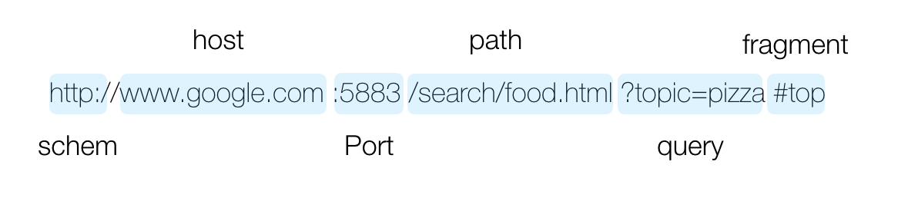

# HTTP 프로토콜

HTTP(Hypertext Transfer Protocol)이란 상호 간에 정의한 규칙을 의미하며 기기 간에 데이터를 주고받기 위해 정의된 통신 프로토콜립니다. 웹에서는 브라우저와 서버 간에 데이터를 주고받기 위해 사용하고 있습니다.

 
 
## Request & Response

HTTP 프로토콜로 데이터를 주고 받으려면 위의 그림과 같이 요청(Request)과 응답(Response)를 이용해야 합니다. 클라이언트 웹으론 브라우저를 의미하고 요청을 보내는 쪽이고 서버는 요청을 받는 쪽입니다.

 
 
## URL

URL(Uniform Resource Locators)은 자원의 위치를 알려주기 위한 프로토콜입니다. 브라우저는 URL을 이용하여 자원의 위치를 찾을 수 있습니다.

 
 
## HTTP 요청 메소드

HTTP 요청 메소드를 사용해 URL에 접근하여 서버에 특정 데이터를 요청 할 수 있습니다.

- GET: 존재하는 데이터를 요청
- POST: 새로운 데이터 생성
- PUT: 존재하는 데이터를 변경
- DELETE: 존재하는 데이터를 삭제

위와 같이 HTTP 요청 메소드로 조회, 생성, 변경, 삭제를 할 수 있습니다.

 
 
## HTTP 상태 코드

HTTP 상태 코드는 서버에서 응답해주는 정보입니다. 주요 상태 코드는 200번대 ~ 500번대 까지 각각 다른 의미로 다양하게 있지만 거의 200(성공)과 400번대(실패) 코드를 자주 볼겁니다.

### 2xx - 성공

200번대의 상태 코드는 대부분 성공을 의미합니다.

### 3xx - 리다이렉션

300번대의 상태 코드는 대부분 클라이언트가 이전 주소로 데이터를 요청하여 서버에서 새 URL로 리다이렉트를 유도하는 경우입니다.

### 4xx - 클라이언트 에러

400번대 상태 코드는 대부분 클라이언트의 코드가 잘못된 경우입니다. 유효하지 않은 자원을 요청했거나 요청이나 권한이 잘못된 경우 발생합니다.

### 5xx - 서버 에러

500번대 상태 코드는 서버 쪽에서 오류가 난 경우입니다.
