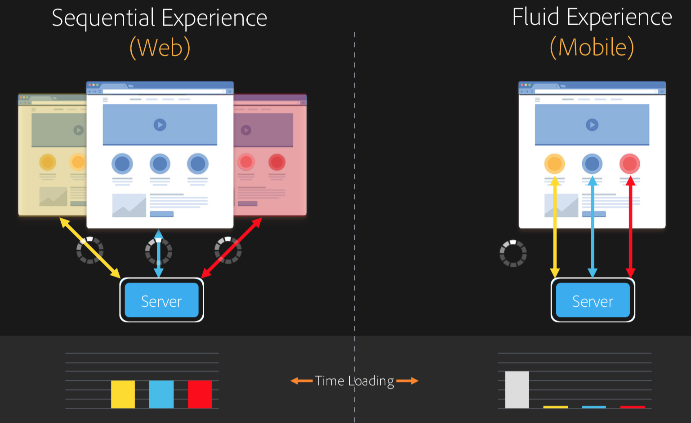

# SPA??

**SPA(Single Page Applications)** 은 이름 그대로 단일 페이지로 구성된 어플리케이션을 뜻합니다. 기존의 웹 페이지는 사용자가 새로운 요청이나 다른 페이지로 이동할 때마다 새로운 페이지를 로드 시켜 주는 SSR과 비슷한 방식을 이용했는데 요즘의 웹에서는 제공되는 정보가 많고 상호 작용되는 부분이 많아짐에 따라 서버에 요청이 많아져 성능 부분에서 비효율적일 수 있습니다. SPA는 CSR 방식을 이용하기 때문에 브라우저에 내장된 Javascript 엔진을 이용하여 브라우저에서 페이지를 직접 렌더링해줍니다. 이때 모든 리소스들을 가져옴으로서 페이지와 유저의 상호 작용시 페이지를 새로 고침하지 않으며 매끄럽고 빠르게 필요한 부분만 바꿔주어 유저에서 보다 매력적인 경험을 제공하게 됩니다.

 

# SPA의 장단점

SPA의 장점으로는 상호 작용이 일어나면 새로운 페이지를 로드하지 않고 필요한 부분만 바꿔줌으로서 보다 빠르고 매끄러운 전환이 이루어져 사용자에게 좋은 경험을 제공해줍니다. 최초 요청시 모든 리소스를 불러와 유저가 상호 작용하더라도 서버에 요청하지 않고 바로 필요한 부분을 가져와 사용함으로서 서버에 부담이 적어집니다.

단점으로는 최초 요청시 모든 리소스를 불러오는 방식이라 실제로 방문하지 않을 수 있는 페이지까지 모두 불러오기 때문에 최초 로딩시 많은 시간이 걸릴 수 있다는 겁니다. 이를 해결하기 위해 코드 스플리팅이라는 기술이 있습니다. 라우트 별로 파일을 나누어 트래픽과 로딩 속도를 개선 시킬 수 있습니다. 또 다른 단점으로는 빈 페이지에 필요한 리소스들을 채워주는 방식이라 채워지 전에 아무것도 없는 흰 페이지가 보여 사용자는 깜빡이는 느낌을 받을 수 있습니다. 그리고 가장 큰 단점으론 SEO에 불리하다는 겁니다. 이 또한 빈 페이지에 검색 엔진 봇이 들어와 정보를 수집하지 못하고 그냥 돌아가 버리기 때문에 생기는 단점입니다.
