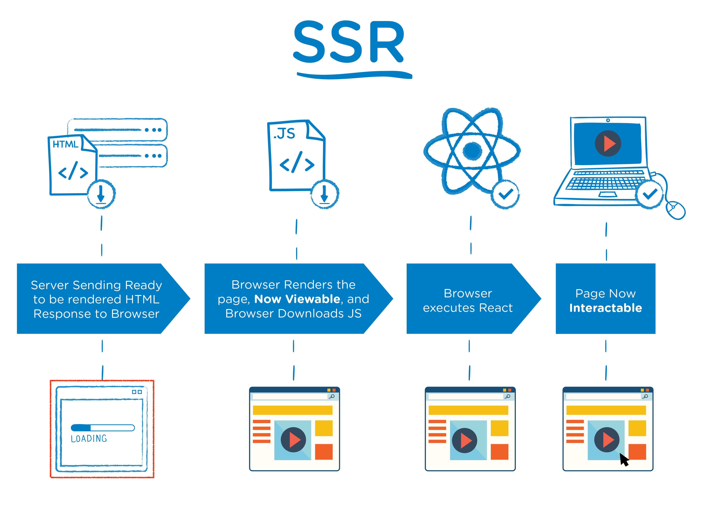
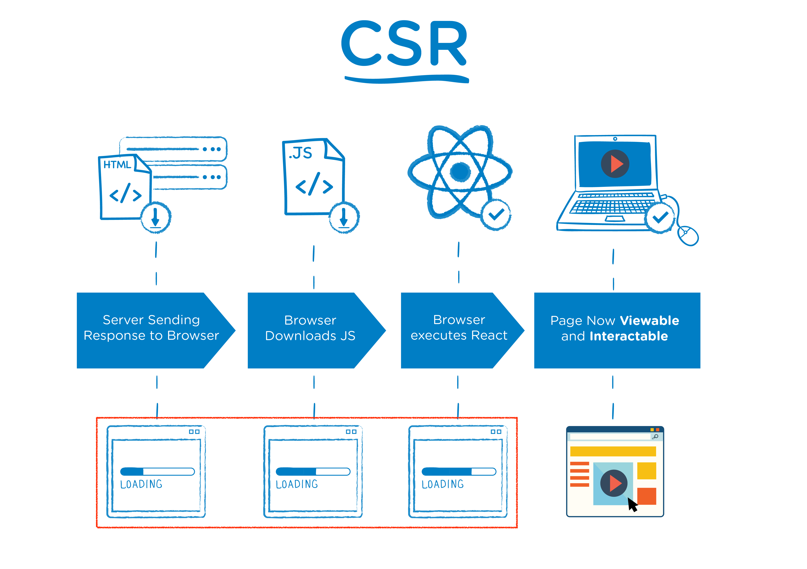

# SSR??

**SSR(Server-Side Rendering)**는 클라이언트에서 요청이 들어오면 서버에서 렌더링을하고 Data가 매핑된 상태의 페이지를 클라이언트에 전달시켜 완성된 페이지를 클라이언트에 띄워줍니다. 이런 방식은 Javascript가 처리되기를 기다리지 않고 처리가 완료되는 대로 클라이언트에 보여줌으로서 초기 로딩 지연시간이 줄어들어 보다 빠르게 유저에게 페이지를 보여줄 수 있는 장점이 있습니다. 하지만 서버에서 페이지를 생성하는 시간이 걸리기 때문에 페이지에 잦은 변화가 이뤄진다면 서버에 부담이 될 수도 있습니다.

 

## SSR 장점

1. **초기 로딩 속도가 빠릅니다.**

   최초 요청에 모든 리소스를 다운 받는 CSR 방식에 비해 적은 양의 리소스를 다운 받아 보다 빠르게 브라우저에 전달되어 화면에 그려지게 됩니다.

2. **SEO에 유리합니다.**

   SSR 방식은 컨텐츠 정보를 포함한 HTML을 브라우저에 제공함으로서 검색 엔진 봇이 많은 양의 정보를 수집할 수 있게 됩니다.

## SSR 단점

1. **서버에 부담이 될 수 있습니다.**

   서버에 요청할 때 마다 새로운 HTML을 작성하는데 많은 시간을 소비해야 하기 때문에 요청이 잦아진다면 서버에 부담이 될 수 있습니다.

 

# CSR??

**CSR(Client-Side Rendering)**은 브라우저에 내장된 Javascript 엔진을 이용하여 브라우저에서 페이지를 직접 렌더링하는 것을 의미합니다. 최초 요청에 HTML, CSS, Javascript 등 모든 리소스를 받아와 브라우저에서 페이지를 만들어 화면에 뿌려줍니다. 그 후에 서버에 필요한 데이터를 요청하여 브라우저에 데이터를 전달시켜 줍니다. 이러한 방식은 처음에 모든 리소스를 받아와야 하기 때문에 초기 렌더링 속도는 SSR에 비해 느리다는 단점이 있습니다. 하지만 최초 요청에 모든 리소스를 받아왔기 때문에 데이터 요청이 필요할 때만 서버에 접근하게 되므로 SSR보다 서버에 부담이 줄어들기도 합니다.

CSR 방식은 브라우저에서 빈 페이지를 만들어 필요한 리소스들을 채워주는 방식으로 동작하기 때문에 **SEO(Search Engine Optimization)**에 불리하게 작용됩니다. SEO는 처음 페이지를 방문 시 페이지의 자료를 수집하여 점수를 부여하고 높은 점수일 수록 검색 결과 상단에 노출되게 도와주는 엔진입니다. 하지만 CSR 방식을 사용할 경우 SEO는 빈 페이지를 탐색하게 되므로 좋지 않은 점수를 받게 됩니다.

 

## CSR 장점

1. **서버에 부담이 적습니다.**

   SSR 방식과 반대로 최초 요청에 모든 리소스를 브라우저에 가져와 필요 시 서버까지 가지 않고 브라우저에서 바로바로 건네줍니다. 데이터 요청을 제외하고는 서버와의 요청이 없어지므로 서버에 부담이 많이 줄어듭니다.

## CSR 단점

1. **초기 로딩 속도가 느립니다.**

   위의 설명대로 최초 요청에 모든 리소스를 가져오는 방식이라 초기 로딩 속도가 SSR에 비해 느립니다.

2. **SEO에 불리합니다.**

   브라우저에서 빈 페이지를 먼저 렌더하고 DOM을 채워주는 방식으로 동작하기 때문에 SEO가 방문 시 아무런 정보가 없는 페이지를 탐색하므로 정보를 수집하지 못하고 돌아가게 됩니다.

 

# 어떤 방식을 이용해야 하나요??

어떤 방식을 채택해야 하는지는 지금 하고 있는 프로젝트의 유형에 따라 다르다고 생각합니다. 검색 엔진에 많은 영향이 있는 프로젝트라면 SSR을 이용하겠지만 검색 엔진이 필요 없는 관리자 페이지 같은 경우에는

CSR 방식을 이용하는게 올바른 선택이 아닐까 싶습니다.

요즘 많이 쓰는 React, Vue, Angular가 전부 CSR 방식으로 동작하기 때문에 이를 SSR로 바꿔주기 위한 각각의 라이브러리가 존재합니다. 이런 라이브러리를 이용하면 처음엔 SSR 방식으로 렌더 하고 그 후에 나머지 페이지들은 CSR 방식으로 렌더 하여 검색 엔진 봇이 처음 방문할 때 비교적 많은 정보를 수집해 가게끔 만들어 줄 수 있다.
