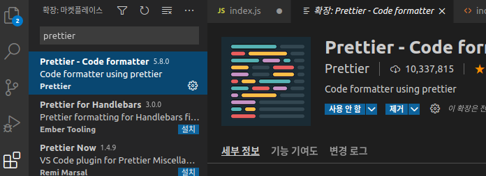
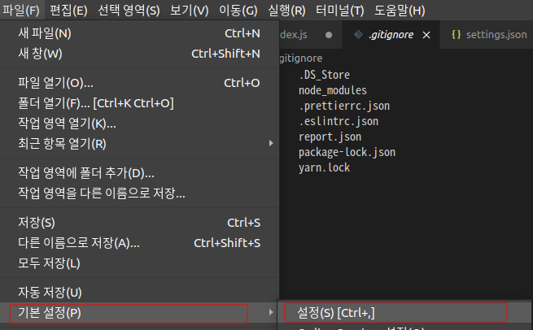
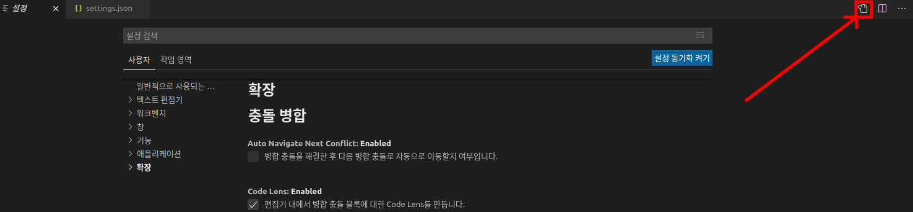
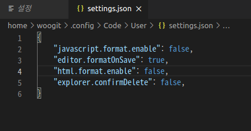
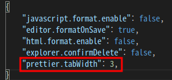
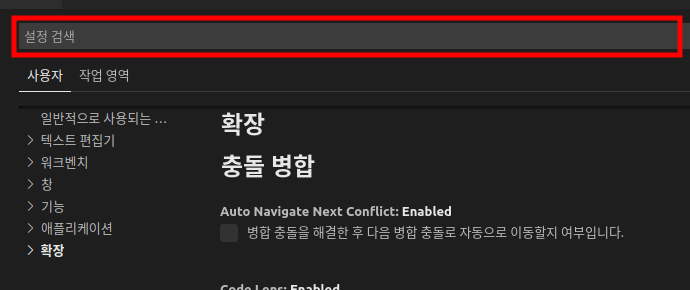

# VScode Prettier

VScode의 필수라고 생각하는 Extension인 Prettier의 설치와 설정을 알아보려합니다.

## Prettier??

Prettier는 아주 쉽게 말해서 작성된 코드를 설정된 규칙에 따라 정렬해주는 기능이라고 생각하면 됩니다. 간단하게 예를 들어볼게요

```jsx
	for(...){
				let a;
for(...){
let b;
			}
				}
```

어쩌다보니 이렇게 코드가 정렬이 안되고 지저분해졌어요 너무 보기 불편합니다. 이럴때 Prettier의 힘을 빌리면

```jsx
for(...){
	let a;
	for(...){
		let b;
	}
}
```

위와 같이 자동으로 정렬을 시켜줘요!! 그리고 Prettier는 JS뿐만 아니라 HTML, CSS 모두 정렬을 해준답니다.

이렇게 좋은데 안쓸이유가 없겠죠??

## Prettier 설치

Prettier를 설치하는 방법은 두 가지가 있어요

---

> 1.npm으로 설치

> 2.vscode의 extenstion으로 설치

---

1번의 방법은 협업으로 프로젝트를 할때 팀원간의 규칙을 정해서 서로 같은 규칙을 지키며 협업이 가능합니다. 대신 프로젝트마다 설정을 해줘야하니 아직 저희에겐 필요 없을것같아요

2번의 방법은 vscode 프로그램 자체에 설정을 넣어주는거라 어느 위치의 파일에서건 사용가능합니다. 고로 두번째 방법으로 설치를 진행할거에요

---



우선 vscode를 실행하시고 맨 좌측을 보시면 네모난 상자들이 있는 버튼이 있어요 여기서 마켓플레이스로 진입하시고 검색창에 Prettier - Code formatter라고 검색하시고 설치를 해주시면 됩니다.

## Prettier 설정

우선 사진들로 설명을 도와드리겠습니다.



vscode에서 파일 > 기본 설정 > 설정에 들어가시게 되면



이러한 화면이 나오는데요 빨간 박스에 표시된 버튼을 누르시면



이런 json파일로 되어있는 설정 파일에 접근이 가능합니다. 저는 미리 설정을 해둬서 내용물이 있는데 아무 내용이 없어도 정상입니다.

이제 setting.json 이 곳에 설정 할 값들을 넣어줄겁니다.



이런식으로 설정 할 값들을 넣어주면 됩니다. 위의 설정은 코드를 포맷팅 해줄때 탭의 공백을 3으로 해달라는 설정이에요 엄청 다양한 설정이 있으니까 아래 정리해 둘게요

- Prettier 설정들

## \*Prettier 자동 포맷팅

이렇게 설정법들을 알아봤고 이제는 파일을 저장할 때 자동으로 포맷팅 해주는 설정을 추가해줄거에요 이게 아주 중요합니다.



다시 파일 > 기본 설정 > 설정으로 이동하셔서 검색창에 아래 키워드들을 검색하세요

HTML format: Enable → 체크 해제

JavaScript format Enable → 체크 해제

formatOnSave → 체크

이렇게 해주시면 저장할때 Prettier가 코드를 이쁘게 정렬해줄겁니다!!
